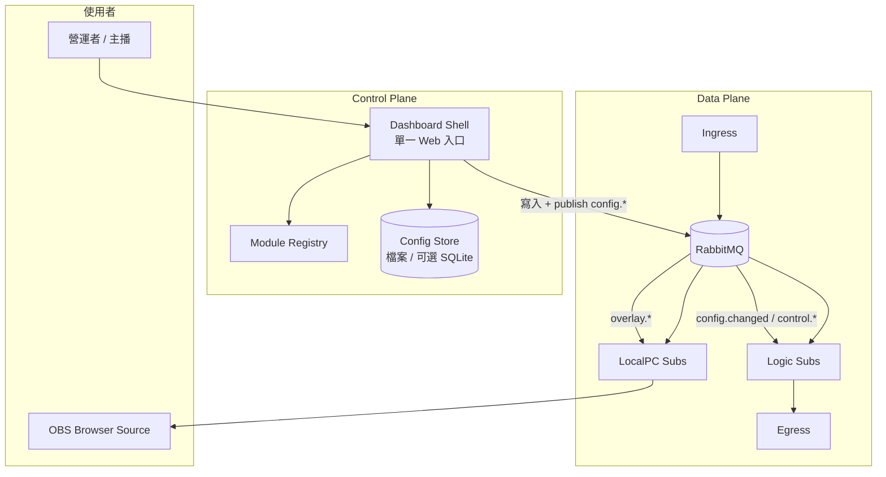
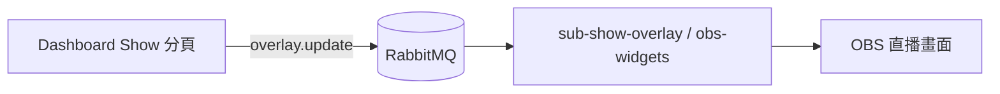
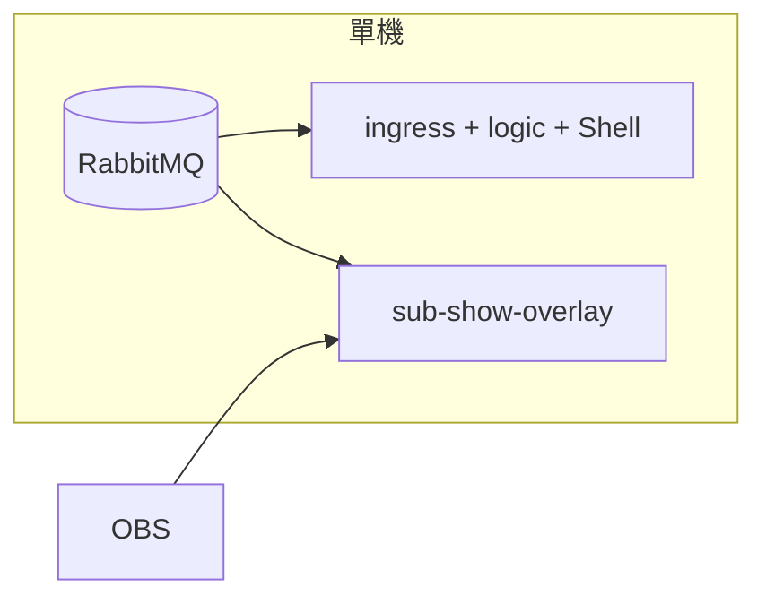
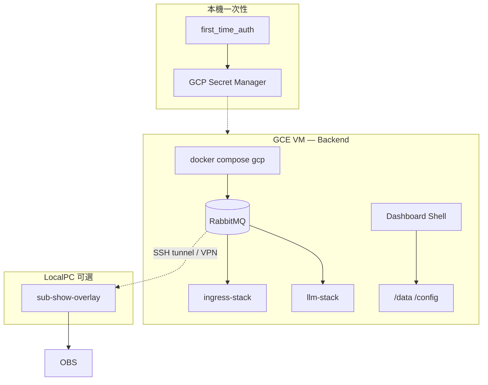
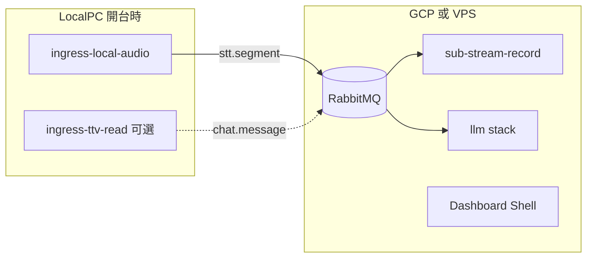

# 控制面（Control Plane）

**狀態：部分實作（Phase 0～1 已交付，2026-06）** — L1 `config.changed` 與 `packages/control` Registry 已上線；Dashboard Shell、profile 目錄、L2 `overlay.update` runtime 屬 Phase 2+。

單一 `streamer-app`、模組可組裝；**控制面與 RabbitMQ 同級**，與資料面並行。

相關：[events.md § 控制面 topic](../events.md#控制面-topic) · 實作計畫：[control-plane-phase-01.md](../plans/control-plane-phase-01.md)

---

## 目標

| 類型 | 能力 |
|------|------|
| Bot | 自訂 `!` 指令、依 `eventsub.*` / `chat.message` 觸發回應集、定時自動發話 |
| LLM | 多組 prompt／個性 **profile**、開台中切換 |
| Show / OBS | 彈幕 overlay、標題跑馬燈、checklist（HTML 排版）、即時改文案 |
| 營運 | 單一 app；不同主播／測試對象以 **profile 與積木組合** 區分 |

---

## 與現有元件的演進

| 元件 | 演進方向 |
|------|----------|
| `streamer-config-gui` | 併入 **Dashboard Shell** 的儲存 API；頁面改為模組分頁 |
| `packages/streamer-config` | **Config Store** 的檔案後端（路徑、驗證、bootstrap） |
| `local-dashboard` | **Monitor 分頁** 訂閱 `system.*` |
| `sub-memory-board` | Dashboard 內 L2 摘要分頁（可選） |

---

## 設計原則

1. **控制面與資料面分離** — 直播資料走 data plane topic；設定變更走 `config.*` / `control.*` topic。
2. **單一 App** — `streamer-app` 為唯一常駐編排器；差異在啟用模組（積木）與 **profile**。
3. **模組註冊** — 每個 Publisher/Subscriber 提供 `ModuleDescriptor`（見下文）。
4. **Dashboard 分頁 = 模組邊界** — 可設定模組附 HTML/HTMX 分頁或 API 片段，由 Shell 聚合。
5. **設定分級** — L0 / L1 / L2；模組在 Descriptor 宣告支援層級。
6. **App 層職責** — 啟停程序、掛載 Shell、轉發 control topic；業務邏輯在各 Sub。

---

## 架構總覽



| 平面 | 職責 | 範例 |
|------|------|------|
| **Data Plane** | 直播資料與決策 | `chat.message` → `sub-llm` → `chat.reply` |
| **Control Plane** | 設定、profile、模組開關、OBS 文案 | `config.changed` → `sub-bot-logic` reload |
| **Config Store** | 持久化設定與 profile | `STREAMER_CONFIG_DIR`、`profiles/` |

---

## 核心概念

### 樂高模型

| 概念 | 說明 |
|------|------|
| **積木** | 可獨立啟用的模組（程序 + Dashboard 分頁） |
| **組裝** | Product 組合（見 [operator-modes.md](../operator-modes.md)） |
| **Profile** | 主播／測試對象的設定快照（channel、知識庫、啟用積木、active LLM persona） |
| **Shell** | 唯一 Dashboard 入口；聚合分頁與 Config API |

同一部署可掛多個 profile（如 `alice`、`bob`），各自擁有 `bot_responses`、`llm_subscriber`、overlay 文案等。

### ModuleDescriptor

每個可設定模組註冊。完整契約如下；**Phase 0 已實作**欄位見 `packages/control`（`module_id`、`process_names`、`config_files`、`reload_level`、`dashboard_route`）。其餘欄位屬 Phase 2+ 擴充。

| 欄位 | 說明 | Phase 0 |
|------|------|---------|
| `module_id` | 穩定 ID，如 `rule-bot`、`llm-bot`、`show-overlay` | ✅ |
| `process_names` | 對應 `app.main run` 程序名 | ✅ |
| `config_files` | 設定檔（相對 `STREAMER_CONFIG_DIR`） | ✅ |
| `reload_level` | `L0` / `L1` / `L2` | ✅ |
| `dashboard_route` | Shell 分頁路由（Phase 2） | ✅（可為 `None`） |
| `config_schema` | JSON Schema 或 validator（可沿用 `streamer-config`） | Phase 2+ |
| `dashboard` | 分頁靜態 HTML 路徑等 | Phase 2+ |
| `topics_in` / `topics_out` | 資料面 topic（Monitor 連線圖） | Phase 2+ |

新增模組時，Descriptor 與 [events.md](../events.md) 契約同 PR 交付（見 [pub-sub-writing.md](../checklists/pub-sub-writing.md)）。

### Profile 目錄

```
{STREAMER_CONFIG_DIR}/
  profiles/
    default/
      manifest.json
      bot_responses.json
      llm_subscriber.json
      sub_visual.json
      knowledge/
        {channel}.md
    alice/
      ...
```

`manifest.json` 範例：

```json
{
  "schema_version": 1,
  "profile_id": "alice",
  "channel": "alice_channel",
  "enabled_modules": ["rule-bot", "llm-bot", "show-overlay"],
  "active_llm_persona": "playful",
  "active_overlay_scene": "default"
}
```

切換 profile：寫入 active 指標 + publish `control.profile.switch`（見 [events.md](../events.md)）。

---

## 設定分級（L0 / L1 / L2）

| 級別 | 行為 | 適用 | 體感 |
|------|------|------|------|
| **L0** | 改檔 → 重啟程序 | Chroma、knowledge 大改、新增模組 | 分鐘級 |
| **L1** | 改檔 → `config.changed` → in-process reload | `bot_responses.json`、`redemption_responses.json`、`llm_subscriber.json`、`sub_visual.json` | 秒級 |
| **L2** | Dashboard → `control.*` → 記憶體／WebSocket 套用 | 跑馬燈、checklist、LLM persona | 即時 |

Shell 依 Descriptor 的 `reload_level` 顯示套用狀態。

---

## Dashboard Shell

### 職責

- 聚合模組分頁（每模組一頁）
- 讀寫 Config Store；驗證後 publish control topic
- Monitor 分頁：訂閱 `system.health` / `system.error`
- Profile 切換 UI
- 僅處理設定與監控；業務事件由各 Sub 訂閱

### 部署邊界

| 元件 | 位置 |
|------|------|
| Dashboard Shell | Backend 同機（本機或 GCP）；遠端經 HTTPS + 認證 |
| `sub-show-overlay`、OBS HTML | LocalPC；訂閱 `overlay.update` |
| RabbitMQ | Backend；LocalPC 經 tunnel/VPN 連線 |

### 能力一覽

| 能力 | 說明 |
|------|------|
| 模組分頁 | Registry 驅動；各模組提供設定 UI |
| 設定生效 | L1/L2 經 MQ 通知 Sub |
| Monitor | `system.*` 健康與錯誤 |
| Profile | CRUD 與 active 切換 |
| 模組啟停 | `control.module.*`（Phase 4） |

---

## 積木與 Product

| `module_id` | 程序 | Product |
|-------------|------|---------|
| `show-overlay` | `sub-show-overlay` | Show |
| `rule-bot` | `sub-bot-logic` | Rule Bot、LLM Bot — Rule Bot + AI |
| `llm-bot` | `sub-llm`、`sub-qa-memory-*`、`twitch-connector` | LLM Bot — AI Q&A、LLM Bot — Rule Bot + AI |
| `ingress-eventsub` | `ingress-twitch-eventsub` | Rule Bot、LLM Bot — Rule Bot + AI |
| `ingress-audio` | `ingress-twitch-audio` / `ingress-local-audio` | LLM Bot（含 STT） |
| `stream-record` | `sub-stream-record` | LLM Bot（記憶管線） |
| `visual-egress` | `sub-visual` | Show（可選） |
| `memory-worker` | `app.workers` | LLM Bot（可選） |

**Show + LLM Bot — Rule Bot + AI**：啟用多個積木，共用一個 Shell 與多個分頁。

### Show 產品定義（面板 → OBS 畫面）

**核心目標：** 營運者在控制面板上編輯可視物件（跑馬燈文字、checklist 項目、標題文案等），變更應反映到**直播畫面（OBS）**上的對應元素，體感為即時或近即時。

| 項目 | 說明 |
|------|------|
| 營運面 | Dashboard Shell 的 Show 分頁（Phase 2+）；現階段 overlay 聊天由 `sub-show-overlay` 處理資料面 |
| 呈現面 | OBS Browser Source 或其他方案（**具體實作尚未定案**） |
| 控制面 topic | **L2** `overlay.update`（Phase 3）；與 L1 `config.changed` 寫檔 reload **不同路徑** |
| 程序邊界 | overlay 程序在 **LocalPC**（實況機）；訂閱 `overlay.update` 後更新本機 HTML／狀態 |



**checklist** 在此指 Show 分頁上的勾選清單／列表物件（非開發用文件 checkbox）。開台中勾選、改字、排序等操作走 L2，不走 `config.changed`。

**現況：** `sub-show-overlay` 已訂閱 `chat.message`（彈幕資料面）；面板改字熱更新屬 Phase 3，契約見 [events.md § overlay.update](../events.md#overlayupdate-l2-熱設定)。

---

## 需求對照

| 需求 | 積木 | 分級 | Control topic |
|------|------|------|---------------|
| 自訂 `!` 指令 | `rule-bot` | L1 | `config.changed` |
| 依 pub 事件回應 | `rule-bot` | L1 | `config.changed` |
| 定時自動發話 | `schedule-announcer` | L1 | `config.changed` |
| LLM 個性／prompt | `llm-bot` | L1 / L2 | `control.llm.persona`、`control.profile.switch` |
| 跑馬燈、checklist | `show-overlay` / `obs-widgets` | L2 | `overlay.update` |
| 換測試主播 | Shell Profile | L0～L1 | `control.profile.switch` |

---

## 部署拓撲

部署描述 **程序跑在哪台機器**；Product 與 Control Plane 契約在各拓撲下相同。差異在 Backend / LocalPC 分工與連線方式。

### 三個邊界

| 邊界 | 典型程序 | 說明 |
|------|----------|------|
| **Backend** | RabbitMQ、ingress（雲端路徑）、`sub-bot-logic`、`--stack llm`、`app.workers`、**Dashboard Shell** | 常駐；可在本機、GCP GCE、或自架 VPS |
| **LocalPC** | `sub-show-overlay`、`sub-visual`、`ingress-local-audio`（混合 STT 時） | 實況機；訂閱遠端 MQ 時設 `RABBITMQ_URL` 指向 Backend |
| **本機一次性** | `scripts/first_time_auth.py`、Secret 寫入 | OAuth 瀏覽器 callback；與 Backend 是否為 GCP 無關 |

### 拓撲一覽

| 拓撲 ID | 名稱 | Backend | LocalPC | 適用 |
|---------|------|---------|---------|------|
| **T1** | All-local | 開發機／實況機全跑 | 同機 | 開發、除錯 |
| **T2** | All-GCP（純文字） | GCE VM（[deployment-gcp.md](../deployment-gcp.md)） | 可不裝 Python；Show 可選 | LLM Bot 常駐（聊天 + metadata，無雲端 STT） |
| **T3** | All-VPS | 自架伺服器（Docker Compose 同 [deploy/docker-compose.gcp.yml](../../deploy/docker-compose.gcp.yml)） | 同 T2 | 與 T2 同構，主機自選 |
| **T4** | Hybrid STT | MQ + logic + Shell | `ingress-local-audio`（可選 `ingress-ttv-read`） | 雲端免 STT 負載；本機 Whisper |

GCP 與自架 VPS 在架構上同屬 **遠端 Backend**；差別在主機供應商、計費與 [deployment-gcp.md](../deployment-gcp.md) 的 Secret Manager / bootstrap 腳本。

### T1 — All-local



- `docker compose up -d` + `app.main run`（見 [getting-started.md](../getting-started.md)）
- Dashboard Shell：`http://127.0.0.1:1426`
- Config Store：本機 `STREAMER_CONFIG_DIR`

### T2 — All-GCP



- Runbook：[deployment-gcp.md](../deployment-gcp.md)（`deploy/up.sh`、`fetch_secrets.sh`）
- 實況機可不跑 Python；僅 OBS 時省略 LocalPC 程序
- Shell 與 Backend 同 VM；營運者經 **SSH tunnel** 開啟 Shell（Phase 2 文件化）
- **預設為純文字**：`--stack ingress-chat`、`RECORD_MODE=chat`，不含雲端 STT；VM 建議 `e2-standard-2` 起
- 若需語音上下文：改採 [T4 Hybrid STT](#t4--hybrid-stt)，不在 GCP VM 跑 Whisper

### T3 — All-VPS（自架伺服器）

拓撲與 T2 相同：一台常駐主機跑 RabbitMQ + data plane + Shell。

| 項目 | 做法 |
|------|------|
| 編排 | 沿用 `deploy/docker-compose.gcp.yml` 或等價 compose |
| 機密 | 本機 `.env` 掛載至 `/run/secrets/.env`（可選 Secret Manager） |
| 資料 | `/data`（SQLite、Chroma）、`/config`（知識庫、profile） |
| LocalPC | 同 T2：overlay 訂閱遠端 `RABBITMQ_URL` |

### T4 — Hybrid STT



- 本機只跑 STT（與可選 IRC）；**不**在雲端跑 `ingress-twitch-audio`
- 連線：SSH tunnel `localhost:5672` → Backend RabbitMQ；本機 `RABBITMQ_URL=amqp://...@127.0.0.1:5672/`
- 詳見 [stream-memory-pipeline.md § 本機擷取音訊](stream-memory-pipeline.md#替代方案主播本機擷取音訊)

### 跨拓撲的 Control Plane 行為

| 能力 | 行為 |
|------|------|
| Config Store | 隨 Backend 的 `STREAMER_CONFIG_DIR` / `/config` |
| `config.changed` | 在 Backend MQ 上 publish；本機 STT 程序若連同一 broker 則與雲端 logic 一致 |
| Dashboard Shell | 與 Backend 同機；遠端存取經 tunnel + token |
| Profile 切換 | 改 Backend 上 `profiles/` + `control.profile.switch` |
| OAuth | 一律在本機開發機執行，再寫入 Secret 或 scp `.env` |

### 拓撲選擇（簡表）

| 情境 | 建議拓撲 |
|------|----------|
| 本機開發、驗證 `!ask` | T1 |
| 實況機不裝 Bot、後端常駐 | T2 或 T3 |
| 已有 Linux VPS、不用 GCP | T3 |
| 免費／小 VM、純文字 AI 問答 | T2（預設 `ingress-chat` + `RECORD_MODE=chat`） |
| 要本機 STT 品質、雲端只跑邏輯 | T4 |

---

## 安全

| 項目 | 做法 |
|------|------|
| Dashboard 存取 | 本機 `127.0.0.1` + token；GCP／VPS 經 SSH tunnel 或 HTTPS 反向代理 |
| RabbitMQ（T2/T3/T4 遠端） | SSH tunnel、WireGuard/Tailscale，或 TLS + 強密碼 |
| Control topic 發布者 | Dashboard Shell、受信任 CLI |
| 機密 | GCP 用 Secret Manager（[deployment-gcp.md](../deployment-gcp.md)）；VPS 用掛載 secrets 檔 |

---

## 相關文件

| 文件 | 內容 |
|------|------|
| [control-plane-phase-01.md](../plans/control-plane-phase-01.md) | 分階段實作 |
| [deployment-gcp.md](../deployment-gcp.md) | GCE VM、Compose、Secret Manager runbook |
| [deployment.md](../deployment.md) | Pub/Sub 部署邊界 |
| [events.md](../events.md) | Control topic schema |
| [operator-modes.md](../operator-modes.md) | Product 與程序表 |
| [solid.md](../solid.md) | Sub 職責邊界 |
