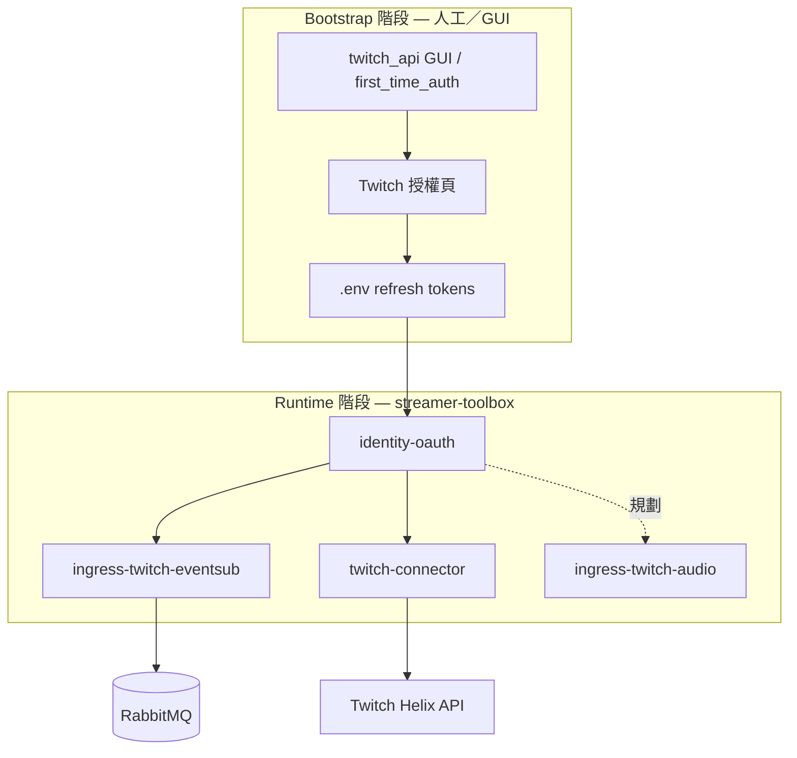
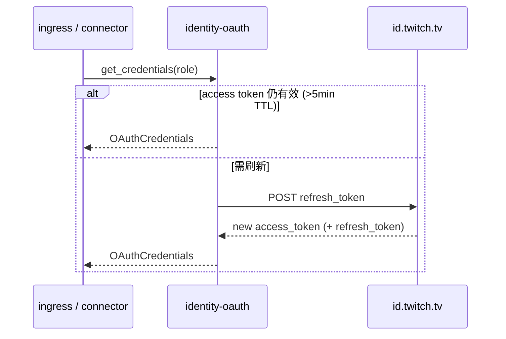

# 授權與身分（Identity Auth）

本文件為 **streamer-toolbox 授權設計的權威來源**。說明 Twitch 相關憑證種類、帳號角色、模組取用方式，以及與 [`twitch_api`](../../../twitch_api) 多帳號模型的對齊策略。

橫切 use-case 摘要仍見 [use-cases/04-oauth.md](../use-cases/04-oauth.md)。

---

## 1. 設計原則

| 原則 | 說明 |
|------|------|
| **單一職責（S）** | `identity-oauth` 只負責憑證載入、刷新、驗證；不 publish MQ、不解析 chat |
| **開放封閉（O）** | 新 ingress（如 streamlink OAuth）透過新 Provider 或 env 擴充，不改 EventSub 核心 |
| **依賴反轉（D）** | EventSub、connector 依賴 `TokenProvider` Protocol，不依賴 `.env` 或 `twitch_api` |
| **Pub/Sub 邊界** | **Token 永不進 MQ**；只在 process 啟動／刷新時注入 consumer |
| **Bootstrap 與 Runtime 分離** | 首次瀏覽器授權可在 `twitch_api` GUI／腳本完成；toolbox 執行期只消費 refresh token |



---

## 2. 三種憑證（不可混用）

Twitch 生態裡，**「登入」並非單一 token**。本專案需區分三類：

### 2.1 Helix OAuth（官方第三方 API）

| 項目 | 內容 |
|------|------|
| **用途** | EventSub、Helix 發話、users/follows 等 REST API |
| **Token 來源** | `https://id.twitch.tv/oauth2/token`（Authorization Code → refresh → access） |
| **管理模組** | `packages/identity-oauth` |
| **env 範例** | `TWITCH_CLIENT_ID`、`TWITCH_*_REFRESH_TOKEN` |
| **刷新** | 自動（`EnvTokenProvider.get_credentials()`） |

這是 **EventSub ingress** 與 **twitch-connector** 使用的唯一正規憑證。

### 2.2 Streamlink GQL Session（網站私有 API）

| 項目 | 內容 |
|------|------|
| **用途** | `ingress-twitch-audio` 向 Twitch 請求 HLS 存取權（可選，嘗試減少廣告段） |
| **Token 來源** | 登入 [twitch.tv](https://twitch.tv) 後，瀏覽器 cookie `auth-token`（開發者工具 Console 讀取） |
| **Header 格式** | `Authorization=OAuth <auth-token>`（streamlink `--twitch-api-header`） |
| **env 規劃** | `TWITCH_STREAMLINK_AUTH_TOKEN` |
| **刷新** | **無官方 API**；過期需手動從瀏覽器更新 |
| **與 Helix 關係** | **不相容** — Helix `access_token` 與自訂 `Client-ID` 不能替代 GQL session |

streamlink 維護者明確表示：認證是否免廣告由 Twitch 決定，**不保證**；且與 Turbo／訂閱狀態可能隨時變動。

### 2.3 無憑證（匿名）

| 模組 | 說明 |
|------|------|
| `ingress-ttv-read` | 匿名 IRC，零 OAuth |
| `ingress-local-audio` | 本機麥克風，零 OAuth |
| `ingress-yt-read` | YouTube 唯讀（非 Twitch） |

---

## 3. 帳號角色（對齊 twitch_api）

[`twitch_api` 的 `AccountService`](../../../twitch_api/src/runtime/account_service.py) 定義兩個執行期身分：

| 角色 ID | 典型帳號 | 主要用途 |
|---------|----------|----------|
| **`channel`** | 實況主／頻道擁有者 | EventSub 訂閱、Broadcaster 脈絡 API |
| **`bot`** | 機器人帳號 | 聊天室發話（Helix `send chat message`） |

### 3.1 雙帳號模式（預設）

```
主帳號 (channel)  ──► EventSub、部分 Broadcaster API
Bot 帳號 (bot)      ──► twitch-connector 發話
```

各自持有 **獨立的 refresh token**，寫入不同 env key（見 §5）。

### 3.2 單帳號模式（single account）

當 `twitch_api` 的 `ui_config.json` 設 `single_account_mode: true`，或 toolbox 設 `TWITCH_SINGLE_ACCOUNT=true` 時：

- `bot` profile **鏡射** `channel` 的 token 與 user id
- `TWITCH_BOT_REFRESH_TOKEN` 可省略（與 channel 相同）
- 適用：實況主用自己的帳號既開台又發 Bot 訊息

### 3.3 MOD 身分

**MOD 不是獨立 OAuth 角色。** MOD 為頻道內權限，不產生額外 token，也不影響：

- Helix API 呼叫身分（仍由 channel／bot token 決定）
- streamlink 廣告行為
- STT 擷取

---

## 4. 模組 × 憑證對照表

| 模組 | 憑證類型 | 帳號角色 | 現況 | 目標 |
|------|----------|----------|------|------|
| `ingress-twitch-eventsub` | Helix OAuth | **`channel`**（規劃；現用單組 env） | ✅ 已實作 | 改 `get_credentials("channel")` |
| `twitch-connector` | Helix OAuth | **`bot`**（規劃；現用 `TWITCH_BOT_ID`） | ✅ 已實作 | 改 `get_credentials("bot")` |
| `ingress-twitch-audio` | Streamlink GQL（可選） | **`channel` 的 browser token** | ❌ 匿名拉流 | 可選 env header |
| `ingress-local-audio` | 無 | — | ✅ | — |
| `ingress-ttv-read` | 無 | — | ✅ | — |
| `sub-stream-record` | 無 | — | ✅ | — |
| `sub-llm` / workers | 無（LLM 用 `GOOGLE_AI_*` 等） | — | ✅ | — |

**禁止：**

- 用 **bot token** 拉 HLS / streamlink
- 把 **refresh token** 或 **access token** publish 到 RabbitMQ
- 在 Sub 內嵌 OAuth refresh 邏輯（應委派 `identity-oauth`）

---

## 5. 環境變數規格

### 5.1 應用程式共用（Helix）

| 變數 | 必填 | 說明 |
|------|------|------|
| `TWITCH_CLIENT_ID` | EventSub / 發話時必填 | Twitch Developer Console 應用 ID |
| `TWITCH_CLIENT_SECRET` | 要 refresh 時必填 | 應用密鑰 |
| `TWITCH_CHANNEL` | 建議 | 頻道 login（不含 `#`） |

### 5.2 雙帳號（目標態，對齊 twitch_api）

| 變數 | 角色 | 說明 |
|------|------|------|
| `TWITCH_CHANNEL_REFRESH_TOKEN` | channel | 主帳號 refresh token |
| `TWITCH_BOT_REFRESH_TOKEN` | bot | Bot refresh token |
| `TWITCH_BROADCASTER_ID` | channel | 主帳號 user id |
| `TWITCH_BOT_ID` | bot | Bot user id |
| `TWITCH_BROADCASTER_TYPE` | channel | `affiliate` / `partner`（EventSub 條件） |
| `TWITCH_DEFAULT_SENDER` | — | `bot` 或 `channel`；connector 預設發話身分 |
| `TWITCH_SINGLE_ACCOUNT` | — | `true` 時 bot 鏡射 channel |

### 5.3 過渡／相容（現況）

| 變數 | 說明 |
|------|------|
| `TWITCH_ACCESS_TOKEN` | 靜態 access token；若無 refresh 則不自動更新 |
| `TWITCH_REFRESH_TOKEN` | 單一 refresh token（未區分 channel/bot 時使用） |

`EnvTokenProvider` **現只讀此單組**。遷移後仍保留 fallback：若未設 `TWITCH_CHANNEL_REFRESH_TOKEN`，則使用 `TWITCH_REFRESH_TOKEN`。

### 5.4 Streamlink 專用（規劃，不經 identity-oauth refresh）

| 變數 | 說明 |
|------|------|
| `TWITCH_STREAMLINK_AUTH_TOKEN` | 瀏覽器 `auth-token` cookie；**敏感**，勿 commit |

### 5.5 與 twitch_api 共用 .env

兩專案可共用同一份 `.env`：

```
D:\github\twitch_api\.env          ← GUI 授權寫入 refresh token
D:\github\streamer_toolbox\.env    ← 可 symlink 或 copy 相同 key
```

toolbox **不**依賴 `twitch_api` runtime；只對齊 **key 命名** 與 refresh 語意。

---

## 6. `identity-oauth` 套件設計

### 6.1 現況（v0.2）

```
packages/identity-oauth/
├── protocol.py              # AccountRole, OAuthCredentials, TokenProvider
├── token_refresh.py         # 共用 refresh 邏輯
├── single_account.py        # TWITCH_SINGLE_ACCOUNT 鏡射
├── multi_account_provider.py # channel + bot profiles（主實作）
├── env_provider.py          # EnvTokenProvider 別名（向後相容）
├── sync_provider.py         # SyncEnvTokenProvider(role=...)
└── __main__.py              # CLI --role channel|bot
```

**已支援：**

- `get_credentials(role="channel"|"bot")`
- `TWITCH_CHANNEL_REFRESH_TOKEN` / `TWITCH_BOT_REFRESH_TOKEN` + legacy fallback
- `TWITCH_SINGLE_ACCOUNT=true` 時 bot 鏡射 channel
- EventSub 注入 bot + channel 雙 token；connector 使用 `role="bot"`

### 6.2 `OAuthCredentials` 欄位語意

| 欄位 | channel 角色 | bot 角色 |
|------|--------------|----------|
| `access_token` | 主帳號 access | Bot access |
| `refresh_token` | 主帳號 refresh | Bot refresh |
| `broadcaster_id` | 主帳號 user id | 同左（API 脈絡用） |
| `bot_id` | Bot user id | Bot user id |
| `client_id` / `client_secret` | 共用應用 | 共用應用 |

### 6.3 執行期刷新流程



- TTL 閾值：`TOKEN_MIN_TTL_SECONDS`（預設 300s，與現 `env_provider` 一致）
- 刷新鎖：asyncio Lock，避免並發 refresh

---

## 7. Consumer 注入方式

### 7.1 非同步（EventSub）

```python
provider = MultiAccountTokenProvider()
creds = await provider.get_credentials("channel")
bot = EventSubIngressBot(token=creds.access_token, refresh_token=creds.refresh_token, ...)
```

### 7.2 同步（connector）

```python
provider = SyncEnvTokenProvider(MultiAccountTokenProvider())
provider.validate(role="bot")
sender = TwitchChatSender(provider, ...)
```

### 7.3 Streamlink（規劃，獨立於 Helix refresh）

```python
token = StreamlinkAuthToken.from_env()  # 只讀 env，不 refresh
if token:
    args += [f"--twitch-api-header=Authorization=OAuth {token.value}"]
```

---

## 8. Bootstrap：首次取得 Refresh Token

toolbox **不提供** GUI 授權（現階段）。請使用 [`twitch_api`](../../../twitch_api)：

| 步驟 | 工具 | 產出 |
|------|------|------|
| 1. 建立 Twitch 應用 | Developer Console | `CLIENT_ID` / `SECRET` |
| 2. 主帳號授權 | `scripts/first_time_auth.py` 或 GUI | `TWITCH_CHANNEL_REFRESH_TOKEN` |
| 3. Bot 授權 | 同上（換 Bot 登入） | `TWITCH_BOT_REFRESH_TOKEN` |
| 4. 驗證 | `uv run identity-oauth` | 印出 token 前綴 |

授權完成後，streamer-toolbox 各 process 只需 `.env` + `identity-oauth` 自動 refresh。

---

## 9. 安全與維運

| 項目 | 規範 |
|------|------|
| **`.env` 不入 git** | 已在 `.gitignore` |
| **Token 不進 log** | 僅允許 prefix（如 `identity-oauth` CLI） |
| **Token 不進 MQ** | 事件 schema 無 auth 欄位 |
| **Streamlink cookie 輪替** | 過期手動更新；可考慮日曆提醒 |
| **Refresh token 撤銷** | Twitch Console 或改密碼後需重新 bootstrap |
| **最小 scope** | EventSub／chat:send 各取所需 scope，勿過度授權 |

---

## 10. 實作路線圖

| Phase | 內容 | 影響模組 |
|-------|------|----------|
| **A** | `MultiAccountTokenProvider` + env 對齊 twitch_api | ✅ 已完成 |
| **B** | `TWITCH_SINGLE_ACCOUNT` 鏡射 | ✅ 已完成 |
| **C** | `ingress-twitch-audio` 可選 `TWITCH_STREAMLINK_AUTH_TOKEN` | `live_audio.py` |
| **D** | `identity-oauth` CLI：`--role channel\|bot` 驗證 | `__main__.py` |
| **E**（可選） | 將 `twitch_api` OAuthManager 邏輯完全搬入 package，GUI 改呼叫 toolbox CLI | 跨 repo |

**不建議：**

- 為 streamlink 另建完整 OAuth 模組
- 在 `ingress-twitch-eventsub` 內嵌 refresh
- 用 Bot token 做 STT 拉流

---

## 11. 常見問題

### Q1：已有 Bot 登入，STT 還會被廣告中斷嗎？

**會（若仍用 `ingress-twitch-audio` 且未帶 streamlink token）。** Bot Helix token 不參與 HLS 拉流。解法優先序：

1. `ingress-local-audio`（本機麥克風，與廣告無關）
2. 可選 `TWITCH_STREAMLINK_AUTH_TOKEN`（不保證免廣告）
3. 接受 streamlink 8.x 過濾廣告時的 pause 缺段

### Q2：EventSub 要用 channel 還是 bot token？

**Channel（主帳號）** — Broadcaster EventSub 需 broadcaster 授權脈絡。Bot token 用於訂閱其他頻道時 scope 不同，本專案預設監看自己的頻道。

### Q3：能否只配一組 token？

可以。設 `TWITCH_SINGLE_ACCOUNT=true` 或只填 `TWITCH_REFRESH_TOKEN`（過渡）。雙帳號為正式運作推薦（主帳開台 + Bot 發話分離）。

### Q4：Discord / YouTube 需要 Twitch OAuth 嗎？

不需要。`ingress-discord`、`ingress-yt-read` 使用各自平台 token（`DISCORD_BOT_TOKEN` 等）。

---

## 12. 相關文件

| 文件 | 內容 |
|------|------|
| [use-cases/04-oauth.md](../use-cases/04-oauth.md) | 橫切時序摘要 |
| [solid.md](../solid.md) | SOLID 與 TokenProvider 抽象 |
| [modules.md](../modules.md) | 哪些產品需要 identity-oauth |
| [stream-memory-pipeline.md](stream-memory-pipeline.md) | STT 路徑（local vs twitch audio） |
| [references.md](../references.md) | twitch_api 遷移對照 |
| [checklists/pub-sub-writing.md](../checklists/pub-sub-writing.md) | ingress 撰寫清單 |
