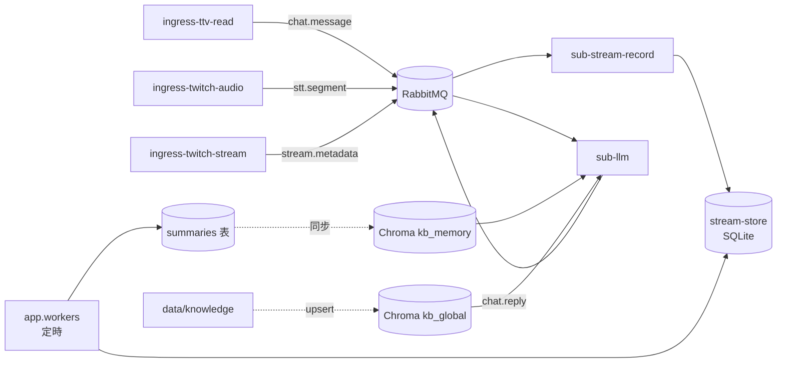

# 直播文字記錄與記憶管線

聊天室觸發問答（`!ask`）與 Memory Board Web UI 已接入；本文件描述 L0～L4 資料流與記憶分層。

## 四層架構

| 層 | 路徑 | 職責 | 狀態 |
|----|------|------|------|
| L0 Ingress | `app/publishers/` | 讀平台 → publish MQ | 已有 |
| L1 記錄 | `app/subscribers/sub_stream_record/` | `chat.message` / `stt.segment` → SQLite | **已實作** |
| L2 記憶 | `app/workers/` | 定期摘要 → `summaries` 表 → Chroma `kb_memory` | **已實作** |
| L3 指令 | `app/subscribers/sub_llm/` | `!ask` → RAG/IGDB 上下文 → LLM → `chat.reply` | **已實作** |
| L4 LLM | `sub_llm/llm.py` | 無狀態推理（template / openai / gemini） | **已實作** |

共用持久化：`stream-store`（`packages/stream-store/`，SQLite schema + CRUD）。

## Phase 2 資料流（聊天 + STT）



## L3 問答上下文（`sub-llm`）

| 來源 | 機制 | 時間尺度 |
|------|------|----------|
| 直播狀態 | 訂閱 `stream.metadata` → 記憶體 buffer | 最新一筆 |
| STT 逐字稿 | 訂閱 `stt.segment` | `LLM_CONTEXT_WINDOW_MINUTES`（預設 15） |
| 聊天室 | 訂閱 `chat.message`（跳過 `TWITCH_BOT_ID`） | 同上 |
| Bot 近期問答 | 程序內 buffer（問答成對，**不寫入 RAG**） | `LLM_BOT_REPLY_WINDOW_MINUTES`（預設 30），最多 `LLM_BOT_REPLY_MAX_PAIRS` 則 |
| 靜態知識 | Chroma `kb_global` ← `LLM_KNOWLEDGE_PATH` | 向量 RAG |
| 直播摘要 | Chroma `kb_memory` ← SQLite `summaries` | 向量 RAG，依 `period_end` 由新到舊 |
| 遊戲資料 | `packages/game-info`（IGDB，直播中可玩分類時注入） | API + 快取 |

### Bot 問答長期記憶（`QA_MEMORY_MODE`）

| 模式 | 值 | 寫入 | RAG 讀取 `source=qa` | SUB |
|------|-----|------|----------------------|-----|
| **1. 原本** | `none`（預設） | 否 | **否**（chat/stt/靜態知識等照常） | 僅 `sub-llm` |
| **2. 單次評分** | `structured` | 同次 JSON 評分 → `memory.qa.record` | **是** | + `sub-qa-memory-structured` |
| **3. 多次批次** | `batch` | `chat.reply` → L2 摘要 | **是** | + `sub-qa-memory-batch` |

模式 2、3 **讀取記憶行為相同**（皆含問答長期記憶）；差異僅在寫入方式。模式 1 仍保留短期 Bot 問答 buffer、STT、聊天、L2 chat/stt 摘要與靜態知識庫。

三者互斥；`--stack llm` 會啟動兩個 memory SUB，非對應模式者自動 idle 退出。

Prompt 來源優先順序（`LLM_SYSTEM_PROMPT` 預設）：**直播狀態 > 逐字稿/聊天 > Bot 近期問答 > 遊戲資料 > 知識庫 > 通識**；上下文沒提到時仍須作答，勿只回「沒提到」。

啟動時若 LLM 推理端點不可用，仍發布降級宣告至 `chat.reply`（Degraded Mode 說明）；詳見 `sub_llm/startup_announcement.py`。

## `RECORD_MODE`

| 值 | 說明 |
|----|------|
| `chat` | 只記 `chat.message` |
| `stt` | 只記 `stt.segment` |
| `both` | 聊天室 + 實況語音 STT；記憶層 **chat / stt 分開摘要**，同一批次共用 `period_start`/`period_end` |

## 為何不做 chat ↔ STT 問答配對

觀眾發聊天 → 主播看到 → 開口回覆 → STT 擷取語音，中間有多段延遲（IRC 傳遞、主播閱讀、反應時間、chunk 切割、Whisper 推論）。因此**無法**用「時間上相鄰的 chat 與 stt 列」可靠推斷誰在回誰。

L2 記憶層的作法：

- **分開摘要**：chat 與 stt 各自摘要，保留各自時間軸敘述
- **channel 過濾**：同一 session 若因早期 E2E 混寫多房資料，摘要時只取 `channel` 符合目標直播間的列
- **period 對齊**：同一 worker 批次共用 `period_start`/`period_end`，方便下游（L3/L4）依時段並列兩份摘要，由 LLM 自行推理語意關聯
- **不做配對**：不在 L2 寫死 Q↔A 規則；若未來要問答分析，應在 L4 用語意理解或更長上下文，而非 timestamp 鄰近配對

## 替代方案：主播本機擷取音訊

> **狀態：部分實作。** `ingress-local-audio` 已支援**本機麥克風** STT（`--stack ingress`）；遠端 HLS 拉流仍由 `ingress-twitch-audio` 負責。loopback／混音擷取仍為規劃項。

若 STT 改在**主播開台電腦**擷取本機音訊，而非從 Twitch HLS 拉流，則 chat 與語音可共用**同一台機器的 wall-clock**，配對準確度會高很多。

### 延遲對比

| 路徑 | chat 時間戳 | STT 時間戳 | 中間延遲 |
|------|-------------|------------|----------|
| **現行（遠端拉流）** | IRC 本機收到 | Twitch CDN → streamlink → chunk → Whisper | 常達 **十～數十秒**（編碼、CDN、chunk 邊界） |
| **本機擷取（提案）** | IRC 本機收到 | 本機麥克風／環境音 chunk → Whisper | 主要為 **主播反應時間 + chunk 長度**（通常數秒） |

觀眾發言 → 主播看到（IRC）→ 開口回覆（麥克風）→ STT，若後三段都在同一台 PC 上打 timestamp，「這則 chat 之後、下一個 stt 之前」的啟發式配對才有意義。

### 可能的擷取來源（待選）

| 來源 | 擷到什麼 | 配對用途 |
|------|----------|----------|
| **麥克風** | 主播開口 | 對應「主播回覆內容」 |
| **系統／環路音** | 喇叭輸出（含 chat 提示 TTS、遊戲音） | 可對應「主播實際聽到的提醒」 |
| **混音（虛擬線）** | mic + 指定 app 音軌 | 最完整，設定較複雜 |

### 與現行架構的關係

- 仍 publish 同一 topic：`stt.segment`
- Publisher：`ingress-local-audio`（麥克風；已實作）；`ingress-twitch-audio`（HLS 拉流；生產預設）
- **部署約束**：必須在主播本機跑 `ingress-ttv-read` + `ingress-local-audio` + `sub-stream-record`；純雲端／旁路監看無法取代
- **L2 記憶層**：即使本機 STT，仍建議 **分開摘要 + period 對齊**；配對若要做，可選在 L2 加「本機模式」啟發式，或留 L4 LLM 處理

### 待釐清（實作前）

1. 主要擷 **麥克風** 還是 **系統音／混音**？
2. Windows 優先（WASAPI loopback）還需跨平台？
3. 配對結果要寫進 DB 新表（`qa_pairs`）還是只在 L4 推理時用？

## SQLite 表

- `stream_sessions` — 場次
- `text_records` — 原始文字（`source=chat` 或 `stt`）
- `summaries` — 記憶層產出的摘要（`source=chat` / `stt`；`both` 模式每批各一列，period 對齊）
- `memory_checkpoints` — worker 游標（**per-channel**：`active_session_id:{channel}`）

## 環境變數

| 變數 | 預設 | 說明 |
|------|------|------|
| `RECORD_MODE` | `chat` | `chat` / `stt` / `both` |
| `STREAM_DB_PATH` | `data/stream_text.db` | SQLite 路徑 |
| `TWITCH_CHANNEL` | — | L1/L2/L3 解析 session 的預設直播間 |
| `MEMORY_CHANNEL` | （同 TWITCH） | memory worker 專用 channel 覆寫 |
| `MEMORY_INTERVAL_MINUTES` | `30` | 摘要週期（常駐 worker 每隔幾分鐘執行一次） |
| `MEMORY_TRIGGER_LISTEN` | `true` | 是否監聽 `memory.summarize.request` 觸發立即摘要 |
| `MEMORY_PUBLISH_READY` | `true` | 摘要完成後 publish `memory.summary.ready` |
| `MEMORY_BOARD_PORT` | `8765` | Memory Board HTTP 埠 |
| `MEMORY_LLM_BACKEND` | `template` | `template` 或 `openai`/`gemini` |
| `MEMORY_LLM_MODEL` | gemini 時 `gemini-2.5-flash` | L2 定時摘要專用模型（與 `LLM_ASK_MODEL` 分層）；免費層預設 Flash，需高品質可設 `gemini-2.5-pro`（每日僅 50 RPD，建議僅用於收台/手動摘要） |
| `LLM_ASK_MODEL` | 沿用 `LLM_MODEL` | 即時 `!ask` 主模型 |
| `LLM_AGENT_MODEL` | `gemini-2.0-flash-lite` | Hybrid 前置路由（僅 `LLM_BACKEND=hybrid`） |
| `STT_*` | 見 `.env.example` | `ingress-twitch-audio` 用 |

## 啟動（RECORD_MODE=both）

```powershell
docker compose up -d
# 終端 1：ingress（含 stream.metadata）
uv run python -m app.main run --stack ingress
# 終端 2：LLM + connector
uv run python -m app.main run --stack llm
# 終端 3：L2 摘要 worker（定時 30 分 + MQ 觸發）
uv run python -m app.workers --llm-backend gemini
# 需要立即摘要時（另開終端）
uv run python -m app.workers --trigger
# 檢視摘要（CLI）
uv run python -m app.memory_view --list-sessions
uv run python -m app.memory_view --active
uv run python -m app.memory_view --session-id ramengyozaset_20260612
# Memory Board（本機網頁）
uv run python -m app.main run sub-memory-board
# 瀏覽器開 http://127.0.0.1:8765/
```

`.env` 需設定 `RECORD_MODE=both` 與 `TWITCH_CHANNEL`（STT 與 IRC 共用頻道）。`!ask` 需同時跑 `--stack ingress` 與 `--stack llm`（含 `twitch-connector`）。
