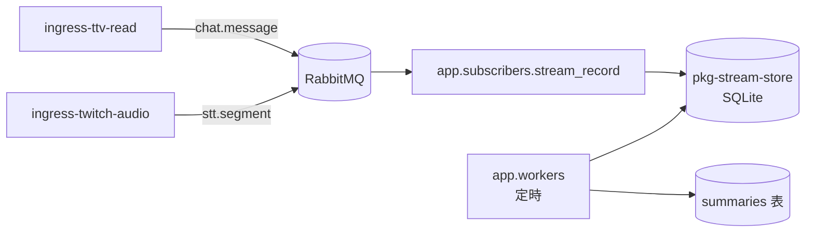

# 直播文字記錄與記憶管線

聊天室觸發問答（指令層）與 Web UI **不在本階段範圍**。本文件描述四層架構，並標記目前實作進度。

## 四層架構

| 層 | 路徑 | 職責 | 狀態 |
|----|------|------|------|
| L0 Ingress | `app/publishers/` | 讀平台 → publish MQ | 已有 |
| L1 記錄 | `app/subscribers/stream_record.py` | `chat.message` / `stt.segment` → SQLite | **Phase 2** |
| L2 記憶 | `app/workers/` | 定期摘要 → `summaries` 表 | **Phase 2** |
| L3 指令 | （規劃） | `!ask` → 查 DB/RAG → LLM → `chat.reply` | 未實作 |
| L4 LLM | （規劃） | 無狀態推理 | 未實作 |

共用持久化：`pkg-stream-store`（SQLite schema + CRUD）。

## Phase 2 資料流（聊天 + STT）



## `RECORD_MODE`

| 值 | 說明 |
|----|------|
| `chat` | 只記 `chat.message` |
| `stt` | 只記 `stt.segment` |
| `both` | 聊天室 + 實況語音 STT；記憶層 **chat / stt 分開摘要**，同一批次共用 `period_start`/`period_end` |

## 為何不做 chat ↔ STT 問答配對

觀眾發聊天 → 主播看到 → 開口回覆 → STT 擷取語音，中間有多段延遲（IRC 傳遞、主播閱讀、反應時間、chunk 切割、Whisper 推論）。因此**無法**用「時間上相鄰的 chat 與 stt 列」可靠推斷誰在回誰。

L2 記憶層的作法：

- **分開摘要**：chat 與 stt 各自摘要，保留各自時間軸敘述
- **period 對齊**：同一 worker 批次共用 `period_start`/`period_end`，方便下游（L3/L4）依時段並列兩份摘要，由 LLM 自行推理語意關聯
- **不做配對**：不在 L2 寫死 Q↔A 規則；若未來要問答分析，應在 L4 用語意理解或更長上下文，而非 timestamp 鄰近配對

## SQLite 表

- `stream_sessions` — 場次
- `text_records` — 原始文字（`source=chat` 或 `stt`）
- `summaries` — 記憶層產出的摘要（`source=chat` / `stt`；`both` 模式每批各一列，period 對齊）
- `memory_checkpoints` — worker 游標

## 環境變數

| 變數 | 預設 | 說明 |
|------|------|------|
| `RECORD_MODE` | `chat` | `chat` / `stt` / `both` |
| `STREAM_DB_PATH` | `data/stream_text.db` | SQLite 路徑 |
| `STREAM_SESSION_ID` | （自動） | 可选手動指定場次 ID |
| `MEMORY_INTERVAL_MINUTES` | `5` | 摘要週期 |
| `MEMORY_LLM_BACKEND` | `template` | `template` 或 `openai`/`gemini` |
| `STT_*` | 見 `.env.example` | `ingress-twitch-audio` 用 |

## 啟動（RECORD_MODE=both）

```powershell
docker compose up -d
uv run python -m app.main run ingress-ttv-read ingress-twitch-audio sub-stream-record
# 另開終端
uv run python -m app.workers --llm-backend gemini
```

`.env` 需設定 `RECORD_MODE=both` 與 `TWITCH_CHANNEL`（STT 與 IRC 共用頻道）。

指令層待 OAuth 就緒後再接。
