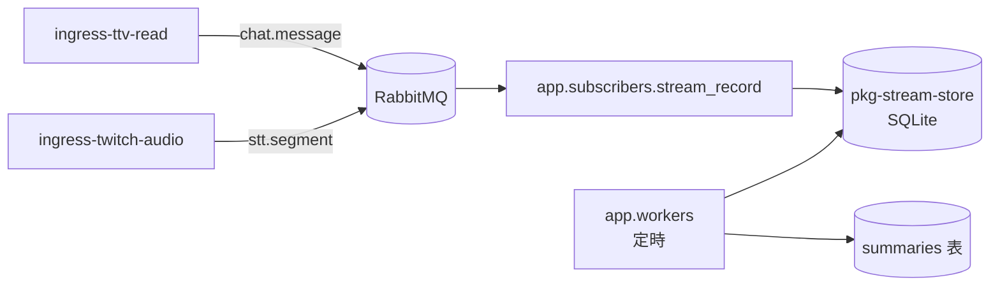

# 直播文字記錄與記憶管線

聊天室觸發問答（指令層）與 Web UI **不在本階段範圍**。本文件描述四層架構，並標記目前實作進度。

## 四層架構

| 層 | 路徑 | 職責 | 狀態 |
|----|------|------|------|
| L0 Ingress | `app/publishers/` | 讀平台 → publish MQ | 已有 |
| L1 記錄 | `app/subscribers/stream_record.py` | `chat.message` / `stt.segment` → SQLite | **Phase 2** |
| L2 記憶 | `app/workers/` | 定期摘要 → `summaries` 表 | **Phase 2** |
| L3 指令 | （規劃） | `!ask` → 查 DB/RAG → LLM → `chat.reply` | 未實作 |
| L4 LLM | （規劃） | 無狀態推理 | 未實作 |

共用持久化：`pkg-stream-store`（SQLite schema + CRUD）。

## Phase 2 資料流（聊天 + STT）



## `RECORD_MODE`

| 值 | 說明 |
|----|------|
| `chat` | 只記 `chat.message` |
| `stt` | 只記 `stt.segment` |
| `both` | 聊天室 + 實況語音 STT；記憶層 **chat / stt 分開摘要**，同一批次共用 `period_start`/`period_end` |

## 為何不做 chat ↔ STT 問答配對

觀眾發聊天 → 主播看到 → 開口回覆 → STT 擷取語音，中間有多段延遲（IRC 傳遞、主播閱讀、反應時間、chunk 切割、Whisper 推論）。因此**無法**用「時間上相鄰的 chat 與 stt 列」可靠推斷誰在回誰。

L2 記憶層的作法：

- **分開摘要**：chat 與 stt 各自摘要，保留各自時間軸敘述
- **period 對齊**：同一 worker 批次共用 `period_start`/`period_end`，方便下游（L3/L4）依時段並列兩份摘要，由 LLM 自行推理語意關聯
- **不做配對**：不在 L2 寫死 Q↔A 規則；若未來要問答分析，應在 L4 用語意理解或更長上下文，而非 timestamp 鄰近配對

## 替代方案：主播本機擷取音訊（未實作）

若 STT 改在**主播開台電腦**擷取本機音訊，而非從 Twitch HLS 拉流（現行 `ingress-twitch-audio`），則 chat 與語音可共用**同一台機器的 wall-clock**，配對準確度會高很多。

### 延遲對比

| 路徑 | chat 時間戳 | STT 時間戳 | 中間延遲 |
|------|-------------|------------|----------|
| **現行（遠端拉流）** | IRC 本機收到 | Twitch CDN → streamlink → chunk → Whisper | 常達 **十～数十秒**（編碼、CDN、chunk 邊界） |
| **本機擷取（提案）** | IRC 本機收到 | 本機麥克風／環境音 chunk → Whisper |  mainly **主播反應時間 + chunk 長度**（通常數秒） |

觀眾發言 → 主播看到（IRC）→ 開口回覆（麥克風）→ STT，若後三段都在同一台 PC 上打 timestamp，「這則 chat 之後、下一個 stt 之前」的啟發式配對才有意義。

### 可能的擷取來源（待選）

| 來源 | 擷到什麼 | 配對用途 |
|------|----------|----------|
| **麥克風** | 主播開口 | 對應「主播回覆內容」 |
| **系統／環路音** | 喇叭輸出（含 chat 提示 TTS、遊戲音） | 可對應「主播實際聽到的提醒」 |
| **混音（虛擬線）** | mic + 指定 app 音軌 | 最完整，設定較複雜 |

### 與現行架構的關係

- 仍 publish 同一 topic：`stt.segment`（payload 可加 `capture_origin=local_mic` 等欄位區分來源）
- 新 Publisher 候選名：`ingress-local-audio`（或 `ingress-host-audio`）
- **部署約束**：必須在主播本機跑 `ingress-ttv-read` + `ingress-local-audio` + `sub-stream-record`；純雲端／旁路監看無法取代
- **L2 記憶層**：即使本機 STT，仍建議 **分開摘要 + period 對齊**；配對若要做，可選在 L2 加「本機模式」啟發式，或留 L4 LLM 處理

### 待釐清（實作前）

1. 主要擷 **麥克風** 還是 **系統音／混音**？
2. Windows 優先（WASAPI loopback）還需跨平台？
3. 配對結果要寫進 DB 新表（`qa_pairs`）還是只在 L4 推理時用？

## SQLite 表

- `stream_sessions` — 場次
- `text_records` — 原始文字（`source=chat` 或 `stt`）
- `summaries` — 記憶層產出的摘要（`source=chat` / `stt`；`both` 模式每批各一列，period 對齊）
- `memory_checkpoints` — worker 游標

## 環境變數

| 變數 | 預設 | 說明 |
|------|------|------|
| `RECORD_MODE` | `chat` | `chat` / `stt` / `both` |
| `STREAM_DB_PATH` | `data/stream_text.db` | SQLite 路徑 |
| `STREAM_SESSION_ID` | （自動） | 可选手動指定場次 ID |
| `MEMORY_INTERVAL_MINUTES` | `5` | 摘要週期 |
| `MEMORY_LLM_BACKEND` | `template` | `template` 或 `openai`/`gemini` |
| `STT_*` | 見 `.env.example` | `ingress-twitch-audio` 用 |

## 啟動（RECORD_MODE=both）

```powershell
docker compose up -d
uv run python -m app.main run ingress-ttv-read ingress-twitch-audio sub-stream-record
# 另開終端
uv run python -m app.workers --llm-backend gemini
```

`.env` 需設定 `RECORD_MODE=both` 與 `TWITCH_CHANNEL`（STT 與 IRC 共用頻道）。

指令層待 OAuth 就緒後再接。
