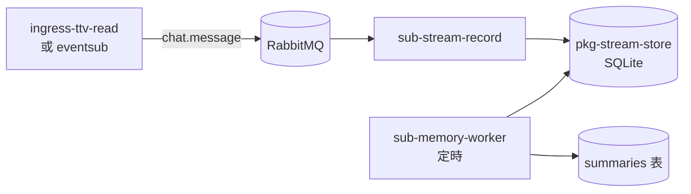

# 直播文字記錄與記憶管線

聊天室觸發問答（指令層）與 Web UI **不在本階段範圍**。本文件描述四層架構，並標記目前實作進度。

## 四層架構

| 層 | Package | 職責 | 狀態 |
|----|---------|------|------|
| L0 Ingress | `ingress-*` | 讀平台 → publish MQ | 已有 |
| L1 記錄 | `sub-stream-record` | `chat.message` → SQLite | **Phase 1（聊天室）** |
| L2 記憶 | `sub-memory-worker` | 定期摘要 → `summaries` 表 | **Phase 1** |
| L3 指令 | `sub-llm-query`（規劃） | `!ask` → 查 DB/RAG → LLM → `chat.reply` | 未實作（涉 OAuth） |
| L4 LLM | `pkg-llm`（規劃） | 無狀態推理 | 未實作 |

共用持久化：`pkg-stream-store`（SQLite schema + CRUD）。

## Phase 1 資料流（僅聊天室文字）



## `RECORD_MODE`（後續擴充）

| 值 | 說明 | Phase |
|----|------|-------|
| `chat` | 只記 `chat.message` | **1** |
| `stt` | 只記 `stt.segment` | 2 |
| `both` | 兩者 | 2 |

## SQLite 表

- `stream_sessions` — 場次
- `text_records` — 原始文字（`source=chat`）
- `summaries` — 記憶層產出的摘要
- `memory_checkpoints` — worker 游標

## 環境變數

| 變數 | 預設 | 說明 |
|------|------|------|
| `STREAM_DB_PATH` | `data/stream_text.db` | SQLite 路徑 |
| `STREAM_SESSION_ID` | （自動） | 可选手動指定場次 ID |
| `MEMORY_INTERVAL_MINUTES` | `5` | 摘要週期 |
| `MEMORY_LLM_BACKEND` | `template` | `template` 或 `openai`/`gemini` |
| `LLM_API_KEY` | — | `openai`/`gemini` 摘要時需要 |

## 啟動（Phase 1）

```powershell
docker compose up -d
uv run python -m app.main run ingress-ttv-read sub-stream-record
# 另開終端
uv run sub-memory-worker
```

指令層（`sub-llm-query` + `twitch-connector`）待 OAuth 就緒後再接。
