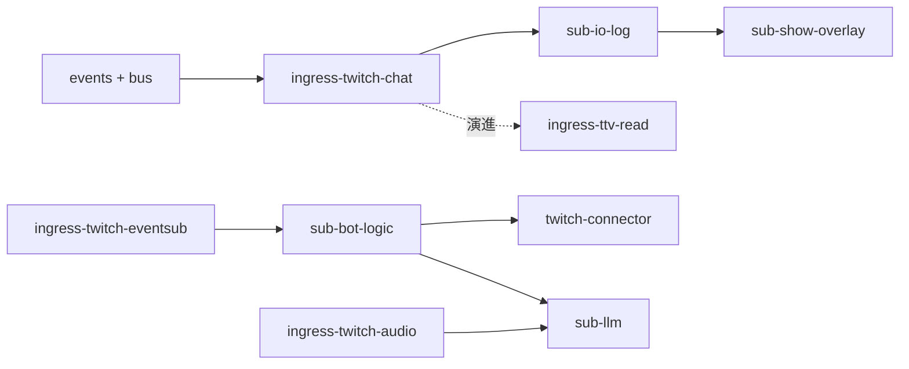

# Pub / Sub 撰寫清單

依 [modules.md](../modules.md)、[events.md](../events.md)、[packages.md](../packages.md) 整理。每個 package 開發前複製對應區塊，完成一項勾一項。

**圖例：** ✅ 本專案已有 · ⚠️ 部分完成 · 📋 規劃中 · 🔮 Future · 📎 參考程式碼

**過渡：** Phase 01 的 `ingress-twitch-chat` 已併入 `ingress-ttv-read`（包 `ttv_chat`）。

---

## 參考程式碼索引

| Package | 參考 repo | 關鍵路徑 |
|---------|-----------|----------|
| `ingress-ttv-read` | [`packages/ttvchat-lens`](../packages/ttvchat-lens) | `src/ttvchat_lens/reader.py` |
| `ingress-yt-read` | [`packages/tubechat-lens`](../packages/tubechat-lens) | `src/tubechat_lens/reader.py` |
| `ingress-twitch-eventsub` | [`twitch_api`](../../twitch_api) | `src/bot/chatbot.py`, `event_handlers.py` |
| `ingress-twitch-audio` | [`llm_twitchat`](../../llm_twitchat) | `services/ingest.py`, `ingest/stt_worker.py` |
| `sub-bot-logic` | `twitch_api` | `chat_commands.py`, `bot_responses.py`, `redemption_responses.py` |
| `sub-tts` | `twitch_api` | `tts/service.py`, `tts/message_filter.py` |
| `sub-show-overlay` | `twitch_api` | `ui/chat_overlay_ipc.py`, `chat_overlay_window.py` |
| `sub-visual` | `twitch_api` | `runtime/subtitle.py` |
| `twitch-connector` | `twitch_api` | `bot/chatbot.py` (`send_message`), `throttle.py` |
| `identity-oauth` | `twitch_api` | `auth/oauth_manager.py`, `runtime/account_service.py` |
| `sub-llm` | `llm_twitchat` | `llm/`, `services/stream_session.py`, `memory/knowledge.py` |
| `sub-stream-record` | `llm_twitchat` | `app/subscribers/stream_record.py` |
| `app.workers` | `app/workers/` |
| `stream-store` | — | 本專案 `packages/stream-store/` |

---

## 速查總表

| Package | 類型 | 狀態 | 發布 topic | 訂閱 topic | 產品 |
|---------|------|------|------------|------------|------|
| `ingress-ttv-read` | Pub | ✅ | `chat.message` | — | A, B 降級 |
| `ingress-yt-read` | Pub | ✅ | `chat.message` | — | A |
| `ingress-twitch-eventsub` | Pub | ✅ | `chat.message`, `eventsub.*` | — | B, C, D |
| `ingress-twitch-audio` | Pub | ✅ | `stt.segment` | — | C |
| `ingress-twitch-stream` | Pub | ✅ | `stream.metadata` | — | C |
| `ingress-local-audio` | Pub | ✅ | `stt.segment` | — | C（開發） |
| `ingress-discord` | Pub | ✅ | `chat.message` | — | — |
| `sub-io-log` | Sub | ✅ | — | `chat.message` | 診斷 |
| `sub-stream-record` | Sub | ✅ | — | `chat.message`, `stt.segment` | 記錄層 L1 |
| `app.workers` | Worker | ✅ | `memory.summary.ready` | —（讀 SQLite） | 記憶層 L2 |
| `sub-memory-board` | Sub | ✅ | — | —（HTTP 讀 DB） | 維運 |
| `sub-show-overlay` | Sub | ✅ | — | `chat.message` | A～D |
| `sub-visual` | Sub | ✅ | — | `chat.message`, `config.changed` | B, C |
| `sub-tts` | Sub | ✅ | — | `chat.message` | B, C |
| `sub-bot-logic` | Sub | ✅ | `chat.reply` | `chat.message`, `eventsub.*`, `config.changed` | B, C |
| `sub-llm` | Sub | ✅ | `chat.reply`, `memory.qa.record` | `chat.message`, `stt.segment`, `stream.metadata`, `config.changed` | C |
| `sub-qa-memory-structured` | Sub | ✅ | `memory.summary.ready` | `memory.qa.record` | C |
| `sub-qa-memory-batch` | Sub | ✅ | — | `chat.reply` | C |
| `twitch-connector` | Sub | ✅ | — | `chat.reply` | B～D |
| `sub-character-brain` | Sub | ✅ | `character.turn`, `chat.reply` | `chat.message` | D |
| `sub-character-voice` | Sub | ✅ | `character.audio.ready` | `character.turn` | D |
| `sub-character-face` | Sub | ✅ | `character.expression.ready` | `character.turn` | D |
| `sub-character-stage` | Sub | ✅ | — | `character.audio.ready`, `character.expression.ready` | D |

---

## 通用骨架（每個 Pub / Sub 都要過）

### 1. Package 初始化

- [ ] 實作於 `app/subscribers/` 或 `app/publishers/`（對齊 streamer-toolkit）
- [ ] 使用 `@register_subscriber` / `@register_publisher` 自動註冊
- [ ] 僅依賴 `events`、`bus`（及該模組必要的第三方 lib）
- [ ] **禁止** import 其他 Sub / Ingress 的業務模組；跨 Sub 共用邏輯放 `app/subscribers/` 或 `app/publishing/`（例：`qa_memory_mode`、`summary_publisher`）

### 2. 契約對齊

- [ ] 在 `events` 定義或引用對應 event dataclass（對齊 [events.md](../events.md)）
- [ ] topic 常數集中於 `events`，不散落 magic string
- [ ] `to_json()` / `from_json()` round-trip 有單元測試

### 3. 執行入口

- [ ] 提供 CLI：`uv run python -m app.subscribers.{module}` 或 `app.main run {name}`
- [ ] 支援環境變數 + `--help`（頻道、MQ URL 等）
- [ ] `uv run python -m app.main list` 可列出（discover 自動註冊）

### 4. 執行期行為

- [ ] 透過 `bus` 的 `EventBus` 連線 MQ（不直接散落 pika 呼叫）
- [ ] Ctrl+C / SIGTERM 優雅關閉（斷開連線、flush log）
- [ ] 可選：週期發布 `system.health` / 錯誤時 `system.error`

### 5. 測試與驗收

- [ ] 單元測試：mapping、序列化、邊界條件
- [ ] 整合測試或手動 E2E 步驟寫在 package README 或本清單驗收區
- [ ] 通過 [solid.md 檢查清單](../solid.md#新-repo--sub-檢查清單)

### 6. 文件回寫

- [ ] [modules.md](../modules.md) 模組狀態更新
- [ ] 若 topic / payload 有變更，先改 [events.md](../events.md)

---

## Publishers（Ingress）

> **Ingress 只做：** 連線 → normalize → `events` 驗證 → `bus.publish()`  
> **禁止：** 訂閱 queue、寫業務 log、呼叫 Sub、直接發話

---

### `ingress-twitch-chat` ✅

Phase 01 Twitch IRC 匿名讀取（本專案已實作，對應設計態 `ingress-ttv-read`）。

| 項目 | 內容 |
|------|------|
| 發布 | `chat.message` |
| 依賴 | `events`, `bus`；IRC 可內建或包 `ttvchat_lens` |
| 參考 | 本專案 `ingress-twitch-chat/`；姊妹專案 `streamer-toolkit` `pub1` |
| 設定 | `TWITCH_CHANNEL`, `RABBITMQ_URL`, `STREAM_EXCHANGE` |

**撰寫清單**

- [x] `LiveChatReader` / IRC 連線與自動重連
- [x] 平台訊息 → `ChatMessageEvent` mapping（`platform: twitch`）
- [x] `bus.publish("chat.message", payload)`
- [x] CLI `--channel` 覆寫 env
- [x] 註冊 `app.main run ingress-twitch-chat`
- [x] workspace 依賴 `packages/ttvchat-lens` 的 `LiveChatReader`
- [ ] 單元測試覆蓋 disconnect / reconnect 邊界

**驗收：** 直播頻道有聊天 → RabbitMQ queue 收到合法 `events.md` JSON。

---

### `ingress-ttv-read` ✅

Twitch IRC 匿名唯讀（通用產品 A ingress）。

| 項目 | 內容 |
|------|------|
| 發布 | `chat.message` |
| 依賴 | `events`, `bus`, `ttvchat-lens`（workspace `packages/ttvchat-lens`） |
| 參考 | 原 [`ttv_chat`](../../ttv_chat) As-is；已收編為 workspace package |
| 設定 | `TWITCH_CHANNEL`, `RABBITMQ_URL` |

**撰寫清單**

- [x] 包裝 `ttvchat_lens.LiveChatReader`，callback 不阻塞讀取 thread
- [x] 支援 `textMessage`、`USERNOTICE`（訂閱 / raid / bits）→ `chat.message` + `raw.message_type`（**不**發 `eventsub.*`）
- [x] `message_id`, `author_name`, `content`, `timestamp`, `channel` 必填
- [x] `author_id`、badge 等放 `raw` 或 optional 欄位
- [x] 吸收 `ingress-twitch-chat` 實作，成為產品 A 正式 ingress
- [x] 單元測試：mock reader → 輸出 JSON 符合 schema

**驗收：** 與 `sub-io-log` 分 process 跑，Sub 即時印出 IRC 訊息。

---

### `ingress-yt-read` ✅

YouTube 直播聊天唯讀。

| 項目 | 內容 |
|------|------|
| 發布 | `chat.message` |
| 依賴 | `events`, `bus`, `tubechat-lens`（workspace `packages/tubechat-lens`） |
| 參考 | 原 [`yt_chat`](../../yt_chat) As-is；已收編為 workspace package |
| 設定 | `YT_CHANNEL` 或 video id, `RABBITMQ_URL` |

**撰寫清單**

- [x] 包裝 `tubechat_lens.LiveChatReader`
- [x] `platform: youtube`；InnerTube `message_id` 對齊
- [x] Super Chat / 會員：`raw.message_type`（`superChat`、`membershipItem`）、`raw.amount`
- [x] 直播結束 / 頻道離線時優雅停止並 log 狀態
- [x] Queue 消費模式（handler 內不做 I/O）
- [x] 單元測試：fixture `ChatMessage.to_dict()` → event payload

**驗收：** 開播中 YouTube 頻道 → `chat.message` 帶 `platform: youtube`。

---

### `ingress-twitch-eventsub` ✅

Twitch EventSub + OAuth 主路徑 ingress。Webhook / WebSocket 僅為**連線方式**，不另建 `ingress-webhook` package。

| 項目 | 內容 |
|------|------|
| 發布 | `chat.message`, `eventsub.*` |
| 依賴 | `events`, `bus`, `identity-oauth`（token） |
| 參考 | [`twitch_api`](../../twitch_api) `src/bot/chatbot.py`, `event_handlers.py` |
| 設定 | OAuth `.env`, `TWITCH_CHANNEL`, websocket 或 webhook |

**應覆蓋的 `eventsub.*`**（見 [events.md#eventsub](../events.md#eventsub) 註冊表）：

`follow`, `raid`, `subscribe`, `subscription_gift`, `subscription_message`, `redemption`, `bits`, `stream_online` / `stream_offline`, `message_delete`, `ban` / `unban`, `poll_*`, `prediction_*`, `hype_train_*`, `automod_message_*`, `first_chat`（應用層合成）

**撰寫清單**

- [x] OAuth token 刷新委派 `identity-oauth`，ingress 不內嵌 auth 邏輯（`EnvTokenProvider`）
- [x] 聊天事件 normalize → `chat.message`（**禁止**在 ingress 做指令判斷）
- [x] 非聊天 EventSub → `eventsub.{event_type}` payload 對齊 [events.md](../events.md#eventsub)
- [x] EventSub 不可用時：由 **App 改啟** `ingress-ttv-read`，停本 ingress（`app.main run --chat-fallback`）
- [x] 單元測試：sample EventSub body → `chat.message` 或 `eventsub.*`
- [x] 從 `twitch_api` 剝離：`event_message` 僅 normalize + publish

**驗收：** 追隨 / 聊天各一則 → 對應 topic 出現在 MQ；重啟 ingress 不影響已運行 Sub。

---

### `ingress-twitch-audio` ✅

直播音訊 STT（產品 C）。對照 `llm_twitchat`，**不**內嵌於 `sub-llm`。

| 項目 | 內容 |
|------|------|
| 發布 | `stt.segment`（可選 `stt.status` / `stt.error`） |
| 依賴 | `events`, `bus`；streamlink + faster-whisper（或抽象 STT Protocol） |
| 參考 | [`llm_twitchat`](../../llm_twitchat) `services/ingest.py`, `ingest/stt_worker.py`, `ingest/stt_filters.py` |
| 設定 | `TWITCH_CHANNEL`, STT 模型路徑、chunk 秒數 |

**撰寫清單**

- [x] streamlink 拉音訊 → chunk → STT → `stt.segment` payload 對齊 [events.md](../events.md#sttsegment)
- [x] 輸入過濾委派 `safety`（幻覺黑名單、靜音閘等）
- [x] **禁止** 訂閱 queue、呼叫 LLM、發 `chat.reply`
- [x] 單元測試：mock 音訊 chunk → segment JSON

**驗收：** 開播頻道 → `sub-llm` 或 `sub-io-log`（若擴充訂閱）收到 `stt.segment`。

---

### `ingress-local-audio` 📋（規劃中，目前不實作）

主播本機音訊 STT，用於改善 chat ↔ 語音時間對齊（詳見 [stream-memory-pipeline.md](../architecture/stream-memory-pipeline.md#替代方案主播本機擷取音訊)）。

| 項目 | 內容 |
|------|------|
| 發布 | `stt.segment`（建議 payload 加 `capture_origin`） |
| 依賴 | faster-whisper；Windows WASAPI loopback／麥克風（待選） |
| 部署 | **僅主播開台 PC**；與 `ingress-ttv-read` 同機 |
| 狀態 | 文件已寫，**程式未開始** |

**撰寫清單（Future）**

- [ ] 本機 PCM 擷取（mic / loopback / 混音擇一）
- [ ] 重用 `STTWorker` + `stt.segment` 契約
- [ ] `@register_publisher` → `ingress-local-audio`
- [ ] 環境變數：`LOCAL_AUDIO_SOURCE=mic|loopback` 等
- [ ] 單元測試：mock PCM chunk → segment JSON

**驗收（Future）：** 本機 IRC + 本機 STT 同跑 → `text_records` 中 chat/stt timestamp 差值主要反映主播反應時間。

---

### `ingress-discord` ✅

| 項目 | 內容 |
|------|------|
| 發布 | `chat.message`（`platform: discord`） |
| 依賴 | `events`, `bus`, `discord.py` |
| 參考 | 無（新建） |
| 設定 | `DISCORD_BOT_TOKEN`, `DISCORD_CHANNEL_ID`, `RABBITMQ_URL` |

**撰寫清單**

- [x] 先在 [events.md](../events.md) 確認 `platform: discord` 欄位約定
- [x] Discord gateway 連線與 intent 設定
- [x] rate limit 與 reconnect 策略（`discord.py` 內建 rate limit；指數退避重連）
- [x] 其餘同通用骨架

**驗收：** Discord 頻道發訊 → RabbitMQ `chat.message` 帶 `platform: discord`；與 `sub-io-log` 分 process 可即時印出。

---

## Subscribers（Sub）

> **Sub 只做：** `bus.subscribe()` → 處理 payload →（可選）`bus.publish()`  
> **禁止：** 連外部平台讀取聊天（除非是 Egress 類如 connector）、import 其他 Sub

---

### `sub-io-log` ✅

診斷用 I/O log Sub。

| 項目 | 內容 |
|------|------|
| 訂閱 | `chat.message` |
| 發布 | — |
| 依賴 | `events`, `bus` |
| 參考 | `streamer-toolkit` `sub1` |
| 設定 | `IO_LOG_PATH`, `IO_LOG_CONSOLE` |

**撰寫清單**

- [x] subscribe `chat.message`
- [x] 終端機一行摘要 + `logs/chat_io.jsonl` JSONL
- [x] 週期統計（received count、最後 timestamp）
- [x] 不修改 payload、不 publish
- [x] 可選：印 `message_id` 前 8 碼便於對照 Pub

**驗收：** Pub 運行時 JSONL 每行合法且符合 `events.md`。

---

### `sub-stream-record` ✅（Phase 2：聊天 + STT）

L1 記錄層：`chat.message` / `stt.segment` → SQLite `text_records`。實作於 **`app/subscribers/stream_record.py`**。

| 項目 | 內容 |
|------|------|
| 訂閱 | `chat.message`（`RECORD_MODE=chat|both`）、`stt.segment`（`stt|both`） |
| 發布 | — |
| 依賴 | `events`, `bus`, `stream-store` |
| 路徑 | `app/subscribers/stream_record.py` |
| 設定 | `STREAM_DB_PATH`, `STREAM_SESSION_ID`, `RECORD_MODE=chat\|stt\|both` |
| 架構 | [stream-memory-pipeline.md](../architecture/stream-memory-pipeline.md) |

**撰寫清單**

- [x] subscribe `chat.message` → `StreamTextStore.append_chat`
- [x] subscribe `stt.segment` → `StreamTextStore.append_stt`（`source=stt`, `author=streamer`）
- [x] `RECORD_MODE` 控制 MQ binding 與 writer 分派
- [x] 自動 session id：`{channel}_{YYYYMMDD}` 或 `STREAM_SESSION_ID`
- [x] 註冊 `app.main run sub-stream-record`
- [x] 單元測試：`StreamRecordWriter`（chat / stt / both）

**驗收：** `RECORD_MODE=both` 時與 `ingress-ttv-read` + `ingress-twitch-audio` 同跑，`text_records` 同時有 `source=chat` 與 `source=stt` 列。

---

### `app.workers` ✅（Phase 2，原 `sub-memory-worker`）

L2 記憶層：定時讀未摘要 chat / stt → 寫 `summaries` 表。實作於 **`app/workers/`**（非 MQ Subscriber）。

| 項目 | 內容 |
|------|------|
| 訂閱 | —（不經 MQ，輪詢 SQLite） |
| 發布 | — |
| 依賴 | `stream-store` |
| 設定 | `STREAM_DB_PATH`, `MEMORY_INTERVAL_MINUTES`, `MEMORY_LLM_BACKEND`, `RECORD_MODE` |
| CLI | `uv run python -m app.workers` / `--once` / `--trigger` |
| 觸發 Topic | `memory.summarize.request` → 常駐 worker 立即跑一輪摘要 |
| 就緒 Topic | `memory.summary.ready` → board / 其他 Sub 即時刷新 |
| 檢視 | CLI `uv run python -m app.memory_view`；Board `sub-memory-board` |

**撰寫清單**

- [x] `fetch_unsummarized_chat` / `fetch_unsummarized_stt` / `fetch_unsummarized_merged` → 摘要 → `save_summary` → `mark_summarized`
- [x] `fetch_unsummarized_merged` 對齊時間軸批次；chat / stt 分開摘要、共用 period
- [x] `MEMORY_LLM_BACKEND=template` 規則摘要（無 API key）
- [x] 可選 `openai` / `gemini` LLM 摘要
- [x] 單元測試：`MemoryWorker.run_once`（chat / stt）

**驗收：** `RECORD_MODE=both` 且 `--once` 後，`summaries` 有 `source=chat` 與 `source=stt` 各一列，且 `period_start`/`period_end` 相同。

---

### `sub-memory-board` ✅（Phase 2）

L2 摘要檢視：本機 HTTP Board + 可選訂閱 `memory.summary.ready` 刷新。

| 項目 | 內容 |
|------|------|
| 訂閱 | `memory.summary.ready`（可 `--no-mq` 關閉） |
| 發布 | — |
| 依賴 | `stream-store`；HTTP |
| CLI | `uv run python -m app.main run sub-memory-board` |
| 檢視 CLI | `uv run python -m app.memory_view` |

**撰寫清單**

- [x] `/api/sessions`、`/api/sessions/{id}/summaries` JSON API
- [x] 本機 HTML Board（預設 `http://127.0.0.1:8765/`）
- [x] MQ 事件 bump revision，前端輪詢刷新
- [x] 單元測試：service + HTTP API

---

### `sub-show-overlay` ✅

聊天 overlay 顯示（產品 A 核心）。

| 項目 | 內容 |
|------|------|
| 訂閱 | `chat.message` |
| 發布 | — |
| 依賴 | `events`, `bus`；HTTP Browser Source + 檔案 IPC |
| 參考 | `twitch_api` `ui/chat_overlay_ipc.py`, `chat_overlay_window.py`, `chat_rich_renderer.py` |
| 設定 | `OVERLAY_LAYOUT`, `OVERLAY_HTTP_PORT`, `OVERLAY_IPC_PATH`, `OVERLAY_FREE_IPC_PATH` |

**撰寫清單**

- [x] 支援兩種 layout 模式：聊天室 overlay、自由視窗（`--layout chat|free|both`）
- [x] 僅訂閱 `chat.message`，渲染 `author_name`、`content`、badge、emote
- [x] UI 與 MQ 消費解耦（queue + 渲染 thread）
- [x] 高流量時丟棄策略或合併（bounded queue + batch drain）
- [x] 不呼叫 Twitch API、不 publish `chat.reply`
- [x] 單元測試：payload → 顯示模型（無 UI 依賴）

**驗收：** 第二個 Sub 綁同 topic，與 `sub-io-log` 同時收到訊息（fan-out）。

---

### `sub-visual` ✅

字幕 / 視覺疊加。

| 項目 | 內容 |
|------|------|
| 訂閱 | `chat.message` |
| 依賴 | `events`, `bus` |
| 參考 | `twitch_api` `runtime/subtitle.py`（含 Spout2 driver） |
| 設定 | `VISUAL_CONFIG_PATH`, `VISUAL_OUTPUT_FILE`, `VISUAL_BACKEND` |

**撰寫清單**

- [x] 彈幕 → 字幕檔或 OBS 文字源更新；可選 Spout2 輸出（driver 可替換）
- [x] 過濾規則可配置（長度、關鍵字）
- [x] 與 `sub-show-overlay` 職責不重疊（本 Sub 偏「字幕檔」而非 overlay UI）
- [x] CLI `uv run sub-visual`；註冊 `app.main run sub-visual`
- [x] 單元測試：filter、sender、service

**驗收：** 與 `sub-io-log` 分 process 跑，OBS 文字源讀取 `obs_subtitle.txt` 即時更新。

---

### `sub-tts` ✅

觀眾彈幕朗讀（**不同於** 產品 D 的 `sub-character-voice`）。

| 項目 | 內容 |
|------|------|
| 訂閱 | `chat.message` |
| 依賴 | `tts`（`TtsEngine` Protocol） |
| 參考 | `twitch_api` `tts/` |

**撰寫清單**

- [x] 依 `tts` 介面播放，不綁死 SAPI5
- [x] 佇列 + 節流（避免彈幕轟炸同時播）
- [x] 可選過濾：指令、URL、黑名單（或委派 `safety` 輸入）
- [x] 不 publish、不發話
- [x] 單元測試：mock `TtsEngine` 驗證佇列順序

---

### `sub-bot-logic` ✅

規則 BOT（指令 + 關鍵字）。

| 項目 | 內容 |
|------|------|
| 訂閱 | `chat.message`, `eventsub.*` |
| 發布 | `chat.reply` |
| 參考 | `twitch_api` `chat_commands.py`, `bot_responses.py`, `redemption_responses.py` |

**撰寫清單**

- [x] 指令表與關鍵字表外置設定（YAML/JSON）
- [x] 處理 `!command` → `chat.reply`（`source: logic-commands`）
- [x] 關鍵字觸發 → `chat.reply`（`source: logic-keywords`）
- [x] `eventsub.*`（follow、redemption、raid…）→ 回覆模板
- [x] `chat.message` + `raw.message_type`（IRC 降級路徑的 USERNOTICE）→ 同一套規則引擎
- [x] **禁止** 直接 `send_message` / Twitch API（交給 `twitch-connector`）
- [x] `correlation_id` 指向觸發的 `message_id`
- [x] 單元測試：各觸發條件 → 預期 `chat.reply` payload

**驗收：** 觀眾打 `!hello` → connector 發出對應聊天（需同時啟 `twitch-connector`）。

---

### `sub-llm` ✅

LLM 問答 Sub（產品 C）。支援 `LLM_BACKEND=template|openai|gemini`；知識庫**僅** `LLM_KNOWLEDGE_BACKEND=chroma`（`ChromaKnowledgeStore` + `ChromaSummaryKnowledgeStore`；`file` 後端已停用）。

| 項目 | 內容 |
|------|------|
| 訂閱 | `chat.message`, `stt.segment`, `stream.metadata` |
| 發布 | `chat.reply` |
| 依賴 | `events`, `bus`, `safety`, `stream-store`（RAG 同步）, `game-info`（IGDB，可選） |
| 參考 | [`llm_twitchat`](../../llm_twitchat) `services/stream_session.py`, `memory/knowledge.py` |

**撰寫清單**

- [x] 觸發條件（如 `!ask`）可配置
- [x] 訂閱 `stt.segment`、`chat.message` 累積短期上下文（`LiveContextBuffer`）
- [x] 訂閱 `stream.metadata` 注入直播狀態（需 `--stack ingress`）
- [x] Bot 近期問答 buffer（問答成對，不寫入 Chroma，避免自我污染）
- [x] Chroma RAG：靜態知識（`kb_global`）+ L2 摘要（`kb_memory`，依 `period_end` 排序）
- [x] 直播中 IGDB 遊戲資料注入（`packages/game-info`）
- [x] 啟動宣告：LLM 成功則問候；失敗則降級模式（Degraded Mode）專業說明
- [x] 輸入閘門：`safety` 過濾觀眾輸入與 STT 片段
- [x] LLM 呼叫抽象（Protocol），不綁死 Gemini（`OpenAiCompatibleLlmClient`）
- [x] 輸出閘門：幻覺 / 敏感詞過濾後才 `publish chat.reply`
- [x] 輸出格式化：`plain_text_for_chat` 去除 Markdown（粗體、連結、程式碼等），配合 `LLM_SYSTEM_PROMPT` 引導 LLM 輸出純文字
- [x] `source: logic-llm`；經 `twitch-connector` 發話，不內嵌 Helix API
- [x] 程序單例鎖（`data/process-locks/`）+ SQLite 冪等去重
- [x] 不與 `sub-bot-logic` 共用程式碼，僅共用 topic
- [x] 單元測試：mock LLM + safety → reply payload

---

### `sub-qa-memory-structured` / `sub-qa-memory-batch` ✅

Bot 問答長期記憶（`QA_MEMORY_MODE=structured|batch`）。兩者互斥，非對應模式 idle 退出；共用 `app/subscribers/qa_memory_mode.py`，**禁止** import `sub_llm`。

| 模組 | 訂閱 | 發布 | 說明 |
|------|------|------|------|
| `sub-qa-memory-structured` | `memory.qa.record` | `memory.summary.ready` | 同次 LLM JSON 評分後寫入 `summaries(source=qa)` |
| `sub-qa-memory-batch` | `chat.reply` | — | 累積 bot 回覆，L2 worker 定時摘要 |

**撰寫清單**

- [x] `QA_MEMORY_MODE` 三態：`none` / `structured` / `batch`
- [x] structured 使用 `app/publishing/summary_publisher`（非 `app.workers`）
- [x] SQLite 冪等去重（`correlation_id`）
- [x] 單元測試：writer + mode 解析

---

### `twitch-connector` ✅

唯一負責「把 `chat.reply` 送到 Twitch」的 Egress Sub。

| 項目 | 內容 |
|------|------|
| 訂閱 | `chat.reply` |
| 依賴 | `events`, `bus`, OAuth token（`identity-oauth`） |
| 參考 | `twitch_api` `send_message`, `throttle.py` |

**撰寫清單**

- [x] 依 `platform` 分派（現階段 `twitch`）
- [x] 節流 / cooldown（全域與 per-channel）
- [x] 失敗重試與 `system.error` 上報
- [x] **禁止** 訂閱 `chat.message` 做邏輯判斷
- [x] 單元測試：mock API → 節流行為
- [x] OAuth 憑證改由 `identity-oauth` 注入（`SyncEnvTokenProvider`）

---

### `sub-character-brain` ✅

產品 D：角色大腦。

| 項目 | 內容 |
|------|------|
| 訂閱 | `chat.message` |
| 發布 | `character.turn`, `chat.reply`（可選） |
| 依賴 | `safety`, `events`, `bus` |
| 參考 | 無（新建） |

**撰寫清單**

- [x] 人設 prompt / 記憶外置配置
- [x] 產出 `character.turn`（`turn_id`, `text`, `emotion`, `correlation_id`）
- [x] 可選同步 `chat.reply` 精簡版至聊天室
- [x] 不直接呼叫 TTS / VTS / OBS
- [x] 單元測試：`chat.message` → `character.turn` schema

---

### `sub-character-voice` ✅

| 項目 | 內容 |
|------|------|
| 訂閱 | `character.turn` |
| 發布 | `character.audio.ready` |
| 依賴 | `tts` |

**撰寫清單**

- [x] 依 `turn_id` 生成音檔路徑或 URL
- [x] `duration_ms`、`visemes` 可選填入
- [x] 與 `sub-tts`（觀眾朗讀）完全分離

---

### `sub-character-face` ✅

| 項目 | 內容 |
|------|------|
| 訂閱 | `character.turn` |
| 發布 | `character.expression.ready` |
| 依賴 | VTS 或表情 driver 抽象 |

**撰寫清單**

- [x] 依 `emotion` / `emotion_intensity` 映射 VTS 參數
- [x] `turn_id` 與 voice 對齊供 stage 同步
- [x] driver 可替換（`vts` WebSocket / `vts-stub` 離線）

---

### `sub-character-stage` ✅

OBS / 舞台同步（等 audio + face 就緒）。

| 項目 | 內容 |
|------|------|
| 訂閱 | `character.audio.ready`, `character.expression.ready` |
| 發布 | — |

**撰寫清單**

- [x] 以 `turn_id` 合併兩路事件（buffer 逾時策略）
- [x] 觸發 OBS WebSocket 或場景切換（`STAGE_DRIVER=obs`）
- [x] 不訂閱 `chat.message`（產品 D 第二層管線）

---

## 控制面（`packages/control`）

| 項目 | 內容 |
|------|------|
| 套件 | `packages/control`：`ModuleDescriptor`、Registry、`try_publish_config_changed` |
| 發布 | `config.changed`（`streamer-config-gui`、Dashboard Shell） |
| 訂閱 | `sub-bot-logic`、`sub-llm`、`sub-visual`（依 `module_id` filter） |

**撰寫清單**

- [x] `events`：`TOPIC_CONFIG_CHANGED`、`ConfigChangedEvent` round-trip 測試
- [x] Registry：`register()` / `get()` / `all_descriptors()`；重複 `module_id` 拒絕
- [x] builtins：`rule-bot`、`llm-bot`、`show-overlay`、`visual-egress`
- [x] Publisher：`publish_config_changed_blocking`、`try_publish_config_changed`（MQ 不可用時 warning）
- [x] Sub 訂閱 `config.changed` 並 in-process reload（L1）
- [x] `streamer-config-gui` PUT 儲存後 publish；knowledge `.md` 仍為 L0 重啟提示

---

## 建議撰寫順序

| 階段 | 建議順序 | 驗證目標 |
|------|----------|----------|
| Phase 01 | `ingress-twitch-chat` → `sub-io-log` | Pub/Sub 解耦 ✅ |
| 產品 A | `ingress-ttv-read` / `ingress-yt-read` → `sub-show-overlay` | fan-out |
| 產品 B | `identity-oauth` → `ingress-twitch-eventsub` → `sub-bot-logic` → `twitch-connector` | 指令回話 |
| 產品 B 降級 | App 改 `ingress-ttv-read` | IRC 唯讀 + `raw.message_type` |
| 產品 C | + `ingress-twitch-audio` → `sub-llm` + `safety` | STT + 聊天觸發 LLM |
| 產品 D | `sub-character-*` 四件組 | `character.turn` 管線 |

---

## 相關文件

- [modules.md](../modules.md) — App 啟用表、產品組裝
- [events.md](../events.md) — payload 權威來源
- [solid.md](../solid.md) — SOLID 檢查清單
- [references.md](../references.md) — 參考程式碼路徑索引
- [development.md](../development.md) — 本機執行與測試
