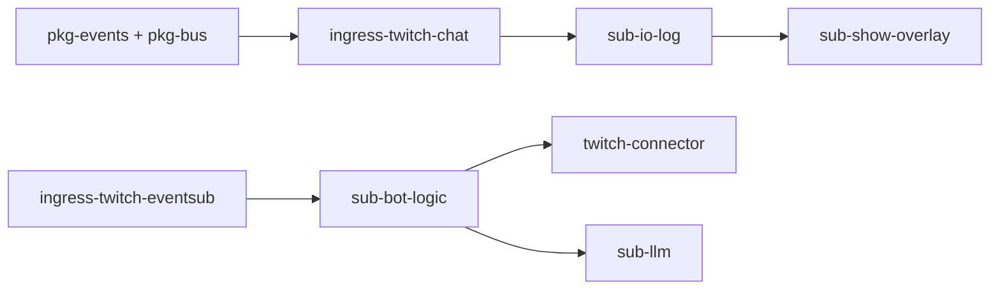

# Pub / Sub 撰寫清單

依 [modules.md](../modules.md)、[events.md](../events.md)、[packages.md](../packages.md) 整理。每個 package 開發前複製對應區塊，完成一項勾一項。

**圖例：** ✅ 本專案已有 · 📋 規劃中 · 🔮 Future · 📎 參考程式碼

---

## 速查總表

| Package | 類型 | 狀態 | 發布 topic | 訂閱 topic | 產品 |
|---------|------|------|------------|------------|------|
| `ingress-twitch-chat` | Pub | ✅ | `chat.message` | — | A, Phase 01 |
| `ingress-ttv-read` | Pub | 📋 | `chat.message` | — | A |
| `ingress-yt-read` | Pub | 📋 | `chat.message` | — | A |
| `ingress-twitch-eventsub` | Pub | 📋 | `chat.message`, `eventsub.*` | — | B, C, D |
| `ingress-discord` | Pub | 🔮 | `chat.message` | — | — |
| `sub-io-log` | Sub | ✅ | — | `chat.message` | 診斷 |
| `sub-show-overlay` | Sub | 📋 | — | `chat.message` | A～D |
| `sub-visual` | Sub | 📋 | — | `chat.message` | B, C |
| `sub-tts` | Sub | 📋 | — | `chat.message` | B, C |
| `sub-bot-logic` | Sub | 📋 | `chat.reply` | `chat.message`, `eventsub.*` | B, C |
| `sub-llm` | Sub | 📋 | `chat.reply` | `chat.message` | C |
| `twitch-connector` | Sub | 📋 | — | `chat.reply` | B～D |
| `sub-character-brain` | Sub | 🔮 | `character.turn`, `chat.reply` | `chat.message` | D |
| `sub-character-voice` | Sub | 🔮 | `character.audio.ready` | `character.turn` | D |
| `sub-character-face` | Sub | 🔮 | `character.expression.ready` | `character.turn` | D |
| `sub-character-stage` | Sub | 🔮 | — | `character.audio.ready`, `character.expression.ready` | D |

---

## 通用骨架（每個 Pub / Sub 都要過）

### 1. Package 初始化

- [ ] 建立 `{package}/pyproject.toml`，加入 uv workspace（根 `pyproject.toml` `members`）
- [ ] 套件名與 import 路徑一致（如 `ingress_twitch_chat`、`sub_io_log`）
- [ ] 僅依賴 `pkg-events`、`pkg-bus`（及該模組必要的第三方 lib）
- [ ] **禁止** import 其他 Sub / Ingress 的業務模組

### 2. 契約對齊

- [ ] 在 `pkg-events` 定義或引用對應 event dataclass（對齊 [events.md](../events.md)）
- [ ] topic 常數集中於 `pkg-events`，不散落 magic string
- [ ] `to_json()` / `from_json()` round-trip 有單元測試

### 3. 執行入口

- [ ] 提供 CLI：`uv run {package-name}` 或 `python -m {module}`
- [ ] 支援環境變數 + `--help`（頻道、MQ URL 等）
- [ ] 註冊至 `app/processes/`（`@register_publisher` / `@register_subscriber`）
- [ ] `uv run python -m app.main list` 可列出

### 4. 執行期行為

- [ ] 透過 `pkg-bus` 的 `EventBus` 連線 MQ（不直接散落 pika 呼叫）
- [ ] Ctrl+C / SIGTERM 優雅關閉（斷開連線、flush log）
- [ ] 可選：週期發布 `system.health` / 錯誤時 `system.error`

### 5. 測試與驗收

- [ ] 單元測試：mapping、序列化、邊界條件
- [ ] 整合測試或手動 E2E 步驟寫在 package README 或本清單驗收區
- [ ] 通過 [solid.md 檢查清單](../solid.md#新-repo--sub-檢查清單)

### 6. 文件回寫

- [ ] [modules.md](../modules.md) 模組狀態更新
- [ ] 若 topic / payload 有變更，先改 [events.md](../events.md)

---

## Publishers（Ingress）

> **Ingress 只做：** 連線 → normalize → `pkg-events` 驗證 → `bus.publish()`  
> **禁止：** 訂閱 queue、寫業務 log、呼叫 Sub、直接發話

---

### `ingress-twitch-chat` ✅

Phase 01 Twitch IRC 匿名讀取（本專案已實作，對應設計態 `ingress-ttv-read`）。

| 項目 | 內容 |
|------|------|
| 發布 | `chat.message` |
| 依賴 | `pkg-events`, `pkg-bus`；IRC 可內建或包 `ttvchat_lens` |
| 參考 | 本專案 `ingress-twitch-chat/`；姊妹專案 `streamer-toolkit` `pub1` |
| 設定 | `TWITCH_CHANNEL`, `RABBITMQ_URL`, `STREAM_EXCHANGE` |

**撰寫清單**

- [x] `LiveChatReader` / IRC 連線與自動重連
- [x] 平台訊息 → `ChatMessageEvent` mapping（`platform: twitch`）
- [x] `bus.publish("chat.message", payload)`
- [x] CLI `--channel` 覆寫 env
- [x] 註冊 `app.main run ingress-twitch-chat`
- [ ] 改為 path 依賴 `ttv_chat` 的 `LiveChatReader`（可選重構）
- [ ] 單元測試覆蓋 disconnect / reconnect 邊界

**驗收：** 直播頻道有聊天 → RabbitMQ queue 收到合法 `events.md` JSON。

---

### `ingress-ttv-read` 📋

Twitch IRC 匿名唯讀（通用產品 A ingress）。

| 項目 | 內容 |
|------|------|
| 發布 | `chat.message` |
| 依賴 | `pkg-events`, `pkg-bus`, `ttvchat_lens`（path `../../ttv_chat`） |
| 參考 | [`ttv_chat`](../../ttv_chat)；可合併或取代 `ingress-twitch-chat` |
| 設定 | `TWITCH_CHANNEL`, `RABBITMQ_URL` |

**撰寫清單**

- [ ] 包裝 `ttvchat_lens.LiveChatReader`，callback 不阻塞讀取 thread
- [ ] 支援 `textMessage`、`USERNOTICE`（訂閱 / raid / bits）→ 統一或分 topic
- [ ] `message_id`, `author_name`, `content`, `timestamp`, `channel` 必填
- [ ] `author_id`、badge 等放 `raw` 或 optional 欄位
- [ ] 與 `ingress-twitch-chat` 差異說明（合併或並存策略）
- [ ] 單元測試：mock reader → 輸出 JSON 符合 schema

**驗收：** 與 `sub-io-log` 分 process 跑，Sub 即時印出 IRC 訊息。

---

### `ingress-yt-read` 📋

YouTube 直播聊天唯讀。

| 項目 | 內容 |
|------|------|
| 發布 | `chat.message` |
| 依賴 | `pkg-events`, `pkg-bus`, `tubechat_lens`（path `../../yt_chat`） |
| 參考 | [`yt_chat`](../../yt_chat) |
| 設定 | `YT_CHANNEL` 或 video id, `RABBITMQ_URL` |

**撰寫清單**

- [ ] 包裝 `tubechat_lens.LiveChatReader`
- [ ] `platform: youtube`；InnerTube `message_id` 對齊
- [ ] 直播結束 / 頻道離線時優雅停止並 log 狀態
- [ ] Queue 消費模式（handler 內不做 I/O）
- [ ] 單元測試：fixture `ChatMessage.to_dict()` → event payload

**驗收：** 開播中 YouTube 頻道 → `chat.message` 帶 `platform: youtube`。

---

### `ingress-twitch-eventsub` 📋

Twitch EventSub + OAuth 主路徑 ingress。

| 項目 | 內容 |
|------|------|
| 發布 | `chat.message`, `eventsub.*`（如 `eventsub.follow`） |
| 依賴 | `pkg-events`, `pkg-bus`, `identity-oauth`（token） |
| 參考 | [`twitch_api`](../../twitch_api) `bot/`, `event_handlers.py` |
| 設定 | OAuth `.env`, `TWITCH_CHANNEL`, webhook 或 websocket 模式 |

**撰寫清單**

- [ ] OAuth token 刷新委派 `identity-oauth`，ingress 不內嵌 auth 邏輯
- [ ] 聊天事件 normalize → `chat.message`（**禁止**在 ingress 做指令判斷）
- [ ] 非聊天 EventSub → `eventsub.{event_type}` payload 對齊 [events.md](../events.md#eventsub)
- [ ] EventSub 不可用時：文件說明是否降級 `ingress-ttv-read`（App 層切換，非 import fallback）
- [ ] 單元測試：sample webhook body → 兩種 topic 輸出
- [ ] 從 `twitch_api` 剝離時：`event_message` 僅保留 normalize + publish

**驗收：** 追隨 / 聊天各一則 → 對應 topic 出現在 MQ；重啟 ingress 不影響已運行 Sub。

---

### `ingress-discord` 🔮

| 項目 | 內容 |
|------|------|
| 發布 | `chat.message`（`platform: discord`） |
| 參考 | 無（新建） |

**撰寫清單**

- [ ] 先在 [events.md](../events.md) 確認 `platform: discord` 欄位約定
- [ ] Discord gateway 連線與 intent 設定
- [ ] rate limit 與 reconnect 策略
- [ ] 其餘同通用骨架

---

## Subscribers（Sub）

> **Sub 只做：** `bus.subscribe()` → 處理 payload →（可選）`bus.publish()`  
> **禁止：** 連外部平台讀取聊天（除非是 Egress 類如 connector）、import 其他 Sub

---

### `sub-io-log` ✅

診斷用 I/O log Sub。

| 項目 | 內容 |
|------|------|
| 訂閱 | `chat.message` |
| 發布 | — |
| 依賴 | `pkg-events`, `pkg-bus` |
| 參考 | `streamer-toolkit` `sub1` |
| 設定 | `IO_LOG_PATH`, `IO_LOG_CONSOLE` |

**撰寫清單**

- [x] subscribe `chat.message`
- [x] 終端機一行摘要 + `logs/chat_io.jsonl` JSONL
- [x] 週期統計（received count、最後 timestamp）
- [x] 不修改 payload、不 publish
- [ ] 可選：印 `message_id` 前 8 碼便於對照 Pub

**驗收：** Pub 運行時 JSONL 每行合法且符合 `events.md`。

---

### `sub-show-overlay` 📋

聊天 overlay 顯示（產品 A 核心）。

| 項目 | 內容 |
|------|------|
| 訂閱 | `chat.message` |
| 發布 | — |
| 依賴 | `pkg-events`, `pkg-bus`；UI 層（WebSocket / 本地視窗） |
| 參考 | `twitch_api` `ui/chat_overlay_*` |
| 設定 | overlay 埠號、樣式路徑 |

**撰寫清單**

- [ ] 僅訂閱 `chat.message`，渲染 `author_name`、`content`、badge、emote
- [ ] UI 與 MQ 消費解耦（queue + 渲染 thread）
- [ ] 高流量時丟棄策略或合併（避免 UI 卡死）
- [ ] 不呼叫 Twitch API、不 publish `chat.reply`
- [ ] 單元測試：payload → 顯示模型（無 UI 依賴）

**驗收：** 第二個 Sub 綁同 topic，與 `sub-io-log` 同時收到訊息（fan-out）。

---

### `sub-visual` 📋

字幕 / 視覺疊加。

| 項目 | 內容 |
|------|------|
| 訂閱 | `chat.message` |
| 參考 | `twitch_api` `runtime/subtitle.py` |

**撰寫清單**

- [ ] 彈幕 → 字幕檔或 OBS 文字源更新
- [ ] 過濾規則可配置（長度、關鍵字）
- [ ] 與 `sub-show-overlay` 職責不重疊（本 Sub 偏「字幕檔」而非 overlay UI）

---

### `sub-tts` 📋

觀眾彈幕朗讀（**不同於** 產品 D 的 `sub-character-voice`）。

| 項目 | 內容 |
|------|------|
| 訂閱 | `chat.message` |
| 依賴 | `pkg-tts`（`TtsEngine` Protocol） |
| 參考 | `twitch_api` `tts/` |

**撰寫清單**

- [ ] 依 `pkg-tts` 介面播放，不綁死 SAPI5
- [ ] 佇列 + 節流（避免彈幕轟炸同時播）
- [ ] 可選過濾：指令、URL、黑名單（或委派 `pkg-safety` 輸入）
- [ ] 不 publish、不發話
- [ ] 單元測試：mock `TtsEngine` 驗證佇列順序

---

### `sub-bot-logic` 📋

規則 BOT（指令 + 關鍵字）。

| 項目 | 內容 |
|------|------|
| 訂閱 | `chat.message`, `eventsub.*` |
| 發布 | `chat.reply` |
| 參考 | `twitch_api` `chat_commands.py`, `bot_responses.py` |

**撰寫清單**

- [ ] 指令表與關鍵字表外置設定（YAML/JSON）
- [ ] 處理 `!command` → `chat.reply`（`source: logic-commands`）
- [ ] 關鍵字觸發 → `chat.reply`（`source: logic-keywords`）
- [ ] EventSub 事件（如 follow）→ 回覆模板
- [ ] **禁止** 直接 `send_message` / Twitch API（交給 `twitch-connector`）
- [ ] `correlation_id` 指向觸發的 `message_id`
- [ ] 單元測試：各觸發條件 → 預期 `chat.reply` payload

**驗收：** 觀眾打 `!hello` → connector 發出對應聊天（需同時啟 `twitch-connector`）。

---

### `sub-llm` 📋

LLM 問答 Sub（產品 C）。

| 項目 | 內容 |
|------|------|
| 訂閱 | `chat.message` |
| 發布 | `chat.reply` |
| 依賴 | `pkg-events`, `pkg-bus`, `pkg-safety`（雙閘門） |
| 參考 | [`llm_twitchat`](../../llm_twitchat) |

**撰寫清單**

- [ ] 觸發條件（如 `!ask`、@mention）可配置
- [ ] 輸入閘門：`pkg-safety` 過濾觀眾輸入
- [ ] LLM 呼叫抽象（Protocol），不綁死 Gemini
- [ ] 輸出閘門：幻覺 / 敏感詞過濾後才 `publish chat.reply`
- [ ] `source: logic-llm`；STT 若需要另建 ingress（不內嵌 streamlink）
- [ ] 不與 `sub-bot-logic` 共用程式碼，僅共用 topic
- [ ] 單元測試：mock LLM + safety → reply payload

---

### `twitch-connector` 📋

唯一負責「把 `chat.reply` 送到 Twitch」的 Egress Sub。

| 項目 | 內容 |
|------|------|
| 訂閱 | `chat.reply` |
| 依賴 | `pkg-events`, `pkg-bus`, OAuth token（`identity-oauth`） |
| 參考 | `twitch_api` `send_message`, `throttle.py` |

**撰寫清單**

- [ ] 依 `platform` 分派（現階段 `twitch`）
- [ ] 節流 / cooldown（全域與 per-channel）
- [ ] 失敗重試與 `system.error` 上報
- [ ] **禁止** 訂閱 `chat.message` 做邏輯判斷
- [ ] 單元測試：mock API → 節流行為

---

### `sub-character-brain` 🔮

產品 D：角色大腦。

| 項目 | 內容 |
|------|------|
| 訂閱 | `chat.message` |
| 發布 | `character.turn`, `chat.reply`（可選） |
| 依賴 | `pkg-safety`, `pkg-events`, `pkg-bus` |
| 參考 | 無（新建） |

**撰寫清單**

- [ ] 人設 prompt / 記憶外置配置
- [ ] 產出 `character.turn`（`turn_id`, `text`, `emotion`, `correlation_id`）
- [ ] 可選同步 `chat.reply` 精簡版至聊天室
- [ ] 不直接呼叫 TTS / VTS / OBS
- [ ] 單元測試：`chat.message` → `character.turn` schema

---

### `sub-character-voice` 🔮

| 項目 | 內容 |
|------|------|
| 訂閱 | `character.turn` |
| 發布 | `character.audio.ready` |
| 依賴 | `pkg-tts` |

**撰寫清單**

- [ ] 依 `turn_id` 生成音檔路徑或 URL
- [ ] `duration_ms`、`visemes` 可選填入
- [ ] 與 `sub-tts`（觀眾朗讀）完全分離

---

### `sub-character-face` 🔮

| 項目 | 內容 |
|------|------|
| 訂閱 | `character.turn` |
| 發布 | `character.expression.ready` |
| 依賴 | VTS 或表情 driver 抽象 |

**撰寫清單**

- [ ] 依 `emotion` / `emotion_intensity` 映射 VTS 參數
- [ ] `turn_id` 與 voice 對齊供 stage 同步
- [ ] driver 可替換（`driver: vts`）

---

### `sub-character-stage` 🔮

OBS / 舞台同步（等 audio + face 就緒）。

| 項目 | 內容 |
|------|------|
| 訂閱 | `character.audio.ready`, `character.expression.ready` |
| 發布 | — |

**撰寫清單**

- [ ] 以 `turn_id` 合併兩路事件（buffer 逾時策略）
- [ ] 觸發 OBS WebSocket 或場景切換
- [ ] 不訂閱 `chat.message`（產品 D 第二層管線）

---

## 建議撰寫順序

| 階段 | 建議順序 | 驗證目標 |
|------|----------|----------|
| Phase 01 | `ingress-twitch-chat` → `sub-io-log` | Pub/Sub 解耦 ✅ |
| 產品 A | `ingress-yt-read` 或 `ingress-ttv-read` → `sub-show-overlay` | fan-out 兩 Sub |
| 產品 B | `ingress-twitch-eventsub` → `sub-bot-logic` → `twitch-connector` | 指令回話 |
| 產品 C | + `sub-llm` + `pkg-safety` | 雙閘門 LLM |
| 產品 D | `sub-character-*` 四件組 | `character.turn` 管線 |

---

## 相關文件

- [modules.md](../modules.md) — App 啟用表、產品組裝
- [events.md](../events.md) — payload 權威來源
- [solid.md](../solid.md) — SOLID 檢查清單
- [references.md](../references.md) — 參考程式碼路徑索引
- [development.md](../development.md) — 本機執行與測試
