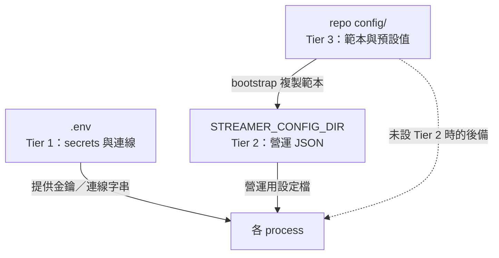

# 設定指南（三層設定故事）

本文件是 streamer_toolbox 設定的**唯一指南**。專案的設定分三層，職責不同，請依層級修改正確的位置，避免把營運值寫進版控範本。



## Tier 1 — `.env`（機密與連線）

放置**機密與環境連線資訊**：API key、token、RabbitMQ 連線、各模組的行為旗標。

- 範本：[`.env.example`](../.env.example)；GCP 純文字部署另見 [`deploy/.env.gcp.example`](../deploy/.env.gcp.example)。
- 設定方式：`copy .env.example .env`，至少填 `TWITCH_CHANNEL`。
- **絕不進版控**（`.gitignore` 與 pre-commit 會阻擋 `.env`）。
- 機密應在 GCP 以 Secret Manager 管理（見 [deployment-gcp.md](deployment-gcp.md)）。

`.env` 也包含 `STREAMER_CONFIG_DIR`，用來指向 Tier 2 的營運設定目錄。

## Tier 2 — `STREAMER_CONFIG_DIR`（營運 JSON）

放置**會依直播主／頻道調整的營運設定**，與程式碼解耦，便於多環境切換。預設位置為
`~/streamer-config`（GCP 容器內為 `/config`）。

| 檔案 | 用途 | 對應模組 |
|------|------|----------|
| `bot_responses.json` | 關鍵字自動回覆 | twitch-connector |
| `redemption_responses.json` | 頻道點數兌換回覆 | twitch-connector |
| `llm_subscriber.json` | LLM 觸發詞、安全設定 | sub-llm |
| `sub_visual.json` | 視覺／字幕設定 | sub-visual |
| `character_brain.json` | 角色人設與觸發設定 | sub-character-brain |
| `knowledge/<channel>.md` | 頻道知識庫 | sub-llm |

建立或更新此目錄請用 bootstrap（僅複製不存在的檔案，不覆寫既有設定）：

```powershell
uv run python -m streamer_config bootstrap
uv run python -m streamer_config validate
```

## Tier 3 — repo `config/`（範本與預設值）

版控內的**範本與預設值**，不是營運設定本身：

- `config/examples/*.example.json`：bootstrap 用的乾淨範本。
- `config/llm_subscriber.json`、`config/sub_visual.json`、`config/character_brain.json`：開發預設值，也是未設定 Tier 2 時的後備。
- `config/knowledge/`：知識庫範本。

請勿直接編輯這裡的檔案當作 production 設定。詳見 [`config/README.md`](../config/README.md)。

## 路徑解析優先序

各模組透過 `streamer_config.resolve_path()` 解析設定路徑，優先序固定為：

```
專屬環境變數  >  STREAMER_CONFIG_DIR  >  repo config/ 預設值
```

| 設定鍵 | 專屬環境變數 | Tier 3 後備 |
|--------|--------------|-------------|
| `bot_responses` | `BOT_RESPONSES_PATH` | `config/`（範例） |
| `redemption_responses` | `BOT_REDEMPTIONS_PATH` | `config/`（範例） |
| `llm_subscriber` | `LLM_SUBSCRIBER_CONFIG` | `config/llm_subscriber.json` |
| `sub_visual` | `VISUAL_CONFIG_PATH` | `config/sub_visual.json` |
| `character_brain` | `CHARACTER_BRAIN_CONFIG` | `config/character_brain.json` |
| `knowledge_dir` | `LLM_KNOWLEDGE_PATH` | `data/knowledge` |

因此設定 `STREAMER_CONFIG_DIR` 後，這些模組會自動讀取該目錄內的對應檔案；若另設專屬環境變數則最優先。

## `.env` 重疊對照（本機 vs GCP）

[`.env.example`](../.env.example) 與 [`deploy/.env.gcp.example`](../deploy/.env.gcp.example) 部分重疊，依用途區分：

| 類別 | 代表變數 | 說明 |
|------|----------|------|
| 共用 | `RABBITMQ_URL`、`STREAM_EXCHANGE`、`TWITCH_*`、`GOOGLE_AI_*`、`LLM_*` | 兩種環境皆需 |
| GCP 專用 | `STREAM_DB_PATH=/data/...`、`STREAMER_CONFIG_DIR=/config`、`RECORD_MODE=chat` | 由 `docker-compose.gcp.yml` 注入，純文字部署不跑 STT |
| 本機／STT 專用 | `STT_*`、`LOCAL_AUDIO_DEVICE`、`VOICE_CLONE_*` | 僅本機含語音的部署需要 |

兩份範本暫不合併為單檔；GCP 機密請改用 Secret Manager。
