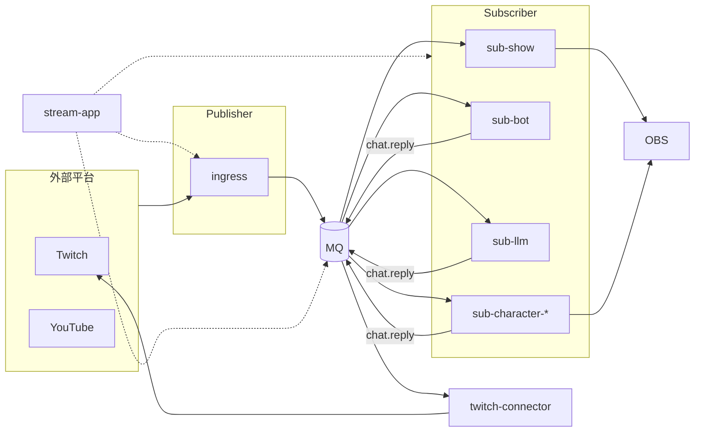
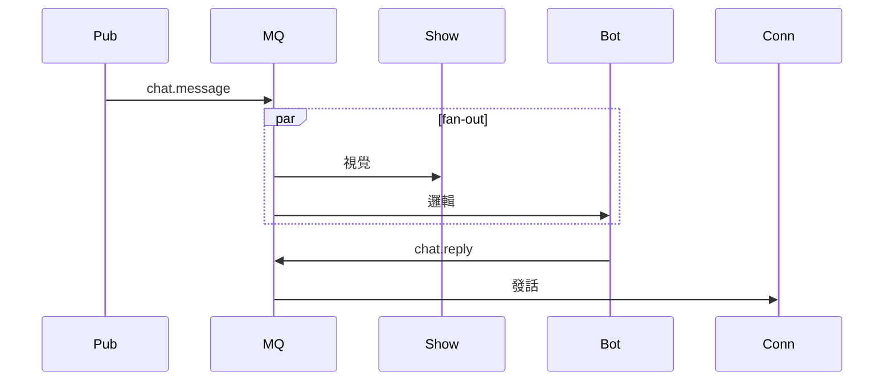

# 部署與 Pub/Sub

運行時拓撲與通訊規則。模組與啟用見 [modules.md](modules.md)；契約見 [events.md](events.md)。

## 部署圖

## 部署邊界

| 邊界 | 內容 | 現階段 |
|------|------|--------|
| External | 平台 API / 聊天 | 雲端 |
| Backend | Ingress、MQ、Logic Sub、Egress、Identity | 可與 LocalPC **同機** |
| LocalPC | overlay、stage、OBS、Dashboard | Windows 實況機 |

`twitch_api` 現況為單機：`RuntimeEventBus` + Bot thread + UI + overlay 子進程。

## 通訊規則

| 規則 | 說明 |
|------|------|
| Fan-out | 多 Sub 可訂閱同一 `chat.message` |
| 第二輪 publish | 發話用 `chat.reply`；角色用 `character.turn` |
| 禁止 | Sub A 直接呼叫 Sub B 的方法 |
| Identity | OAuth 僅 bootstrap，不進訊息管線 |

產品 D 的 `character.turn` 管線見 [use-cases/05-character.md](use-cases/05-character.md)。

## MQ 選型

| 階段 | 實作 | Package |
|------|------|---------|
| 本機驗證 | in-process queue | `pkg-bus` InProcessBus |
| 多 process / 多 repo | RabbitMQ 或 Redis Streams | `pkg-bus` 外部 adapter |
| 產品 A 極簡 | ingress 直連 show（可跳過 MQ） | — |

Phase 01 的 RabbitMQ fan-out 已於姊妹專案 [streamer-toolkit](references/streamer-toolkit.md) 驗證（`pub1` → fanout `twitch.chat` → `sub1` / `sub2`）。

介面：`publish(topic, dict)` / `subscribe(topic, handler)`。

## 可觀測性

| 機制 | 說明 |
|------|------|
| `system.health` | 各 Sub 週期發布；App 彙總 |
| `system.error` | 例外與降級 |
| 集中 log | App 收集各 Sub stdout 或 structlog |
| Dashboard | 可選訂閱 `system.*` 與 `chat.message` 監控 |

App **只監控不處理**業務事件內容（SOLID **S**）。

## 未來演進

| 變更 | 條件 |
|------|------|
| Backend 上 VPS | 外部 MQ；Dashboard WebSocket 遠端 |
| EventSub Webhook | `ingress-webhook` + HTTPS |
| 多頻道 | App 多 tenant 設定 |
| LLM / 角色雲端化 | Sub 可部署 GPU 節點，仍經 MQ |

## 相關文件

- [packages.md](packages.md) — 各 package 部署單元
- [solid.md](solid.md) — 依賴規則
