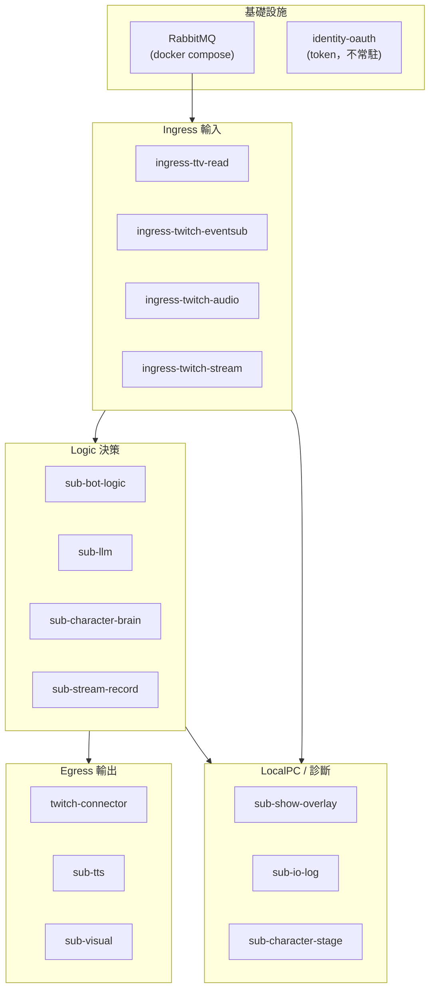

# 運作模式指南

本文件回答一件事：**我想讓 Bot 做什麼？要開哪些程序？**

不用記「產品 A/B/C/D」或「模式 0～5」也能選方案。底下編號只當快捷鍵，詳見 [附錄：編號對照](#附錄編號對照)。

技術安裝步驟見 [getting-started.md](getting-started.md)。

---

## 30 秒選方案

回答兩個問題就夠：

**問題 1：Bot 要在聊天室說話嗎？**

| 你的答案 | 往哪走 |
|----------|--------|
| 不要，只要看彈幕 | → [方案：只看彈幕](#方案只看彈幕) |
| 要，但只用 AI 回 `!ask` | → [方案：AI 問答](#方案ai-問答)（**多數人、含你目前的設定**） |
| 要，用自訂指令/關鍵字（如 `!ping`、追隨通知） | → 繼續問題 2 |
| 要，虛擬角色驅動 OBS/VTS | → [方案：虛擬角色](#方案虛擬角色) |

**問題 2：（有自訂指令時）也要 AI `!ask` 嗎？**

| 你的答案 | 方案 |
|----------|------|
| 要 | [方案：規則 Bot + AI](#方案規則-bot--ai)（完整版 twitch_api + LLM） |
| 不要 | [方案：規則 Bot](#方案規則-bot)（twitch_api 去掉 AI） |

還沒裝好、只想測試聊天有沒有進系統？→ [方案：安裝測試](#方案安裝測試)。

---

## 架構分層（選方案前先看這段）

本專案用 **Pub/Sub** 組裝。文件與對照表都依**層**分，不用「觀眾感受到什麼」這種模糊說法。

### 兩種「東西」不要混在一起

| 種類 | 在哪 | 你做什麼 | 範例 |
|------|------|----------|------|
| **`packages/` 套件** | `packages/*` | **不單獨啟動**；被 app 程序 import | `bus`、`events`、`identity-oauth`、`safety`、`streamer-config` |
| **`app` 程序** | `app/` 的 ingress / sub | **`app.main run` 啟動** | `ingress-ttv-read`、`sub-llm`、`twitch-connector` |
| **常駐 worker** | `app.workers` | 另開終端 | L2 記憶摘要 |
| **設定小工具** | `tools/streamer-config-gui` | 需要時手動開；**不進 stack** | 只寫設定檔 |

**選方案 = 選要在每一層啟動哪些 app 程序。**  
`packages/` 是底層能力；營運上你要勾的是右邊的程序名。

### 五層模型



| 層 | 職責 | 訂閱/發布（摘要） |
|----|------|-------------------|
| **基礎設施** | MQ 通訊、OAuth token | 所有程序連 `bus`；發話前需 token |
| **Ingress** | 外部平台 → `chat.message` / `stt.segment` / `eventsub.*` | 只收資料，**不**判斷指令 |
| **Logic** | 規則或 AI 決策 → `chat.reply` | `sub-bot-logic` 與 `sub-llm` **互斥場景**可並存，但各司其職 |
| **Egress** | `chat.reply` → Twitch 發話 | 通常只有 `twitch-connector` |
| **LocalPC** | overlay、字幕、OBS；或診斷 log | 不發聊天回覆 |

**舊專案對到層：**

| 舊工具 | 主要是哪幾層 |
|--------|----------------|
| `llm_twitchat` | Ingress（聊天+STT）+ Logic（`sub-llm`）；**沒有** Egress 發話 |
| `twitch_api` 規則 | Ingress（EventSub）+ Logic（`sub-bot-logic`）+ Egress + 可選 LocalPC |
| 設定 GUI（本專案） | **不在管線內**；`streamer-config` 只寫檔 |

---

## 方案：AI 問答

**適合誰**：只要 `!ask`，不要 `!ping`、關鍵字、追隨通知。  
**近似舊工具**：`llm_twitchat`（但本專案會在聊天室代發回覆）。  
**你目前的實際狀態**：就是這個方案。

### 各層啟用（本方案勾選）

| 層 | 程序 | 本方案 |
|----|------|:------:|
| 基礎設施 | RabbitMQ + OAuth（發話） | ● |
| Ingress | `ingress-ttv-read` | ● |
| Ingress | `ingress-twitch-audio` | ● |
| Ingress | `ingress-twitch-stream` | ● |
| Ingress | `ingress-twitch-eventsub` | — |
| Logic | `sub-llm` | ● |
| Logic | `sub-bot-logic` | — |
| Logic | `sub-stream-record` | ● |
| Egress | `twitch-connector` | ● |
| Worker | `app.workers` | ○ |

● 必開 · ○ 建議加開 · — 不開

### 需要準備

| 項目 | 必要？ |
|------|:------:|
| Docker（RabbitMQ） | 是 |
| Twitch OAuth（Bot 能發話） | 是 |
| Google AI API key（Gemini） | 是 |
| 知識庫 md | 建議 |

### 怎麼開（兩個終端）

```powershell
# 終端 1：收聊天、語音轉文字、直播標題/遊戲
uv run python -m app.main run --stack ingress

# 終端 2：AI 問答 + 發話
uv run python -m app.main run --stack llm
```

可選第三終端：長期記憶摘要 `uv run python -m app.workers --llm-backend gemini`

完整安裝教學：[getting-started.md §3](getting-started.md#第-3-層實際跑-llm-bota-問答方案)。

---

## 方案：規則 Bot

**適合誰**：要 `!ping`、關鍵字、追隨/訂閱通知，**不要** AI。  
**近似舊工具**：`twitch_api` 去掉 LLM 與桌面 GUI。

### 各層啟用

| 層 | 程序 | 本方案 |
|----|------|:------:|
| 基礎設施 | RabbitMQ + OAuth | ● |
| Ingress | `ingress-twitch-eventsub` | ● |
| Ingress | `ingress-ttv-read` | ○¹ |
| Logic | `sub-bot-logic` | ● |
| Logic | `sub-llm` | — |
| Egress | `twitch-connector` | ● |

¹ EventSub 聊天不可用時，runner 可 fallback 改開 `ingress-ttv-read`。

### 怎麼開（兩個終端）

```powershell
# 終端 1：OAuth 收聊天 + 事件
uv run python -m app.main run ingress-twitch-eventsub

# 終端 2：規則判斷 + 發話
uv run python -m app.main run sub-bot-logic twitch-connector
```

設定檔：`bot_responses.json`、`redemption_responses.json`（可用 `uv run streamer-config-gui` 編輯）。

---

## 方案：規則 Bot + AI

**適合誰**：規則 Bot **和** `!ask` 都要。  
**近似舊工具**：完整 `twitch_api` + LLM。

= [AI 問答](#方案ai-問答) + [規則 Bot](#方案規則-bot)，但發話程序只開一份：

```powershell
# 終端 1
uv run python -m app.main run ingress-twitch-eventsub ingress-twitch-audio ingress-twitch-stream sub-stream-record

# 終端 2：只跑規則，不發話
uv run python -m app.main run sub-bot-logic

# 終端 3：AI + 發話（含規則產生的回覆）
uv run python -m app.main run --stack llm
```

---

## 方案：只看彈幕

**適合誰**：彈幕顯示在 OBS overlay，Bot 完全不說話、不跑 AI。

```powershell
uv run python -m app.main run sub-show-overlay    # 終端 1
uv run python -m app.main run ingress-ttv-read    # 終端 2
```

不需 OAuth、不需 API key。

---

## 方案：虛擬角色

**適合誰**：聊天驅動 VTuber 角色（TTS + 表情 + OBS），**不是**聊天室裡的規則 Bot 或 `!ask`。

```powershell
uv run python -m app.main run ingress-twitch-eventsub sub-character-brain sub-character-voice sub-character-face sub-character-stage
```

**不要**同時開 `sub-bot-logic`、`sub-llm`。詳見 [05-character.md](use-cases/05-character.md)。

---

## 方案：安裝測試

**適合誰**：剛裝好，只想確認「聊天有進系統」，還不要 OAuth 和 AI。

```powershell
uv run python -m app.main run sub-io-log          # 終端 1
uv run python -m app.main run ingress-ttv-read  # 終端 2
```

終端 1 出現 `[HH:MM:SS] … author: content` 即通過。

---

## 分層啟用總表（依程序名）

圖例：**●** 方案預設啟動 · **○** 可選加開 · **—** 不啟動

### 基礎設施

| 元件 | 安裝測試 | 只看彈幕 | AI 問答 | 規則 Bot | 規則+AI | 虛擬角色 |
|------|:--------:|:--------:|:-------:|:--------:|:-------:|:--------:|
| RabbitMQ | ● | ● | ● | ● | ● | ● |
| OAuth（發話/EventSub） | — | — | ● | ● | ● | ○ |

### Ingress（`app` Publisher）

| 程序 | 安裝測試 | 只看彈幕 | AI 問答 | 規則 Bot | 規則+AI | 虛擬角色 |
|------|:--------:|:--------:|:-------:|:--------:|:-------:|:--------:|
| `ingress-ttv-read` | ● | ● | ● | ○ | ○ | ○ |
| `ingress-twitch-eventsub` | — | — | — | ● | ● | ● |
| `ingress-twitch-audio` | — | — | ● | — | ● | — |
| `ingress-twitch-stream` | — | — | ● | — | ● | — |

### Logic（`app` Subscriber）

| 程序 | 安裝測試 | 只看彈幕 | AI 問答 | 規則 Bot | 規則+AI | 虛擬角色 |
|------|:--------:|:--------:|:-------:|:--------:|:-------:|:--------:|
| `sub-io-log` | ● | — | — | — | — | — |
| `sub-bot-logic` | — | — | — | ● | ● | — |
| `sub-llm` | — | — | ● | — | ● | — |
| `sub-stream-record` | — | — | ● | — | ● | — |
| `sub-character-brain` | — | — | — | — | — | ● |

### Egress

| 程序 | 安裝測試 | 只看彈幕 | AI 問答 | 規則 Bot | 規則+AI | 虛擬角色 |
|------|:--------:|:--------:|:-------:|:--------:|:-------:|:--------:|
| `twitch-connector` | — | — | ● | ● | ●² | ○ |
| `sub-tts` | — | ○ | ○ | ○ | ○ | — |
| `sub-visual` | — | ○ | ○ | ○ | ○ | — |

² 規則+AI：建議只由 `--stack llm` 內的 connector 發話；`sub-bot-logic` 終端不併開 connector。

### LocalPC / 角色管線

| 程序 | 安裝測試 | 只看彈幕 | AI 問答 | 規則 Bot | 規則+AI | 虛擬角色 |
|------|:--------:|:--------:|:-------:|:--------:|:-------:|:--------:|
| `sub-show-overlay` | — | ● | ○ | ○ | ○ | ○ |
| `sub-character-voice` | — | — | — | — | — | ● |
| `sub-character-face` | — | — | — | — | — | ● |
| `sub-character-stage` | — | — | — | — | — | ● |

### Worker / 設定（不在 Pub/Sub 管線內）

| 元件 | 安裝測試 | 只看彈幕 | AI 問答 | 規則 Bot | 規則+AI | 虛擬角色 |
|------|:--------:|:--------:|:-------:|:--------:|:-------:|:--------:|
| `app.workers`（L2 記憶） | — | — | ○ | — | ○ | — |
| `streamer-config-gui` | — | ○ | ○ | ○ | ○ | ○ |

`packages/streamer-config` 等套件：所有方案共用，**不列入上表**（沒有獨立啟動步驟）。

### 預定義 stack 對照

| 方案 | 終端指令 | 等價於上表 |
|------|----------|------------|
| AI 問答 | `--stack ingress` + `--stack llm` | Ingress 列 + `sub-llm` + connector |
| 純文字 AI 問答（GCP，不含 STT） | `--stack ingress-chat` + `--stack llm` | 同上但 ingress 不含 STT |
| 僅直播上下線宣告 | `--stack ingress` + `--stack status` | metadata ingress + `sub-live-status` + connector（不含 `!ask`） |
| 安裝測試 | `sub-io-log` + `ingress-ttv-read` | 診斷 + 最小 Ingress |

其餘方案需**手動**依上表勾程序名（見各方案章節）。

---

## 設定檔與小工具

各方案的 JSON/md 設定建議放在外部目錄（與主程式分離）：

```powershell
powershell -NoProfile -File scripts/setup_user_config.ps1
uv run streamer-config-gui   # http://127.0.0.1:1426
```

`.env` 建議設 `STREAMER_CONFIG_DIR=%USERPROFILE%/streamer-config`。

改完設定要重啟對應程序：

| 改了什麼 | 重啟誰 |
|----------|--------|
| `bot_responses.json` | `sub-bot-logic` |
| `knowledge/*.md`、`llm_subscriber.json` | `sub-llm` |
| `sub_visual.json` | `sub-visual` |

---

## 常見問題

### 為什麼文件其他地方寫「產品 C」？

開發文件裡的「產品 C」有時指**完整版**（規則 + AI）。  
本指南的 **[AI 問答](#方案ai-問答)** 是精簡版（只有 AI），也是 [getting-started.md](getting-started.md) 的預設路線。

| 說法 | 意思 |
|------|------|
| 產品 C 精簡 | = 本文件的 **AI 問答** |
| 產品 C 完整 | = 本文件的 **規則 Bot + AI** |

### 只開 `--stack llm` 為什麼沒反應？

`--stack llm` 不讀聊天，一定要另開 `--stack ingress`（或任何會收聊天的程序）。

### 和舊專案怎麼對？

| 你以前用 | 現在用哪個方案 |
|----------|----------------|
| `llm_twitchat` | **AI 問答** |
| `twitch_api` 規則功能 | **規則 Bot** 或 **規則 Bot + AI** |
| 只要 overlay | **只看彈幕** |

---

## 附錄：編號對照

給已在其他文件看到編號的人：

| 編號 | 本文件方案 |
|------|------------|
| 模式 0 | [安裝測試](#方案安裝測試) |
| 模式 1 | [只看彈幕](#方案只看彈幕) |
| 模式 2 | [AI 問答](#方案ai-問答) |
| 模式 3 | [規則 Bot + AI](#方案規則-bot--ai) |
| 模式 4 | [規則 Bot](#方案規則-bot) |
| 模式 5 | [虛擬角色](#方案虛擬角色) |

| 產品字母 | 本文件方案 |
|----------|------------|
| 產品 A | 只看彈幕 |
| 產品 B | 規則 Bot |
| 產品 C 精簡 | AI 問答 |
| 產品 C 完整 | 規則 Bot + AI |
| 產品 D | 虛擬角色 |

---

## 相關文件

| 文件 | 內容 |
|------|------|
| [getting-started.md](getting-started.md) | 安裝與 OAuth（以 AI 問答為主） |
| [modules.md](modules.md) | 程序名與開發用啟用表 |
| [architecture/identity-auth.md](architecture/identity-auth.md) | OAuth 單/雙帳號 |
