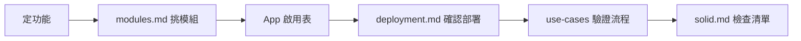

# 總覽

stream_helper 是直播互動助手的**設計文件庫**（無可執行程式）。目標：用可組裝的 Pub/Sub 模組，從參考專案演進出產品 A～D。

## 設計約束（強制）

1. **[SOLID](solid.md)** — 所有現有與未來 repo/package 必須遵守
2. **Pub/Sub** — 模組間以 topic 通訊，禁止 Sub 之間直接 import 業務邏輯
3. **App 層不寫業務** — 只啟停 Pub/Sub、設定、log/monitor
4. **一張圖一個問題** — 能力 / 部署 / 流程分開寫

## 決策流程

## 文件地圖

| 文件 | 職責 |
|------|------|
| [solid.md](solid.md) | SOLID 準則、反例、新 Sub 檢查清單 |
| [modules.md](modules.md) | 模組目錄、產品 A～D、App 啟用表 |
| [events.md](events.md) | Topic 與 payload 契約（**唯一 schema 來源**） |
| [packages.md](packages.md) | 規劃中的 repo/package 與依賴 |
| [deployment.md](deployment.md) | Pub/Sub 部署、MQ、fan-out |
| [references.md](references.md) | 姊妹專案、twitch_api 遷移（含 streamer-toolkit 專章） |
| [use-cases/](use-cases/) | 各產品時序圖 |

## 三種圖表

| 圖表 | 文件 | 禁止 |
|------|------|------|
| 能力 / 模組 | modules.md | 畫執行順序箭頭 |
| 部署 | deployment.md | 畫所有 Sub 互聯 |
| 流程 | use-cases/*.md | 一張畫全系統 |

## 產品一覽

| 產品 | 說明 | 時序 |
|------|------|------|
| **A** | 純聊天 overlay | [01-show.md](use-cases/01-show.md) |
| **B** | 規則 BOT（指令/關鍵字） | [02-rule-bot.md](use-cases/02-rule-bot.md) |
| **C** | LLM BOT + 雙閘門安全層 | [03-llm-bot.md](use-cases/03-llm-bot.md) |
| **D** | 虛擬角色（文字+TTS+表情+OBS） | [05-character.md](use-cases/05-character.md) |

橫切：[04-oauth.md](use-cases/04-oauth.md)（產品 B/C/D 需 Twitch 發話/EventSub 時）

## 架構分層

| 層 | 職責 | 範例模組 |
|----|------|----------|
| Ingress | 收外部資料 → publish | `ingress-yt-read` |
| Core | App、MQ | `core-orchestrator`, `core-eventbus` |
| Logic | 規則、LLM、角色腦 | `logic-commands`, `sub-character-brain` |
| Egress | 發話、TTS、字幕 | `egress-chat-send`, `sub-character-voice` |
| LocalPC | UI、overlay、OBS 合成 | `local-show`, `sub-character-stage` |
| Identity | OAuth bootstrap | `identity-oauth` |

## 參考專案

| 專案 | 角色 |
|------|------|
| `streamer-toolkit` | Phase 01 可執行範本（RabbitMQ Pub/Sub POC） |
| `twitch_api` | As-is 基準（半模組化，有 SOLID 債務） |
| `yt_chat` / `ttv_chat` | Ingress 模板（唯讀、`ChatMessage`） |
| `stream_helper` | To-be 規劃 |

詳見 [references.md](references.md)。

## 實作計畫

| 階段 | 文件 |
|------|------|
| Phase 01 | [plans/phase-01-rabbitmq-io-poc.md](plans/phase-01-rabbitmq-io-poc.md) — RabbitMQ 1 Pub + 1 Sub（Twitch → I/O Log） |

參考實作位於姊妹 repo [`streamer-toolkit`](../streamer-toolkit)，詳見 [references/streamer-toolkit.md](references/streamer-toolkit.md)。計畫書中的 `implementations/phase-01/` 為設計時暫定路徑，以 toolkit 為準。

## 範圍外（設計 repo 本身）

`docs/` 不含可執行程式；實作依 [packages.md](packages.md) 與 [solid.md](solid.md) 進行。
