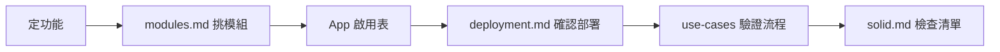

# 總覽

streamer-toolbox 是直播互動助手的**設計文件庫與 stream-core 實作根目錄**。目標：用可組裝的 Pub/Sub 模組，從參考專案演進出產品 A～D。想跑 Bot 見 [getting-started.md](getting-started.md)；開發環境見 [development.md](development.md)。

## 設計約束（強制）

1. **[SOLID](solid.md)** — 所有現有與未來 repo/package 必須遵守
2. **Pub/Sub** — 模組間以 topic 通訊，禁止 Sub 之間直接 import 業務邏輯
3. **App 層不寫業務** — 只啟停 Pub/Sub、設定、log/monitor
4. **一張圖一個問題** — 能力 / 部署 / 流程分開寫

## 決策流程

## 文件地圖

| 文件 | 職責 |
|------|------|
| [getting-started.md](getting-started.md) | **營運者**：安裝、驗證、啟動 Bot |
| [operator-modes.md](operator-modes.md) | **營運者**：方案選擇、**分層**啟用表（Ingress/Logic/Egress） |
| [solid.md](solid.md) | SOLID 準則、反例、新 Sub 檢查清單 |
| [modules.md](modules.md) | 模組目錄、產品 A～D、App 啟用表 |
| [events.md](events.md) | Topic 與 payload 契約（**唯一 schema 來源**） |
| [packages.md](packages.md) | `packages/` 套件與 app 模組對照 |
| [deployment.md](deployment.md) | Pub/Sub 部署、MQ、fan-out |
| [references.md](references.md) | 姊妹專案、參考程式碼、Sub/Ingress 對照、twitch_api 遷移 |
| [references/llm-twitchat.md](references/llm-twitchat.md) | 產品 C As-is（llm_twitchat） |
| [use-cases/](use-cases/) | 各產品時序圖 |
| [architecture/identity-auth.md](architecture/identity-auth.md) | **授權與身分設計**（Helix / 雙帳號 / streamlink） |
| [architecture/stream-memory-pipeline.md](architecture/stream-memory-pipeline.md) | L1/L2 記憶管線 |
| [checklists/pub-sub-writing.md](checklists/pub-sub-writing.md) | Pub/Sub 各 package 撰寫清單 |

## 三種圖表

| 圖表 | 文件 | 禁止 |
|------|------|------|
| 能力 / 模組 | modules.md | 畫執行順序箭頭 |
| 部署 | deployment.md | 畫所有 Sub 互聯 |
| 流程 | use-cases/*.md | 一張畫全系統 |

## 產品一覽

| 產品 | 說明 | 時序 |
|------|------|------|
| **A** | 純聊天 overlay | [01-show.md](use-cases/01-show.md) |
| **B** | 規則 BOT（指令/關鍵字） | [02-rule-bot.md](use-cases/02-rule-bot.md) |
| **C** | LLM BOT + 雙閘門安全層 | [03-llm-bot.md](use-cases/03-llm-bot.md) |
| **D** | 虛擬角色（文字+TTS+表情+OBS） | [05-character.md](use-cases/05-character.md) |

橫切：[04-oauth.md](use-cases/04-oauth.md)（摘要）→ [architecture/identity-auth.md](architecture/identity-auth.md)（完整設計）

## 架構分層

| 層 | 職責 | 範例模組 |
|----|------|----------|
| Ingress | 收外部資料 → publish | `ingress-yt-read` |
| Core | App、MQ | `core-orchestrator`, `core-eventbus` |
| Logic | 規則、LLM、角色腦 | `logic-commands`, `sub-character-brain` |
| Egress | 發話、TTS、字幕 | `egress-chat-send`, `sub-character-voice` |
| LocalPC | UI、overlay、OBS 合成 | `local-show`, `sub-character-stage` |
| Identity | OAuth bootstrap | `identity-oauth` |

## 姊妹專案與參考程式碼

| 專案 | 類型 | 角色 |
|------|------|------|
| `streamer-toolkit` | **姊妹專案** | 早期 Phase 01 架構參考（RabbitMQ Pub/Sub POC） |
| `twitch_api` | 歷史參考 | 產品 B As-is；邏輯已遷移至本專案 |
| `llm_twitchat` | 歷史參考 | 產品 C As-is；已演進為 `sub-llm` + `ingress-twitch-audio` |

`ttvchat-lens`、`tubechat-lens` 已收編於 `packages/`，非外部依賴。

詳見 [references.md](references.md)、[references/llm-twitchat.md](references/llm-twitchat.md)。

## 實作計畫

| 階段 | 文件 |
|------|------|
| Phase 01 | [plans/phase-01-rabbitmq-io-poc.md](plans/phase-01-rabbitmq-io-poc.md) — RabbitMQ 1 Pub + 1 Sub（Twitch → I/O Log） |

Phase 01 已於本專案實作（見 [development.md](development.md)）。姊妹專案 [`streamer-toolkit`](../streamer-toolkit) 為早期架構參考，詳見 [references/streamer-toolkit.md](references/streamer-toolkit.md)。

## 實作範圍

`docs/` 為契約與設計；程式碼置於 workspace package（見 [development.md](development.md)），依 [packages.md](packages.md) 與 [solid.md](solid.md) 擴充。
