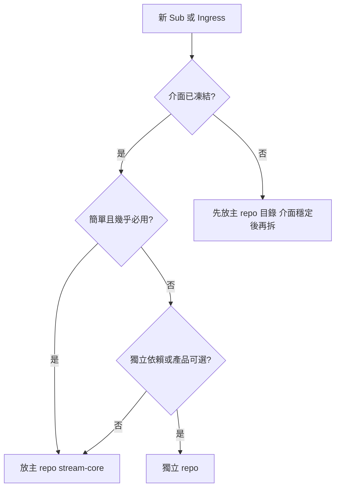
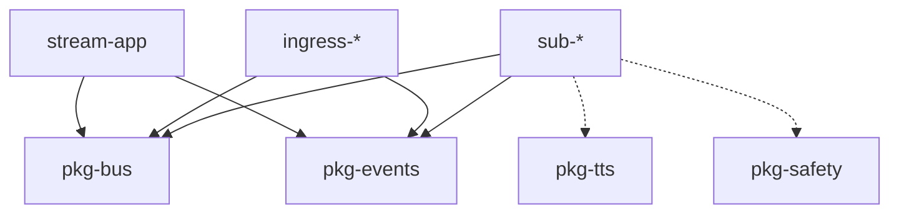

# Repo / Package 規劃

每個黃框為獨立 repo 或 monorepo 子 package。依 [SOLID](solid.md)：**Sub 不互相 import，只經 MQ + `pkg-*` 介面**。

**拆 repo 與否不影響執行期架構**——只要遵守 `events.md` 與 `pkg-bus` 契約，放主 repo 或獨立 repo 行為相同。

## 主 repo vs 獨立 repo

### 主 repo（`stream-core`）

承載**簡單、基礎、幾乎一定會用到**的程式；與 App 同生命週期、同版號發布。

| 歸主 repo | 理由 |
|-----------|------|
| `pkg-events`, `pkg-bus` | 全體契約，變更需全專案對齊 |
| `stream-app` | 編排核心 |
| `sub-io-log` | Phase 01 診斷用；開發/維運必備，邏輯極簡 |
| `identity-oauth`（未來） | 橫切基礎設施，多產品共用 |

主 repo 內仍用 **package 目錄分離**（SOLID **S**），只是不另外開 Git remote。

### 獨立 repo

**介面定義明確之後**（`events.md` + `EventBus` Protocol 穩定），再將下列拆出：

| 適合獨立 repo | 理由 |
|---------------|------|
| `sub-bot-logic`, `sub-llm` | 領域複雜、迭代頻繁 |
| `sub-show-overlay` | 前端/UI 技術棧不同 |
| `sub-character-*` | 產品 D 專用，可選安裝 |
| `ingress-twitch-eventsub` | 可從 `twitch_api` 演進，體積大 |
| `twitch-connector` | 可獨立升級平台 API 適配 |

### 決策流程



| 問題 | 是 → | 否 → |
|------|------|------|
| `events.md` / `pkg-bus` 已穩定？ | 可考慮拆 | 先留主 repo |
| 少於 ~200 行、無重型依賴？ | 傾向主 repo | 傾向獨立 |
| 只有部分產品需要？ | 獨立 repo | 主 repo |

**拆 repo 的必要條件：** 僅依賴 `pkg-events`、`pkg-bus`（及已發布的 pkg PyPI/git 依賴），**禁止**依賴其他 Sub 的原始碼。

### 目錄對照（規劃）

```
skymiku/
├── stream_helper/              # 設計文件（本 repo）
├── stream-core/                # 主 repo：pkg-*、app、基礎 sub
│   ├── pkg-events/
│   ├── pkg-bus/
│   ├── stream-app/
│   └── sub-io-log/
├── sub-bot-logic/              # 獨立 repo（介面穩定後）
├── sub-show-overlay/
└── ...
```

Phase 01 實作可先在 `stream_helper/implementations/phase-01/` 孵化，穩定後整包遷入 `stream-core/`，或直接把 `stream-core` 當實作根目錄。

## 目錄結構（長期 skymiku 全景）

```
skymiku/
├── stream_helper/          # 本文件庫（設計 only）
├── pkg-events/             # 事件 schema
├── pkg-bus/                # EventBus Protocol + adapters
├── pkg-tts/                # TtsEngine 抽象
├── pkg-safety/             # SafetyFilter 抽象
├── ingress-yt-read/        # 或維持 yt_chat 演進
├── ingress-ttv-read/
├── ingress-twitch-eventsub/
├── sub-show-overlay/
├── sub-bot-logic/
├── sub-llm/
├── sub-character-brain/
├── sub-character-voice/
├── sub-character-face/
├── sub-character-stage/
├── twitch-connector/
├── stream-app/             # core-orchestrator 實作
├── twitch_api/             # 現有，逐步拆出上述
├── yt_chat/
└── ttv_chat/
```

不必一次建齊；**產品 A 可僅 2～3 個 package**。

## 共用 Package（`pkg-*`）

| Package | 職責 | 依賴 | 被誰用 |
|---------|------|------|--------|
| `pkg-events` | Topic 常數、payload dataclass、JSON 驗證 | 無（或僅 pydantic） | 全部 Sub |
| `pkg-bus` | `EventBus` Protocol；`InProcessBus`、`RabbitMQBus` | `pkg-events` | ingress、所有 sub、app |
| `pkg-tts` | `TtsEngine` Protocol；SAPI5 實作 | 無平台依賴 | `sub-tts`, `sub-character-voice` |
| `pkg-safety` | `SafetyFilter` Protocol；輸入/輸出實作 | `pkg-events` | `sub-llm`, `sub-character-brain` |

抽取時機見 [solid.md](solid.md#何時抽-pkg--共用-repo)。

## Subscriber Package

| Package | 模組 ID | 訂閱 topic | 發布 topic | Repo |
|---------|---------|------------|------------|------|
| `sub-io-log` | （診斷） | `chat.message` | — | **主 repo** |
| `sub-show-overlay` | `local-show` | `chat.message` | — | 獨立 |
| `sub-visual` | `egress-subtitle` | `chat.message` | — | 獨立 |
| `sub-tts` | `egress-tts` | `chat.message` | — | 獨立 |
| `sub-bot-logic` | `logic-*` | `chat.message`, `eventsub.*`, `sa.message` | `chat.reply` | 獨立 |
| `sub-llm` | `logic-llm` | `chat.message` | `chat.reply` | 獨立 |
| `sub-character-brain` | character brain | `chat.message` | `character.turn`, `chat.reply` | 獨立 |
| `sub-character-voice` | character voice | `character.turn` | `character.audio.ready` | 獨立 |
| `sub-character-face` | character face | `character.turn` | `character.expression.ready` | 獨立 |
| `sub-character-stage` | character stage | `character.audio.ready`, `character.expression.ready` | — | 獨立 |
| `twitch-connector` | `egress-chat-send` | `chat.reply` | — | 獨立 |

## Publisher / Ingress Package

| Package | 發布 topic |
|---------|------------|
| `ingress-yt-read` | `chat.message` |
| `ingress-ttv-read` | `chat.message` |
| `ingress-twitch-eventsub` | `chat.message`, `eventsub.*` |
| `ingress-sa-bridge` | `sa.message` |

Ingress **只做**：連線 → normalize → `pkg-events` 驗證 → publish。

## App Package

`stream-app`（`core-orchestrator`）：

- 讀取 YAML 產品設定（見 [modules.md](modules.md)）
- 啟停各 Sub process 或 in-process 註冊
- 注入 MQ 位址、OAuth env 路徑
- 訂閱 `system.*` 做 health monitor
- **不包含**指令、LLM、overlay 渲染邏輯

## 依賴規則



| 允許 | 禁止 |
|------|------|
| `sub-*` → `pkg-*` | `sub-a` → `sub-b` |
| `ingress-*` → `pkg-*` | `sub-*` → `twitch_api.src.bot` |
| `app` → 啟停契約（CLI/entrypoint） | `pkg-events` → 任何 Sub |

## 各產品最小 package 集

| 產品 | packages |
|------|----------|
| A | `pkg-events`, `pkg-bus`, `ingress-*`, `sub-show-overlay` |
| B | A 基礎 + `identity-oauth`, `ingress-twitch-eventsub`, `sub-bot-logic`, `twitch-connector` |
| C | B + `pkg-safety`, `sub-llm` |
| D | `pkg-events`, `pkg-bus`, `pkg-tts`, `pkg-safety`, `ingress-*`, `sub-character-*`×4, `twitch-connector`；可選 `sub-show-overlay` |

## Python 技術約定（實作階段）

- 套件管理：**uv**（與姊妹專案一致）
- Python：**>= 3.11**
- 介面：`typing.Protocol` 或抽象 base class
- 設定：環境變數 + YAML；secrets 不進 repo

## 相關文件

- [events.md](events.md) — payload 定義歸入 `pkg-events`
- [modules.md](modules.md) — 模組 ID 與產品組裝
- [deployment.md](deployment.md) — 運行時部署
