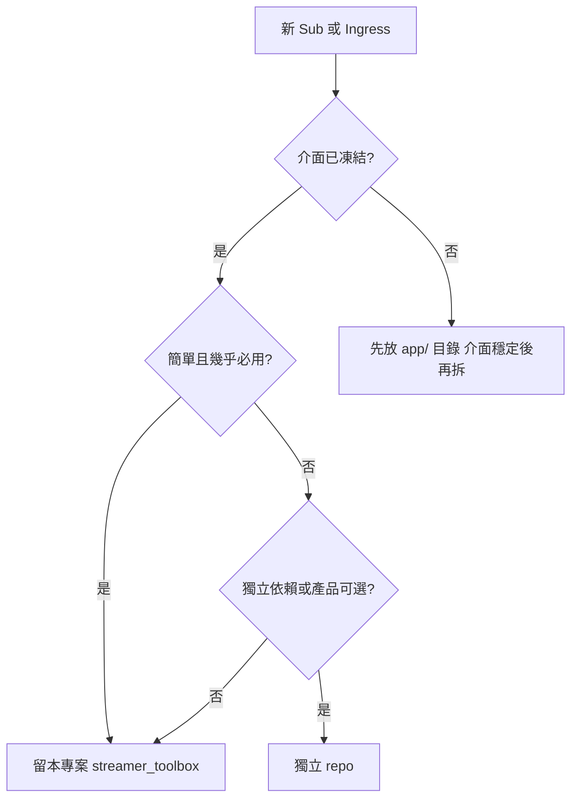
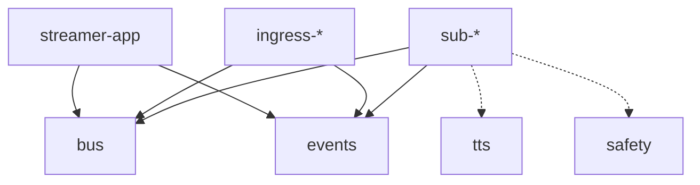

# Repo / Package 規劃

每個黃框為獨立 repo 或 monorepo 子 package。依 [SOLID](solid.md)：**Sub 不互相 import，只經 MQ + `packages/` 共用介面**。

**拆 repo 與否不影響執行期架構**——只要遵守 `events.md` 與 `bus` 契約，留本專案或拆獨立 repo 行為相同。

## Monorepo 架構規則（強制）

| 規則 | 摘要 |
|------|------|
| **職責分離** | `packages/` = 無狀態基礎設施與合約；`app/` = 商業邏輯、Pub/Sub 組裝 |
| **單向依賴** | `app/` → `packages/` 允許；`packages/` → `app/` **禁止** |
| **命名** | 套件在 `packages/` 下，不帶 `pkg-` 前綴（`bus`、`events`、`safety`…） |
| **uv Workspace** | 根 `pyproject.toml`：`members = ["app", "packages/*", "tools/streamer-config-gui"]` |

詳見 Cursor 規則 `.cursor/rules/monorepo-architecture.mdc`。

## 本專案 vs 獨立 repo

**本專案** = `streamer_toolbox`（`docs/` 設計文件 + `app/` 應用層 + `packages/` 共用套件）。下列「留本專案」指不另外開 Git remote。

### 留本專案（stream-core 層）

承載**簡單、基礎、幾乎一定會用到**的程式；與 App 同生命週期、同版號發布。

| 留本專案 | 路徑 | 理由 |
|-----------|------|------|
| `events`, `bus` | `packages/events`, `packages/bus` | 全體契約，變更需全專案對齊 |
| `streamer-app` | `app/` | 編排核心 |
| `sub-io-log` | `app/src/app/subscribers/sub_io_log/` | Phase 01 診斷用；開發/維運必備，邏輯極簡 |
| `identity-oauth` | `packages/identity-oauth/` | 橫切基礎設施，多產品共用 |

本專案內仍用 **package 目錄分離**（SOLID **S**），只是不另外開 Git remote。

### 獨立 repo

**介面定義明確之後**（`events.md` + `EventBus` Protocol 穩定），再將下列拆出：

| 適合獨立 repo | 理由 |
|---------------|------|
| `sub-bot-logic`, `sub-llm` | 領域複雜、迭代頻繁 |
| `sub-show-overlay` | 前端/UI 技術棧不同 |
| `sub-character-*` | 產品 D 專用，可選安裝 |
| `ingress-twitch-eventsub` | 可從 `twitch_api` 演進，體積大 |
| `twitch-connector` | 可獨立升級平台 API 適配 |

### 決策流程



| 問題 | 是 → | 否 → |
|------|------|------|
| `events.md` / `bus` 已穩定？ | 可考慮拆 | 先留本專案 |
| 少於 ~200 行、無重型依賴？ | 傾向本專案 | 傾向獨立 |
| 只有部分產品需要？ | 獨立 repo | 本專案 |

**拆 repo 的必要條件：** 僅依賴 `events`、`bus`（及已發布的 PyPI/git 依賴），**禁止**依賴其他 Sub 的原始碼。

## 目錄結構（現況）

```
streamer_toolbox/
├── pyproject.toml           # uv workspace 根（members: app, packages/*）
├── app/
│   ├── pyproject.toml       # streamer-app
│   ├── src/app/
│   │   ├── main.py          # CLI 編排
│   │   ├── publishing/      # 跨 Sub/Worker 共用發布工具（summary_publisher 等）
│   │   ├── publishers/      # Ingress（ingress_*）
│   │   ├── subscribers/     # Sub（sub_*、twitch_connector）、共用設定（qa_memory_mode 等）
│   │   ├── workers/         # 定時 worker（記憶層等）
│   │   └── memory_view/     # Memory Board HTTP 服務（sub-memory-board 使用）
│   └── tests/
├── packages/
│   ├── bus/                 # EventBus Protocol + MQ adapter
│   ├── control/             # 控制面模組 registry 與 builtin descriptor
│   ├── emotes/              # 平台表情符號查詢
│   ├── events/              # Topic 常數與 payload schema
│   ├── game-info/           # IGDB 遊戲評分／簡介查詢
│   ├── identity-oauth/      # Twitch OAuth token provider
│   ├── safety/              # SafetyFilter Protocol、SttInputFilter
│   ├── stt-core/            # STT 共用核心（SttConfig、TranscriptSegment、模型生命週期）
│   ├── stream-store/        # SQLite 記錄/記憶
│   ├── streamer-config/     # 外部設定目錄（STREAMER_CONFIG_DIR）bootstrap
│   ├── tts/                 # TtsEngine Protocol
│   ├── voice-clone/         # 離線語音克隆 CLI（OmniVoice；可選、GPU、不進 app 依賴）
│   ├── ttvchat-lens/        # Twitch IRC 匿名唯讀（原 ttv_chat）
│   └── tubechat-lens/       # YouTube 直播聊天唯讀（原 yt_chat）
├── tools/
│   └── streamer-config-gui/ # 設定編輯 GUI（dev 工具，不進執行期）
├── config/
├── docs/
└── docker-compose.yml
```

Phase 01 已於本專案實作。姊妹專案 [`streamer-toolkit`](../streamer-toolkit)（見 [references/streamer-toolkit.md](references/streamer-toolkit.md)）為早期架構參考。

## 共用 Package（`packages/`）

| Package | 路徑 | 職責 | 依賴 | 被誰用 |
|---------|------|------|------|--------|
| `events` | `packages/events/` | Topic 常數、payload dataclass、JSON 驗證 | 無 | 全部 Sub、Ingress |
| `bus` | `packages/bus/` | `EventBus` Protocol；RabbitMQ adapter | `events` | ingress、所有 sub、app |
| `tts` | `packages/tts/` | `TtsEngine` Protocol；SAPI5 實作 | 無平台依賴 | `sub-tts`, `sub-character-voice` |
| `safety` | `packages/safety/` | `SafetyFilter`、`SttInputFilter`；輸入/輸出實作 | `events`, numpy | `sub-llm`, `sub-character-brain`, `stt-core`, `ingress-twitch-audio`（STT 幻覺過濾） |
| `stt-core` | `packages/stt-core/` | STT 共用核心：`SttConfig`、`TranscriptSegment`、`BaseSTTWorker` 模型生命週期 | `safety`, numpy；可選 faster-whisper | `ingress-twitch-audio`, `ingress-local-audio`, `voice-clone` |
| `stream-store` | `packages/stream-store/` | SQLite 記錄/記憶 CRUD | 無 | `sub-stream-record`, `app.workers`, `sub-llm` RAG |
| `game-info` | `packages/game-info/` | IGDB 遊戲評分／簡介查詢 | 無 | `sub-llm`（直播中注入 prompt） |
| `identity-oauth` | `packages/identity-oauth/` | OAuth token provider | httpx | `ingress-twitch-eventsub`, `twitch-connector` |
| `control` | `packages/control/` | 控制面模組 registry 與 builtin descriptor | `events` | `app`（控制面）、`audit_project` |
| `emotes` | `packages/emotes/` | 平台表情符號查詢 | 無 | `sub-llm` 等 |
| `streamer-config` | `packages/streamer-config/` | 外部設定目錄（`STREAMER_CONFIG_DIR`）bootstrap 與路徑解析 | 無 | `app`、`scripts/setup_user_config.ps1` |
| `ttvchat-lens` | `packages/ttvchat-lens/` | Twitch IRC 匿名唯讀 | websockets | `ingress-ttv-read` |
| `tubechat-lens` | `packages/tubechat-lens/` | YouTube 直播聊天唯讀 | pytchat | `ingress-yt-read` |
| `voice-clone` | `packages/voice-clone/` | 離線零樣本語音克隆 CLI（OmniVoice subprocess） | numpy, scipy, soundfile；stt extra: `safety`, `stt-core` | **獨立 CLI**；不接入 app/MQ（可選 `--group voice-clone`） |

設計詳見 [architecture/identity-auth.md](architecture/identity-auth.md)。

抽取時機見 [solid.md](solid.md#何時抽共用-package)。

## Subscriber 模組（`app/src/app/subscribers/`）

**Sub** = Pub/Sub 架構中的 Subscriber process（`sub-*`），與 Git submodule 無關。As-is 參考實作見 [references.md](references.md#sub--ingress-與參考程式對照)。

| 模組 | 模組 ID | 訂閱 topic | 發布 topic | Repo | As-is 參考 |
|------|---------|------------|------------|------|------------|
| `sub-io-log` | （診斷） | `chat.message` | — | **本專案** | streamer-toolkit `sub1` |
| `sub-show-overlay` | `local-show` | `chat.message` | — | 獨立 | `twitch_api` `ui/chat_overlay_*` |
| `sub-visual` | `egress-subtitle` | `chat.message` | — | 獨立 | `twitch_api` `runtime/subtitle.py` |
| `sub-tts` | `egress-tts` | `chat.message` | — | 獨立 | `twitch_api` `tts/` |
| `sub-bot-logic` | `logic-*` | `chat.message`, `eventsub.*` | `chat.reply` | 獨立 | `twitch_api` `chat_commands.py` 等 |
| `sub-llm` | `logic-llm` | `chat.message`, `stt.segment`, `stream.metadata` | `chat.reply`, `memory.qa.record`（structured 模式） | 獨立 | [`llm_twitchat`](../llm_twitchat) |
| `sub-stream-record` | L1 記錄 | `chat.message`, `stt.segment` | —（寫入 SQLite） | **本專案** | — |
| `sub-qa-memory-structured` | qa memory L2 | `memory.qa.record` | `memory.summary.ready` | **本專案** | — |
| `sub-qa-memory-batch` | qa memory L2 | `chat.reply` | —（寫入 L1，L2 worker 摘要） | **本專案** | — |
| `sub-memory-board` | memory board | —（HTTP 讀 DB） | — | **本專案** | — |
| `sub-character-brain` | character brain | `chat.message` | `character.turn`, `chat.reply` | 獨立 |
| `sub-character-voice` | character voice | `character.turn` | `character.audio.ready` | 獨立 |
| `sub-character-face` | character face | `character.turn` | `character.expression.ready` | 獨立 |
| `sub-character-stage` | character stage | `character.audio.ready`, `character.expression.ready` | — | 獨立 |
| `twitch-connector` | `egress-chat-send` | `chat.reply` | — | 獨立 |

### 跨 Sub 共用模組（非 process）

| 模組 | 路徑 | 職責 | 被誰用 |
|------|------|------|--------|
| `qa_memory_mode` | `app/subscribers/qa_memory_mode.py` | `QA_MEMORY_MODE` 解析與旗標 | `sub-llm`, `sub-qa-memory-*` |
| `summary_publisher` | `app/publishing/summary_publisher.py` | 摘要寫入 DB 後 publish `memory.summary.ready` | `app.workers`, `sub-qa-memory-structured` |
| `stream_record_config` | `app/subscribers/stream_record_config.py` | L1 記錄設定 | `sub-stream-record`, `sub-qa-memory-*` |
| `memory_view` | `app/memory_view/` | Memory Board HTTP 服務實作 | `sub-memory-board` |

## Publisher / Ingress 模組（`app/src/app/publishers/`）

| 模組 | 發布 topic | As-is 參考 |
|------|------------|------------|
| `ingress-yt-read` | `chat.message` | `packages/tubechat-lens` |
| `ingress-ttv-read` | `chat.message` | `packages/ttvchat-lens` |
| `ingress-twitch-eventsub` | `chat.message`, `eventsub.*` | [`twitch_api`](../twitch_api) `bot/` |
| `ingress-twitch-audio` | `stt.segment` | [`llm_twitchat`](../llm_twitchat) `ingest/`（STT 核心用 `stt-core`） |
| `ingress-twitch-stream` | `stream.metadata` | Twitch GQL |
| `ingress-local-audio` | `stt.segment` | 本機麥克風（開發用；STT 核心用 `stt-core`） |
| `ingress-discord` | `chat.message` | — |

Ingress **只做**：連線 → normalize → `events` 驗證 → publish。

## App Package

`streamer-app`（`app/`）：

- **現況**：CLI 編排（`uv run python -m app.main run`、`--stack ingress/llm`）；預定義 stack 見 `app/processes/stacks.py`
- **規劃中**：YAML 產品設定（`product: A/B/C/D`，見 [modules.md](modules.md)）
- 啟停各 Sub process；注入 MQ 位址、OAuth env 路徑
- process lock（`data/process-locks/`）避免同程序重複啟動
- **不包含**指令、LLM、overlay 渲染邏輯

### Worker（`app/workers/`）

| 模組 | 職責 | Repo |
|------|------|------|
| `app.workers` | L2 定時摘要 → `summaries` 表 → Chroma `kb_memory` | **本專案** |

啟動：`uv run python -m app.workers --llm-backend gemini`（詳見 [stream-memory-pipeline.md](architecture/stream-memory-pipeline.md)）。

## 依賴規則



| 允許 | 禁止 |
|------|------|
| `app/` → `packages/*` | `packages/*` → `app/` |
| `sub-*` → `packages/*` | `sub-a` → `sub-b` |
| `ingress-*` → `packages/*` | `sub-*` → `twitch_api.src.bot` |
| `packages/*` 互相依賴（例：`bus` → `events`） | `events` → 任何 Sub |

## 各產品最小 package 集

| 產品 | packages / 程序 |
|------|-----------------|
| A | `events`, `bus`, `ingress-*`, `sub-show-overlay` |
| B | A 基礎 + `identity-oauth`, `ingress-twitch-eventsub`, `sub-bot-logic`, `twitch-connector` |
| C | B + `safety`, `stream-store`, `game-info`, `ingress-twitch-audio`, `ingress-twitch-stream`, `sub-llm`, `sub-stream-record`, `app.workers`；可選 `sub-qa-memory-*`, `sub-memory-board` |
| D | `events`, `bus`, `tts`, `safety`, `ingress-*`, `sub-character-*`×4, `twitch-connector`；可選 `sub-show-overlay` |

## Python 技術約定（實作階段）

- 套件管理：**uv workspace**（根 `members = ["app", "packages/*"]`）
- Python：**>= 3.11**
- 介面：`typing.Protocol` 或抽象 base class
- 設定：環境變數 + YAML；secrets 不進 repo

## 相關文件

- [events.md](events.md) — payload 定義歸入 `packages/events`
- [modules.md](modules.md) — 模組 ID 與產品組裝
- [deployment.md](deployment.md) — 運行時部署
- [development.md](development.md) — workspace 結構與開發流程
