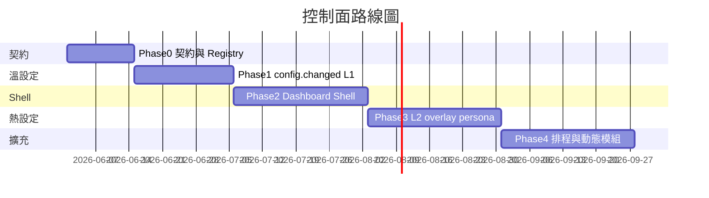

# 控制面實作計畫（Phase 0～4）

依 [architecture/control-plane.md](../architecture/control-plane.md) 分階段交付。契約先於實作；每階段更新 [events.md](../events.md) 與 [pub-sub-writing.md](../checklists/pub-sub-writing.md)。

---

## 總覽

| Phase | 目標 | 交付能力 |
|-------|------|----------|
| **0** | 契約、Registry | `ModuleDescriptor` 註冊與測試 |
| **1** | L1 溫設定 | `config.changed` → Sub in-process reload |
| **2** | Dashboard Shell | 單一入口、模組分頁、Monitor |
| **3** | L2 熱設定 | persona、overlay 即時更新 |
| **4** | 擴充積木 | 定時發話、`control.module.*` |

---

## Phase 0 — 契約與 Module Registry

**目標：** 固定控制面與資料面邊界。

### 工作項目

- [x] [events.md](../events.md)：`config.changed`、`control.profile.switch`、`overlay.update` schema
- [x] `packages/control`：
  - `ModuleDescriptor`、`registry.register()` / `registry.all_descriptors()`
  - 單元測試：重複 `module_id` 拒絕
- [x] 最小 Descriptor：`rule-bot`、`llm-bot`、`show-overlay`、`visual-egress`
- [x] [pub-sub-writing.md](../checklists/pub-sub-writing.md) 控制面勾選區
- [x] [overview.md](../overview.md) 文件地圖

### 驗收

- `uv run pytest packages/control` 通過
- 契約文件審查通過

**範圍：** Registry 與 schema；不含 runtime reload、完整 UI。

---

## Phase 1 — L1 溫設定（`config.changed`）

**目標：** 儲存設定後 Sub 自動 reload。

### 工作項目

- [x] `packages/events`：`ConfigChangedEvent`
- [x] 儲存 API publish `config.changed`（`module_id`、`config_file`、`profile_id`）
- [x] `sub-bot-logic`：filter `rule-bot` → reload `bot_responses.json`、`redemption_responses.json`
- [x] `sub-llm`：filter `llm-bot` → reload `llm_subscriber.json`
- [x] `sub-visual`：reload `sub_visual.json`
- [x] `streamer-config-gui` PUT 共用 `_save_json_config` + publish
- [x] 測試：改 JSON 後下一則 `!ping` / `!ask` 反映新設定

### 驗收

| 案例 | 預期 |
|------|------|
| 改 `bot_responses.json` | 下一則指令回應更新，程序持續運行 |
| 改 `llm_subscriber.json` | 下一則 `!ask` prompt 更新 |
| 改 knowledge md | L0：重啟或 Chroma preload |

### 實作備註

- reload 與進行中 LLM 請求：handler 內 lock，或下一則請求生效

---

## Phase 2 — Dashboard Shell

**目標：** 單一 Shell、每模組一頁，與 `streamer-app` 共生。

### 工作項目

- [ ] `app/dashboard/` 或 `tools/dashboard-shell/`：
  - FastAPI（預設 `127.0.0.1:1426`）
  - Registry 驅動側邊欄分頁
  - Monitor：`system.health` / `system.error`（WebSocket 或 SSE）
- [ ] 遷移 `streamer-config-gui` API 為 Shell 子路由
- [ ] 模組靜態頁：`dashboard_page` → `static/index.html`
- [ ] Profile CRUD、active 切換 → `control.profile.switch`
- [ ] 認證：`DASHBOARD_TOKEN` 或 localhost bind
- [ ] 營運文件：本機 / GCP SSH tunnel

### 驗收

- 單一 URL 編輯 rule-bot、llm-bot、visual 設定
- 儲存觸發 Phase 1 reload
- Monitor 頁顯示已註冊程序健康狀態

**Phase 2 範圍：** Shell 與分頁；跑馬燈 WYSIWYG 屬 Phase 3。

---

## Phase 3 — L2 熱設定（persona、OBS）

**目標：** 開台中切換 LLM 個性與 OBS 文案。

### 工作項目

- [ ] `control.llm.persona` / `control.profile.switch` 含 `persona_id`
- [ ] `llm_subscriber.json` 多 persona；`sub-llm` 記憶體切換
- [ ] `overlay.update`：`widget_id`、`html` 或 `template_vars`、`scene`
- [ ] `sub-show-overlay` 或 `obs-widgets` 訂閱 → Browser Source / WebSocket
- [ ] Shell 分頁：跑馬燈、checklist → publish `overlay.update`
- [ ] 測試：persona 切換、跑馬燈 10 秒內更新

### 驗收

- LLM persona 下一則 `!ask` 生效
- 至少一種 OBS widget（跑馬燈或 checklist）支援 L2

---

## Phase 4 — 排程與動態模組

**目標：** 定時發話、依 manifest 啟用積木。

### 工作項目

- [ ] `schedule-announcer`：讀 `schedule_messages.json`，定時 publish `chat.reply`
- [ ] Shell 排程分頁
- [ ] `control.module.enable` / `disable`：App runner 依 `manifest.enabled_modules` 啟停（可先「下次啟動生效」）
- [ ] GCP：Shell 與 Backend 同 VM；LocalPC overlay + tunnel

### 驗收

- 排程訊息出現在聊天室
- 重啟後僅跑 manifest 勾選的模組

---

## 部署拓撲（與 Control Plane）

完整說明見 [architecture/control-plane.md § 部署拓撲](../architecture/control-plane.md#部署拓撲)。

| ID | 拓撲 | Backend | LocalPC | Runbook |
|----|------|---------|---------|---------|
| T1 | All-local | 本機全跑 | 同機 | [getting-started.md](../getting-started.md) |
| T2 | All-GCP | GCE VM | 可選 overlay | [deployment-gcp.md](../deployment-gcp.md) |
| T3 | All-VPS | 自架伺服器 | 同 T2 | `deploy/docker-compose.gcp.yml` |
| T4 | Hybrid STT | GCP/VPS | 本機 `ingress-local-audio` | tunnel → `RABBITMQ_URL` |

Phase 2～4 文件與實作須覆蓋：

- [ ] T2：`deploy/up.sh` 同機啟動 Shell；營運者 SSH tunnel 存取 `:1426`
- [ ] T3：VPS 機密掛載方式（無 Secret Manager 時）
- [ ] T4：本機 publisher 連遠端 MQ 的 `.env` 範例與 tunnel 指令

Shell 與 data plane 共用同一 Backend 部署；拓撲只改程序所在機器與連線方式。

---

## 分工建議

| 角色 | Phase 0～1 | Phase 2～3 |
|------|------------|------------|
| 架構 | 契約、Registry | Shell、安全 |
| Bot | `sub-bot-logic` reload | rule-bot 分頁 |
| LLM | `sub-llm` reload、persona | llm-bot 分頁 |
| Show | — | `overlay.update`、OBS 分頁 |

---

## 決策紀錄

| 日期 | 決策 | 說明 |
|------|------|------|
| 2026-06 | 單一 App + Control Plane 與 MQ 同級 | 模組經 Registry 掛載 Dashboard |
| 2026-06 | Phase 1 先於 Phase 3 | L1 reload 優先於 overlay 熱更新 |
| 2026-06 | `packages/control` | Registry 與 publisher 放 workspace 套件；`app` 與 `streamer-config-gui` 依賴 |

---

## 相關文件

- [architecture/control-plane.md](../architecture/control-plane.md)
- [events.md](../events.md)
- [operator-modes.md](../operator-modes.md)
