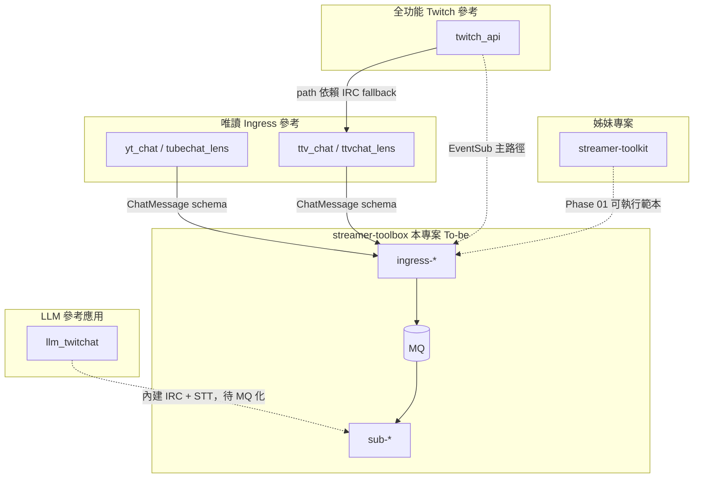

# 參考專案與遷移

本文件描述 **streamer-toolbox**（本專案，To-be：`ingress-*` / `sub-*`）與外部程式碼的對照關係。

## 術語

| 術語 | 含義 |
|------|------|
| **本專案** | `streamer_toolbox`：設計文件（`docs/`）與 stream-core 實作（`pkg-*` 等 workspace package） |
| **姊妹專案** | 僅 [`streamer-toolkit`](../streamer-toolkit)：早期 Phase 01 Pub/Sub 架構參考 |
| **參考程式碼** | `twitch_api`、`yt_chat`、`ttv_chat`、`llm_twitchat` 等：既有 As-is 實作，供拆分模組或對照邏輯，**不是**姊妹專案 |
| **Sub** | Pub/Sub 架構中的 **Subscriber package**（`sub-io-log`、`sub-llm` 等），非 Git submodule |

## 姊妹專案

| 專案 | 路徑 | 用途 |
|------|------|------|
| streamer-toolkit | [`../streamer-toolkit`](../streamer-toolkit) | 早期 Phase 01 RabbitMQ Pub/Sub 架構參考；本專案已實作對齊設計的版本 |

詳見 [references/streamer-toolkit.md](references/streamer-toolkit.md)。

## 參考程式碼總覽

下列 repo 為**參考用程式**，方便拆分或建立本專案各模組與邏輯；目標是演進為本專案內的 `ingress-*` / `sub-*` package，而非與本專案並列的姊妹專案。

| 專案 | 路徑 | PyPI / 套件名 | 用途 | 目標 package |
|------|------|---------------|------|----------------|
| twitch-oauth-bot | [`../twitch_api`](../twitch_api) | `twitch-oauth-bot` | 全功能 Twitch BOT（OAuth、EventSub、發話、TTS、Desktop） | 多數 `sub-*` / `ingress-twitch-eventsub` |
| TubeChat Lens | [`../yt_chat`](../yt_chat) | `tubechat-lens` | YouTube 直播聊天唯讀 | `ingress-yt-read` |
| ttvchat-lens | [`../ttv_chat`](../ttv_chat) | `ttvchat-lens` | Twitch IRC 匿名唯讀 | `ingress-ttv-read` |
| llm-twitchat | [`../llm_twitchat`](../llm_twitchat) | `llm-twitchat` | 直播 STT + IRC 聊天 + Gemini 問答（獨立 Web App） | `sub-llm`（及未來 STT ingress） |

## 模組依賴關係



| 關係 | 說明 |
|------|------|
| `yt_chat` ↔ `ttv_chat` | 同類參考程式；`ChatMessage.to_dict()` schema 對齊，方便同一下游 pipeline |
| `twitch_api` → `ttv_chat` | `pyproject.toml` path 依賴 `ttvchat-lens`；EventSub 不可用時**降級**為匿名 IRC 唯讀 |
| `llm_twitchat` ⊥ `twitch_api` | **分離運行**；LLM / STT 已自 `twitch_api` 拆出，不共用 EventBus 或 Python 套件 |
| 參考程式 → streamer-toolbox | 作為各層 As-is 對照；目標態經 MQ + `pkg-events` 解耦 |
| streamer-toolkit → streamer-toolbox | 姊妹專案；早期 Pub/Sub 架構參考，本專案已實作對齊設計的 Phase 01 |

### streamer-toolkit（姊妹專案）

早期 Phase 01 架構參考：Twitch IRC（匿名）→ RabbitMQ fanout → 多 Sub（檔案 log、web UI）。與 `ttv_chat` 同為 IRC 匿名讀取，但 toolkit 為自包含實作，曾示範 Pub/Sub 管線與 process registry 擴充模式；**正式實作已移至本專案**。

詳見 [references/streamer-toolkit.md](references/streamer-toolkit.md)。

### yt_chat（TubeChat Lens）

| 項目 | 內容 |
|------|------|
| 套件 | `tubechat_lens`（`uv run tubechat-lens`） |
| 連線 | `pytchat` / InnerTube，**無** YouTube Data API Key |
| 輸出 | CLI、`LiveChatReader` API、WebSocket `ws://127.0.0.1:8765`、Tauri 桌面 App |
| 設計角色 | `ingress-yt-read` 模板；normalize 後發布 `chat.message`（`platform: youtube`） |

- `ChatMessage` + `to_dict()` → 對齊 [events.md#chatmessage](events.md#chatmessage)
- 設計筆記：用 Queue 消費，避免 handler 內 I/O 拖慢拉取

### ttv_chat（ttvchat-lens）

| 項目 | 內容 |
|------|------|
| 套件 | `ttvchat_lens`（`uv run ttvchat-lens`） |
| 連線 | Twitch IRC over WebSocket（`justinfan*` 匿名），**零 OAuth** |
| 輸出 | CLI、`LiveChatReader` API、WebSocket `ws://127.0.0.1:8766`、Tauri 桌面 App |
| 設計角色 | `ingress-ttv-read` 模板；Phase 01 `ingress-twitch-chat` 建議依賴此 reader |

- 支援 `textMessage`、訂閱 / Raid / Bits 等 `USERNOTICE` 類型
- 讀取層與發話層解耦（發話需 OAuth，見 `twitch_api` / `twitch-connector`）

### twitch_api（Twitch OAuth Bot）

| 項目 | 內容 |
|------|------|
| 連線 | EventSub + OAuth（主路徑）；降級時委派 `ttvchat_lens` |
| 能力 | 發話、指令、關鍵字、TTS、字幕、雙帳號、Overlay、Helix API |
| 執行期 | 單機 `RuntimeEventBus` + Bot thread + PySide6 UI + overlay 子進程 |
| 設計角色 | 產品 B As-is 基準；逐步拆為 `ingress-twitch-eventsub`、`sub-bot-logic`、`sub-tts`、`sub-show-overlay`、`twitch-connector`、`identity-oauth` |

#### twitch_api vs ttv_chat

| | ttv_chat | twitch_api |
|---|----------|------------|
| 連線 | IRC 匿名 | EventSub + OAuth（fallback → `ttvchat_lens`） |
| 發話 / EventSub | 否 | 是（fallback 時唯讀） |
| SOLID | 讀取層乾淨 | `event_message` 上帝方法（遷移目標：僅 normalize + publish） |

**LLM 已移出：** `!ask` / `!summary` 等 AI 問答不再內建於本 Bot，改由 [`llm_twitchat`](../llm_twitchat) 獨立提供。

### llm_twitchat

| 項目 | 內容 |
|------|------|
| 啟動 | `uv run llm-twitchat`；Web UI `http://127.0.0.1:1425`、WS `ws://127.0.0.1:8767` |
| 輸入 | 直播音訊 STT（streamlink + faster-whisper）+ Twitch IRC 聊天（內建，匿名） |
| 輸出 | Gemini 問答、摘要、高光時段；**不**代發 Twitch 訊息 |
| 執行期 | 單機 in-process `EventBus`（`core/event_bus.py`） |
| 設計角色 | 產品 C **As-is** 參考；目標態為 MQ 上的 `sub-llm` + 未來 STT ingress |

詳見 [references/llm-twitchat.md](references/llm-twitchat.md)、[use-cases/03-llm-bot.md](use-cases/03-llm-bot.md)。

## Sub / Ingress 與參考程式對照

Subscriber（`sub-*`）與 Publisher（`ingress-*`）的 As-is 參考見 [packages.md#subscriber-package](packages.md#subscriber-package)。

| To-be package | 參考 As-is | 備註 |
|---------------|------------|------|
| `ingress-yt-read` | `yt_chat` | 可直接包 `tubechat_lens.LiveChatReader` |
| `ingress-ttv-read` | `ttv_chat` | Phase 01 建議 path 依賴 `../../ttv_chat` |
| `ingress-twitch-eventsub` | `twitch_api` `bot/` | EventSub 主路徑 |
| `sub-bot-logic` | `twitch_api` `chat_commands.py`、`bot_responses.py` | 規則 BOT |
| `sub-tts` | `twitch_api` `tts/` | 觀眾彈幕朗讀 |
| `sub-show-overlay` | `twitch_api` `ui/chat_overlay_*` | |
| `sub-visual` | `twitch_api` `runtime/subtitle.py` | |
| `twitch-connector` | `twitch_api` `send_message`、`throttle.py` | |
| `identity-oauth` | `twitch_api` `auth/` | |
| `sub-llm` | `llm_twitchat` | 待拆出 LLM 邏輯並改訂閱 MQ `chat.message` |
| `sub-io-log` | streamer-toolkit `sub1` | 診斷 Sub，留本專案 |

## twitch_api 路徑索引

| 層 | 路徑 | 遷移目標 |
|----|------|----------|
| Ingress | `src/bot/chatbot.py`, `event_handlers.py` | `ingress-twitch-eventsub` |
| Ingress SA | `src/bridge/sa_bridge.py` | `ingress-sa-bridge` |
| Ingress fallback | `ttvchat_lens`（path 依賴 `../ttv_chat`） | `ingress-ttv-read`（唯讀保底） |
| Core | `src/runtime/events.py` | `pkg-bus` |
| Core | `src/runtime/controller.py`, `bot_manager.py` | `stream-app` |
| Identity | `src/auth/`, `account_service.py` | `identity-oauth` |
| Logic | `bot/chat_commands.py`, `utils/bot_responses.py` | `sub-bot-logic` |
| Egress | `send_message`, `throttle.py` | `twitch-connector` |
| Egress | `tts/` | `sub-tts` + `pkg-tts` |
| Egress | `runtime/subtitle.py` | `sub-visual` |
| LocalPC | `ui/main_window.py`, `chat_overlay_*` | `sub-show-overlay` |

入口：`main.py`、`scripts/first_time_auth.py`。

**缺口（尚未有參考程式）：** Discord ingress、Web Dashboard、EventSub Webhook、虛擬角色管線（`sub-character-*`）、MQ 化後的 `sub-llm`、輸出安全層（`pkg-safety` 輸出閘門）。

## 遷移對照

| twitch_api 現況 | 目標 | 難度 | SOLID |
|-----------------|------|------|-------|
| `RuntimeEventBus` | `pkg-bus` | 低 | D |
| `AppController` | `stream-app` | 低 | S |
| `TwitchBot` + Mixin | 拆 ingress / sub / connector | **高** | S, O |
| `auth/` | `identity-oauth` | 低 | I |
| `tts/message_filter` | `pkg-safety` 輸入 | 低 | L |
| `ui/chat_overlay_*` | `sub-show-overlay` | 中 | O |
| — | `pkg-events`, `sub-character-*` | 新建 | — |
| `llm_twitchat`（獨立） | `sub-llm` + 可選 STT ingress | 中 | S, O |

### 遷移順序

1. 建立 `pkg-events` + `pkg-bus`，凍結 [events.md](events.md) 契約
2. `event_message` → 僅 normalize + publish `chat.message`
3. 抽出 `sub-bot-logic`、`twitch-connector`、`sub-tts` 為獨立訂閱者
4. `yt_chat` / `ttv_chat` ingress adapter 接入同一 schema
5. `llm_twitchat` 的 LLM 路徑演進為 `sub-llm`（不改 `sub-bot-logic`，**O**）
6. `sub-character-*` 以新 Sub 擴展（**O**）

每步通過 [solid.md 檢查清單](solid.md#新-repo--sub-檢查清單)。

## OAuth

→ [use-cases/04-oauth.md](use-cases/04-oauth.md)；權威來源 [`twitch_api/README.md`](../twitch_api/README.md)。

## 本專案與外部程式關係

```
streamer_toolbox/          ← 本專案：docs/ + pkg-* 實作
streamer-toolkit/          ← 姊妹專案：Phase 01 MQ 可執行參考
yt_chat / ttv_chat         ← 參考程式碼：ingress 讀取模板
twitch_api/                ← 參考程式碼：產品 B As-is，逐步拆 sub-*
llm_twitchat/              ← 參考程式碼：產品 C As-is，演進為 sub-llm
```

實作不得與設計文件衝突；契約變更須先改 `events.md` 再改程式。
