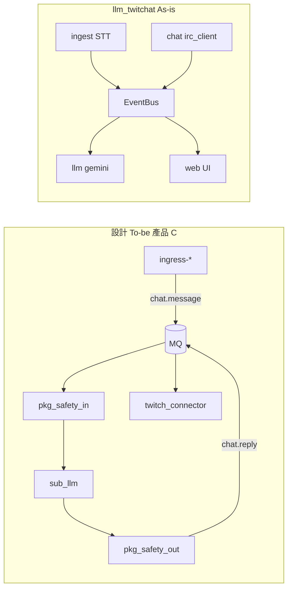

# llm-twitchat（產品 C As-is 參考）

## 定位

[llm_twitchat](../../llm_twitchat) 是 **產品 C（LLM BOT）** 的獨立可執行參考：直播音訊 STT、Twitch IRC 聊天讀取與 Gemini 問答，透過瀏覽器 Web UI 操作。**不是**最終 `sub-llm` 形態：目前為單進程 in-process `EventBus`，尚未接入 RabbitMQ 或 `pkg-events` schema。

| 項目 | 內容 |
|------|------|
| 本機路徑 | [`../../llm_twitchat`](../../llm_twitchat) |
| 套件名 | `llm-twitchat`（`uv run llm-twitchat`） |
| 對應產品 | C（LLM 問答；不含規則 BOT 發話，除非另開 `twitch_api`） |
| 對應設計 | [modules.md#產品-c--llm-bot](../modules.md#產品-c--llm-bot)、[03-llm-bot.md](../use-cases/03-llm-bot.md) |
| 與 twitch_api | **分離運行**；Bot 不再提供 `!ask` / `!summary` / `!highlight` |

## 快速啟動（摘要）

詳見 [`llm_twitchat/README.md`](../../llm_twitchat/README.md)。

```bash
cd ../llm_twitchat
uv sync
cp .env.example .env
# GOOGLE_AI_API_KEY、TWITCHAT_CHANNEL
uv run llm-twitchat skymiku39
```

瀏覽器：**http://127.0.0.1:1425** · WebSocket：**ws://127.0.0.1:8767**

## 架構對照



| 設計（To-be） | llm_twitchat（As-is） | 路徑 |
|---------------|----------------------|------|
| `ingress-*` → `chat.message` | 內建 IRC + STT buffer | `chat/irc_client.py`、`services/ingest.py` |
| `sub-llm` | LLM 問答 / 摘要 / 高光 | `services/stream_session.py`、`llm/` |
| `pkg-safety` 雙閘門 | 幻覺過濾、STT 黑名單 | `ingest/data/hallucination_blocklist.txt` |
| `twitch-connector` | — | **無**（IRC 唯讀，不代發聊天） |
| `pkg-bus` | in-process `EventBus` | `core/event_bus.py` |
| `knowledge/<channel>.md` | RAG 知識庫 | `knowledge/`、`memory/` |

## 與其他姊妹專案的關係

| | llm_twitchat | ttv_chat | twitch_api |
|---|--------------|----------|------------|
| IRC 聊天 | 內建 `irc_client`（匿名） | `ttvchat_lens` 套件 | EventSub 主路徑；fallback → `ttvchat_lens` |
| 發話 | 否 | 否 | 是 |
| LLM / STT | 是（核心） | 否 | 已移出至本專案 |
| 執行期 | 單機 Web App | CLI / WS / 桌面 | Desktop + Bot + overlay |

**演進建議：** 將 LLM 決策與 prompt 組裝抽成 `sub-llm`，訂閱 MQ `chat.message`（及未來 `stt.segment` 等 topic）；STT ingest 可另建 `ingress-twitch-audio` 或類似 Publisher。過渡期可與 `twitch_api` 並行：前者問答、後者規則回覆與發話。

## 缺口（相對設計文件）

| 差距 | 說明 |
|------|------|
| 無 MQ / `pkg-events` | payload 未對齊 [events.md](../events.md) |
| 無 `chat.reply` | 無法經 `twitch-connector` 自動回覆聊天室 |
| 無 `sub-bot-logic` 協作 | 與規則 BOT 需 App 層分別啟停 |
| STT topic 未定義 | 設計文件尚未註冊 `stt.*` topic |

## 相關文件

- [references.md](../references.md) — 姊妹專案總覽
- [03-llm-bot.md](../use-cases/03-llm-bot.md) — 產品 C 時序（To-be）
- [packages.md](../packages.md) — `sub-llm` 規劃
