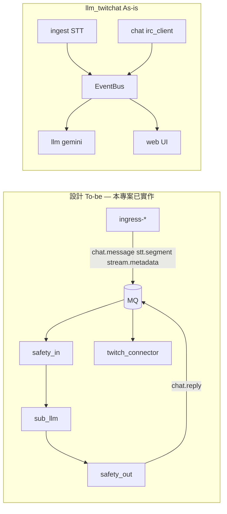

# llm-twitchat（產品 C As-is 參考）

## 定位

[llm_twitchat](../../llm_twitchat) 是 **產品 C（LLM BOT）** 的獨立可執行參考：直播音訊 STT、Twitch IRC 聊天讀取與 Gemini 問答，透過瀏覽器 Web UI 操作。

**與本專案關係：** `llm_twitchat` 仍為單進程 in-process `EventBus` 的 As-is 參考；**To-be 已於 `streamer_toolbox` 實作**為 `sub-llm` + `ingress-twitch-audio` / `ingress-twitch-stream` + `twitch-connector`，經 RabbitMQ 與 `events` schema 通訊。

| 項目 | 內容 |
|------|------|
| 本機路徑 | [`../../llm_twitchat`](../../llm_twitchat) |
| 套件名 | `llm-twitchat`（`uv run llm-twitchat`） |
| 對應產品 | C（LLM 問答；不含規則 BOT 發話，除非另開 `twitch_api` 或本專案 `sub-bot-logic`） |
| 對應設計 | [modules.md#產品-c--llm-bot](../modules.md#產品-c--llm-bot)、[03-llm-bot.md](../use-cases/03-llm-bot.md) |
| 與 twitch_api | **分離運行**；Bot 不再提供 `!ask` / `!summary` / `!highlight` |

## 快速啟動（摘要）

詳見 [`llm_twitchat/README.md`](../../llm_twitchat/README.md)。

```bash
cd ../llm_twitchat
uv sync
cp .env.example .env
# GOOGLE_AI_API_KEY、TWITCHAT_CHANNEL
uv run llm-twitchat skymiku39
```

瀏覽器：**http://127.0.0.1:1425** · WebSocket：**ws://127.0.0.1:8767**

本專案 To-be 啟動見 [getting-started.md](../getting-started.md) §3.4。

## 架構對照



| 設計（To-be / 本專案） | llm_twitchat（As-is） | 路徑 |
|---------------|----------------------|------|
| `ingress-*` → `chat.message` | 內建 IRC + STT buffer | `chat/irc_client.py`、`services/ingest.py` |
| `sub-llm` | LLM 問答 / 摘要 / 高光 | `services/stream_session.py`、`llm/` |
| `safety` 雙閘門 | 幻覺過濾、STT 黑名單 | `ingest/data/hallucination_blocklist.txt` |
| `twitch-connector` | — | **無**（IRC 唯讀，不代發聊天） |
| `bus` | in-process `EventBus` | `core/event_bus.py` |
| `knowledge/<channel>.md` | RAG 知識庫 | `knowledge/`、`memory/` |

## 與其他參考程式碼的關係

| | llm_twitchat | ttv_chat | twitch_api |
|---|--------------|----------|------------|
| IRC 聊天 | 內建 `irc_client`（匿名） | `ttvchat_lens` 套件 | EventSub 主路徑；fallback → `ttvchat_lens` |
| 發話 | 否 | 否 | 是 |
| LLM / STT | 是（核心） | 否 | 已移出至本專案 |
| 執行期 | 單機 Web App | CLI / WS / 桌面 | Desktop + Bot + overlay |

**演進狀態：** LLM 決策與 prompt 組裝已抽成 `sub-llm`；STT 已拆為 `ingress-twitch-audio`（及開發用 `ingress-local-audio`）→ `stt.segment`。規則回覆與發話由 `sub-bot-logic` + `twitch-connector` 負責。

## 缺口（僅相對 `llm_twitchat` 自身）

| 差距 | 說明 |
|------|------|
| 無 MQ / `events` | As-is 仍為 in-process；本專案 To-be 已解決 |
| 無 `chat.reply` | As-is 不代發；本專案經 `twitch-connector` 已解決 |
| 無 `sub-bot-logic` 協作 | As-is 需另開 Bot；本專案可 `--stack llm` 組裝 |
| STT 未拆 ingress | As-is 內建；本專案 `ingress-twitch-audio` 已解決 |

## 相關文件

- [references.md](../references.md) — 姊妹專案與參考程式碼總覽
- [03-llm-bot.md](../use-cases/03-llm-bot.md) — 產品 C 時序（To-be）
- [packages.md](../packages.md) — `sub-llm` 與記憶管線
- [stream-memory-pipeline.md](../architecture/stream-memory-pipeline.md) — L1/L2 記憶
