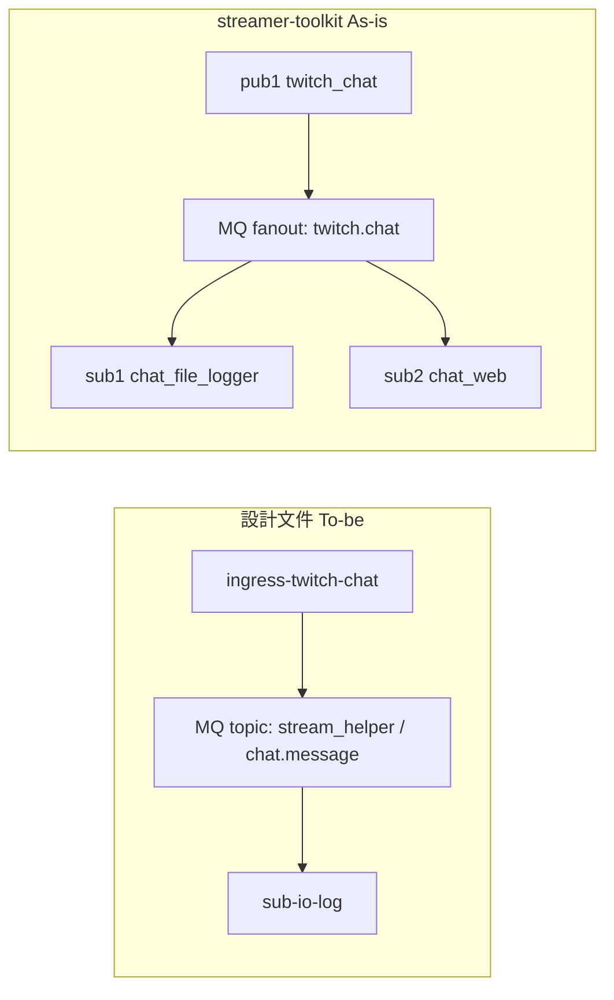

# streamer-toolkit（Phase 01 參考實作）

## 定位

[streamer-toolkit](https://github.com/pomodorozhong/streamer-toolkit) 是 **Phase 01** 的可執行參考實作：Twitch IRC 匿名讀取 → RabbitMQ → 多個 Subscriber（檔案 log、live web UI）。具備 process registry 與 CLI 編排，可作為 Pub/Sub 管線與擴充模式的實際範本。

**不是**本專案最終形態：訊息 schema、MQ 拓撲與 package 拆分尚未完全對齊 [events.md](../events.md) 與 [phase-01 計畫](../plans/phase-01-rabbitmq-io-poc.md)。

**本專案 `streamer_toolbox` 已對齊設計：** `packages/events`、`packages/bus`、topic `stream_helper` / `chat.message`、`sub-io-log` JSONL。toolkit 僅供歷史架構對照。

| 項目 | 內容 |
|------|------|
| 本機路徑 | [`../../streamer-toolkit`](../../streamer-toolkit) |
| 遠端 | https://github.com/pomodorozhong/streamer-toolkit |
| 上游文件 | [`doc/architecture.md`](../../streamer-toolkit/doc/architecture.md)、[`doc/cli.md`](../../streamer-toolkit/doc/cli.md) |
| 對應產品 | 產品 A 子集（ingress + I/O 檢查，尚無 overlay） |
| 對應計畫 | [phase-01-rabbitmq-io-poc.md](../plans/phase-01-rabbitmq-io-poc.md) |

## 快速啟動（摘要）

詳見 toolkit [`README.md`](../../streamer-toolkit/README.md)。

```bash
cd ../streamer-toolkit
uv sync
cp .env.example .env   # 設定 TWITCH_CHANNEL
docker compose up -d
uv run python -m app.main run
```

預設啟動 `pub1`（Twitch → MQ）、`sub1`（→ `logs/chat.log`）、`sub2`（→ http://127.0.0.1:8080）。

## 架構對照



## 模組對照

| 設計（To-be） | streamer-toolkit（As-is） | 路徑 |
|---------------|---------------------------|------|
| `ingress-twitch-chat` | `pub1` | `app/publishers/twitch_chat.py` |
| Twitch IRC 讀取 | 內建匿名 IRC | `app/publishers/twitch_irc.py` |
| `sub-io-log` | `sub1` | `app/subscribers/chat_file_logger.py` |
| （Phase 02 預覽） | `sub2` live web UI | `app/subscribers/chat_web.py` |
| `events` | `ChatMessage` schema | `packages/events/`（本專案已拆） |
| `bus` | RabbitMQ helpers | `packages/bus/`（本專案已拆） |
| MQ 命名常數 | Exchange / Queue | `packages/bus/topology.py` |
| `streamer-app` | CLI + ProcessRegistry + Runner | `app/main.py`、`app/processes/` |

### 與 ttv_chat 的關係

| | ttv_chat | streamer-toolkit |
|---|----------|------------------|
| 連線方式 | IRC 匿名 | IRC 匿名（`justinfan`） |
| 依賴 | 參考程式碼（可選） | 自包含，不依賴 `ttv_chat` |
| 輸出 | WebSocket / `ChatMessage` | RabbitMQ JSON |
| 設計角色 | Ingress 模板 | **完整 Pub/Sub 管線**參考 |

兩者皆採匿名 IRC 讀取；toolkit 額外示範 MQ 解耦與多 Sub fan-out。

## 訊息契約差異

### 設計（[events.md#chatmessage](../events.md#chatmessage)）

```json
{
  "schema_version": 1,
  "topic": "chat.message",
  "platform": "twitch",
  "message_id": "...",
  "author_name": "viewer",
  "login": "viewer_login",
  "content": "hello",
  "timestamp": "2026-06-12T17:00:00+08:00",
  "channel": "some_channel"
}
```

### toolkit 現況（`app/messaging/schemas.py`）

```json
{
  "channel": "channelname",
  "username": "viewer",
  "message": "hello",
  "timestamp": "2026-06-12T10:00:00+00:00"
}
```

| 差距 | 說明 |
|------|------|
| 無 `schema_version` / `topic` | Sub 無法依契約版本演進 |
| 無 `platform` / `message_id` | 多平台與去重困難 |
| `username` vs `author_name` | 欄位命名未對齊 |
| `message` vs `content` | 欄位命名未對齊 |
| 輸出格式 | `sub1` 寫文字行，非 JSONL |

**演進建議：** 在 `schemas.py` 補齊 `events.md` 必填欄位 → 更新 pub/sub 序列化 → `sub1` 改寫 JSONL。

## MQ 拓撲差異

| 項目 | 設計 | toolkit |
|------|------|---------|
| Exchange 類型 | **topic** | **fanout** |
| Exchange 名稱 | `stream_helper` | `twitch.chat` |
| Routing key | `chat.message` | （fanout 無 routing key） |
| Queue（I/O log） | `sub.io_log.chat_message` | `twitch.chat.log` |
| Queue（web UI） | — | `twitch.chat.web` |

toolkit 使用 fanout 是因為 Phase 01 僅單一來源（Twitch chat），一個 exchange 即可 fan-out 至多個 queue，無需 routing key。對齊設計時需：

1. 將 exchange 改為 topic `stream_helper`
2. 使用 routing key `chat.message`
3. 各 Sub 綁定專用 queue（命名對齊計畫書）

**已驗證：** `pub1` + `sub1` + `sub2` 證明 fan-out 可行（一 Pub、多 Sub 互不知曉）。

## SOLID 對照

| 原則 | toolkit 現況 |
|------|-------------|
| **S** | Pub 只發、Sub 只收；MQ 設定獨立於 `messaging/` |
| **O** | `@register_publisher` / `@register_subscriber` + 自動發現，加 Sub 不改 orchestrator |
| **L** | 無 `EventBus` Protocol，尚無 adapter 替換 |
| **I** | Sub 只依賴 queue 消費，不依賴 Pub 模組 |
| **D** | Sub 依賴 toolkit 內 `ChatMessage`，非獨立 `events` package |

已知技術債：schema 與 bus 合併於 `app/messaging/`，未拆成獨立 package。

## 演進路徑（toolkit → 設計 → 本專案）

建議順序（**本專案 `streamer_toolbox` 已完成 1～5**）：

1. ~~**Schema 對齊**~~ ✅ — `packages/events` 對齊 `events.md`
2. ~~**拓撲對齊**~~ ✅ — topic `stream_helper` + routing key `chat.message`
3. ~~**抽出 package**~~ ✅ — `events`、`bus` 獨立於 `packages/`
4. ~~**命名對齊**~~ ✅ — `ingress-ttv-read` / `sub-io-log`；JSONL 輸出
5. ~~**編排演進**~~ ✅ — `streamer-app` CLI + `--stack`（YAML 產品設定規劃中）

每步通過 [solid.md 檢查清單](../solid.md#新-repo--sub-檢查清單)。

## 相關文件

- [references.md](../references.md) — 姊妹專案與參考程式碼總覽
- [phase-01-rabbitmq-io-poc.md](../plans/phase-01-rabbitmq-io-poc.md) — 計畫書與驗收標準
- [deployment.md](../deployment.md) — MQ 選型與 fan-out 規則
- [packages.md](../packages.md) — 長期 package 拆分規劃
