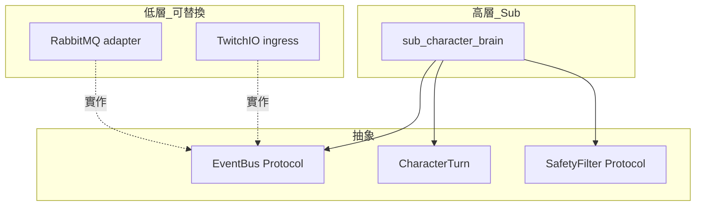

# SOLID 設計準則

**本文件為 stream_helper 及未來所有相關 repo/package 的強制設計約束。** 新模組、重構、從 `twitch_api` 抽離程式時，須滿足下列原則與檢查清單。

## 與 Pub/Sub 的關係

Pub/Sub 是達成 SOLID 的**手段**，不是替代品：

| 手段 | 對應原則 |
|------|----------|
| 一個 Sub 只訂閱/處理一類職責 | **S** |
| 新功能 = 新 Sub + 新 topic，不改舊 Sub | **O** |
| 共用 `pkg-*` 介面，多種實作可替換 | **L**, **D** |
| `TtsEngine`、`ChatPublisher` 等小介面 | **I** |
| Sub 只依賴 event schema，不依賴具體框架 | **D** |

## S — Single Responsibility（單一職責）

**一個 package / Sub / 類別只有一個改動理由。**

| 要做 | 不要做 |
|------|--------|
| `ingress-*` 只 normalize + publish | Ingress 內順便跑 LLM |
| `sub-bot-logic` 只產出 `chat.reply` | Bot Sub 內直接呼叫 Helix API |
| `twitch-connector` 只發話 + 節流 | Connector 內解析關鍵字 |
| App 只啟停與設定 | App 內寫指令邏輯 |

**反例（現況）：** `twitch_api` 的 `event_message` 同時負責 emit、TTS、字幕、指令、關鍵字——違反 S。目標態見 [use-cases/02-rule-bot.md](use-cases/02-rule-bot.md) To-Be。

**新黃框判斷：** 若你無法用一句話說「這個 repo 只負責 ___」，就該再拆。

## O — Open/Closed（開放封閉）

**對擴展開放，對修改封閉。**

| 擴展方式 | 範例 |
|----------|------|
| 新 Sub | 加 `sub-character-brain`，不改 `sub-bot-logic` |
| 新 topic | 加 `character.turn`，既有 `chat.message` 消費者不受影響 |
| 新 ingress | 加 `ingress-discord`，既有 YT/Twitch ingress 不動 |
| App 設定 | `subscribers.xxx.enabled: true`，不 fork 核心程式 |

**禁止：** 為了 Neuro 角色去改 `sub-tts` 內部加 `if neuro_mode` 分支。

## L — Liskov Substitution（里氏替換）

**實作可互換，呼叫方行為不受破壞。**

```python
# 正確：依賴抽象
class TtsEngine(Protocol):
    def synthesize(self, text: str) -> AudioClip: ...

# Windows SAPI5、Neuro 語音、雲端 TTS 皆可替換，Sub 行為一致
```

| 抽象 | 可替換實作 |
|------|------------|
| `TtsEngine` | SAPI5、Neuro voice、ElevenLabs |
| `ChatPublisher` | Twitch Helix、Discord webhook |
| `ExpressionDriver` | VTS API、Live2D、sprite sheet |
| `EventBus` | in-process queue、RabbitMQ adapter |

**禁止：** 子類實作 `synthesize()` 卻在特定輸入時 `raise NotImplementedError`，迫使呼叫方寫特殊判斷。

## I — Interface Segregation（介面隔離）

**客戶端不應依賴它用不到的方法。**

| 錯誤 | 正確 |
|------|------|
| `BotService` 含 chat、tts、oauth、overlay、clips | 拆成 `ChatPublisher`、`TtsEngine`、`TokenProvider` |
| Neuro Sub 依賴整個 `TwitchBot` | 只注入 `publish(topic, payload)` 與需要的 config |

**pkg 劃分建議：**

| Package | 介面規模 |
|---------|----------|
| `pkg-events` | 純資料類型，無行為 |
| `pkg-tts` | 僅 TTS 相關 |
| `pkg-safety` | 僅 filter 相關 |
| `pkg-bus` | 僅 publish / subscribe |

## D — Dependency Inversion（依賴反轉）

**高層不依賴低層實作，兩者都依賴抽象。**



| 高層 | 應依賴 | 不應依賴 |
|------|--------|----------|
| `sub-bot-logic` | `chat.message` schema、`EventBus` | `PySide6`、`TwitchIO.ChatMessage` |
| `sub-character-voice` | `CharacterTurn`、`TtsEngine` | `sub-character-brain` 的內部 class |
| App | 各 Sub 的啟停契約 | 各 Sub 的業務邏輯 |

## 何時抽 `pkg-*` 共用 repo

| 條件 | 動作 |
|------|------|
| 第二個 Sub 需要相同邏輯 | 考慮抽取 |
| 第三個 Sub 複製貼上同段程式 | **必須**抽取 |
| 僅一個 Sub 使用 | 留在 Sub 內，不預先抽象 |

抽取的是**穩定抽象**（TTS、事件格式、安全過濾），不是「可能以後會用到」的猜測。

## 新 repo / Sub 檢查清單

新增黃框前逐項確認：

- [ ] **S**：一句話能描述唯一職責
- [ ] **O**：不需修改已上線的其他 Sub
- [ ] **L**：對外依賴透過 Protocol / schema，實作可換
- [ ] **I**：注入的介面小於 5 個方法（經驗法則，過大則拆）
- [ ] **D**：不 import 其他 Sub 的內部模組，只經 MQ topic 或 pkg 介面溝通
- [ ] 訂閱的 topic 已寫入 [modules.md](modules.md) Topic 表
- [ ] App 可用 `enabled: true/false` 單獨開關

## 產品與 SOLID 對照

| 產品 | 合規重點 |
|------|----------|
| A SHOW | ingress 與 show 分離；不為 A 在 ingress 加發話 |
| B 規則 BOT | 拆開 bot-logic 與 connector；告別 `event_message` 上帝方法 |
| C LLM | safety 獨立 pkg；LLM Sub 不內嵌發話 API |
| D 虛擬角色 | 新 topic `character.turn`；見 [modules.md#擴展範例](modules.md#擴展範例虛擬角色neuro-sama-類型) |

## 姊妹專案遷移時

| 專案 | SOLID 債務 | 遷移方向 |
|------|------------|----------|
| `twitch_api` | `TwitchBot` + Mixin 違反 S、D | 拆 ingress / logic / egress Sub |
| `yt_chat` / `ttv_chat` | 結構較乾淨 | 作為 ingress 模板，加 `pkg-events` 對齊 schema |
| `llm_twitchat` | 單機 EventBus，未 MQ 化 | 演進為 `sub-llm`；不反向 import 進 `sub-bot-logic` |
| 未來新 repo | — | 從一開始依本文件與 [modules.md](modules.md) 模組 ID 命名 |

## 相關文件

- [modules.md](modules.md) — 模組邊界與產品組裝
- [events.md](events.md) — 依賴反轉的 payload 契約
- [packages.md](packages.md) — repo 依賴規則
- [deployment.md](deployment.md) — Pub/Sub 部署
- [references.md](references.md) — twitch_api 遷移對照
