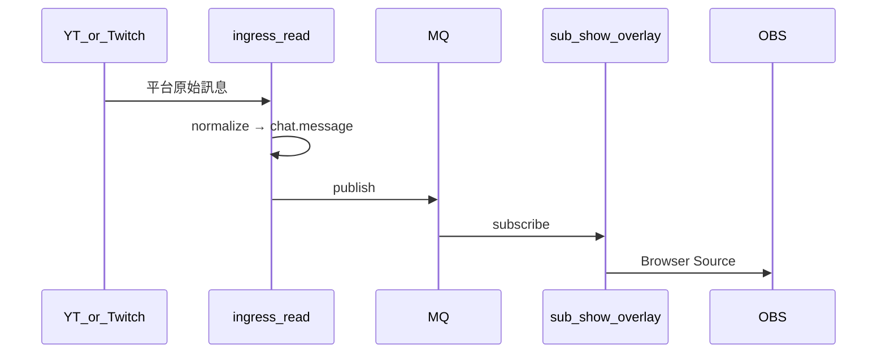

# 產品 A：純 SHOW

| 項目 | 連結 |
|------|------|
| 模組 / 啟用 | [modules.md#產品-a--純-show](../modules.md#產品-a--純-show) |
| 事件契約 | [events.md#chatmessage](../events.md#chatmessage) |
| SOLID | ingress 與 show 分離（**S**）；不為 A 修改 bot Sub（**O**） |

## 時序

## 要點

- 零 OAuth 優先 `ingress-yt-read` / `ingress-ttv-read`
- 不 publish / subscribe `chat.reply`
- 參考：`yt_chat/desktop/`、`ttv_chat/desktop/`、`twitch_api/ui/chat_overlay_*`
