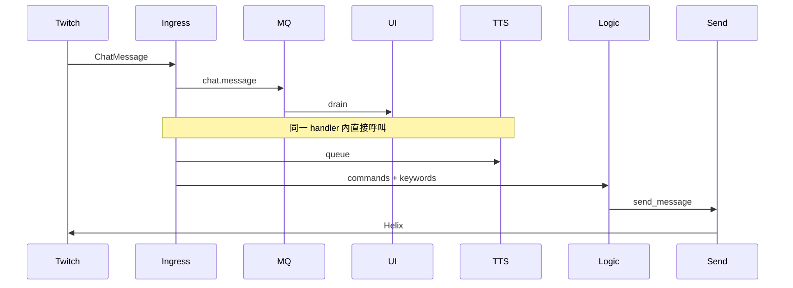
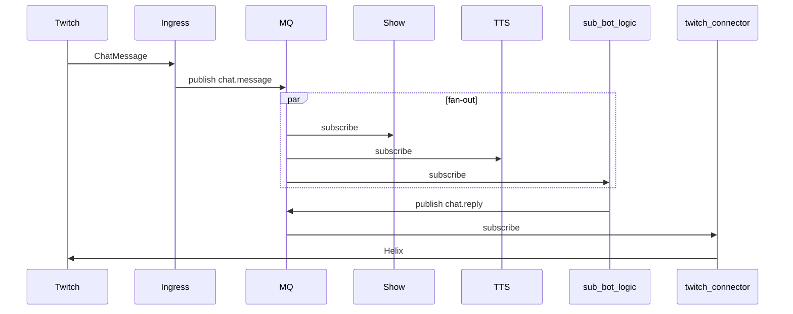

# 產品 B：規則 BOT

| 項目 | 連結 |
|------|------|
| 模組 / 啟用 | [modules.md#產品-b--規則-bot](../modules.md#產品-b--規則-bot) |
| 事件 | [chat.message](../events.md#chatmessage)、[chat.reply](../events.md#chatreply) |
| OAuth | [04-oauth.md](04-oauth.md) |

對照 `twitch_api` [`event_handlers.event_message`](../../../twitch_api/src/bot/event_handlers.py)。

## As-Is（違反 SOLID **S**）

## To-Be（目標態）

## twitch_api 對照

| 步驟 | 檔案 |
|------|------|
| 接收 | `bot/chatbot.py`, `event_handlers.py` |
| publish | `event_bus.emit(CHAT_MESSAGE)` |
| 指令 / 關鍵字 | `chat_commands.py`, `bot_responses.json` |
| 發話 | `send_message`, `throttle.py` |

## EventSub 非聊天事件

`eventsub.follow` 等由 ingress publish → `sub-bot-logic` 訂閱 → `chat.reply` 通知。見 [events.md#eventsub](../events.md#eventsub)。
