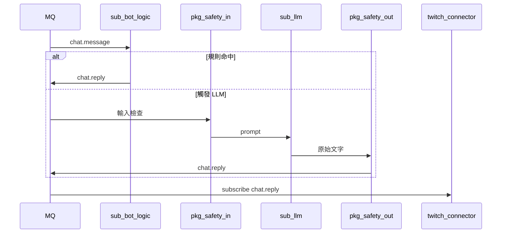

# 產品 C：LLM BOT（Future）

| 項目 | 連結 |
|------|------|
| 模組 / 啟用 | [modules.md#產品-c--llm-bot](../modules.md#產品-c--llm-bot) |
| 安全層 | [solid.md](../solid.md)、`pkg-safety` |

產品 B 基礎上增加 `sub-llm`。預設僅 `!ask` 或 redemption 觸發 LLM。

## 時序

## 雙閘門

| 閘門 | 檢查 |
|------|------|
| 輸入 | injection、黑名單、頻率、權限 |
| 輸出 | 違規、個資、長度；fallback 不送原文 |

輸入參考 `twitch_api/tts/message_filter.py`；輸出為 `pkg-safety` 新建。

## SOLID

- `sub-llm` 只產出 `chat.reply`，不呼叫 Helix（**S**, **D**）
- 不修改 `sub-bot-logic` 加入 LLM 分支（**O**）
