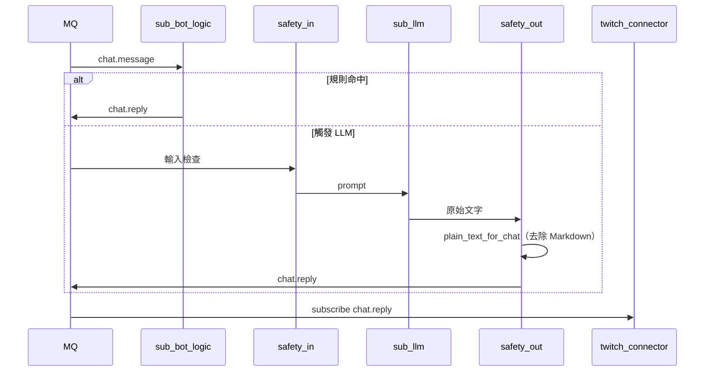

# 產品 C：LLM BOT

| 項目 | 連結 |
|------|------|
| 模組 / 啟用 | [modules.md#產品-c--llm-bot](../modules.md#產品-c--llm-bot) |
| 安全層 | [solid.md](../solid.md)、`safety` |
| As-is 參考 | [`llm_twitchat`](../../../llm_twitchat)、[references/llm-twitchat.md](../references/llm-twitchat.md) |

產品 B 基礎上增加 `sub-llm`。預設僅觸發詞（如 `!ask`）或 redemption 觸發 LLM。

> **運作模式**：若只要 `!ask`、不要規則 Bot，用 [AI 問答](operator-modes.md#方案ai-問答)。  
> 若要規則 Bot + LLM，用 [規則 Bot + AI](operator-modes.md#方案規則-bot--ai)。

## 現況：本專案已實作

產品 C 已由 **streamer-toolbox** 內的 `sub-llm`、`ingress-twitch-audio`、`ingress-twitch-stream`、`twitch-connector` 等程序組裝，經 RabbitMQ 協作；記憶管線見 `sub-stream-record` + `app.workers`。啟動方式見 [getting-started.md](../getting-started.md) §3.4（`--stack ingress` + `--stack llm`）。

## 歷史參考：`llm_twitchat`

[`llm_twitchat`](../../../llm_twitchat) 為遷移前的**獨立 Web App**（`uv run llm-twitchat`）：

- 直播音訊 STT + Twitch IRC 聊天（匿名）→ 瀏覽器問答 / 摘要 / 高光
- **不**經 MQ、**不**發布 `chat.reply`（IRC 唯讀）

上述能力已演進為本專案的 `sub-llm` + `ingress-twitch-audio` + `twitch-connector`。

## 時序

## 上下文與記憶（已實作）

`sub-llm` 組裝 prompt 時合併多層來源（詳見 [stream-memory-pipeline.md](../architecture/stream-memory-pipeline.md)）：

1. **短期 buffer**：`stream.metadata`、STT、聊天、`Bot 近期問答`（不進 RAG）
2. **Chroma RAG**：靜態知識 + L2 摘要
3. **IGDB**：直播中可玩遊戲分類時注入遊戲資料

啟動時若 Gemini 推理端點失敗，仍發布降級宣告（Degraded Mode）。

## 雙閘門

| 閘門 | 檢查 |
|------|------|
| 輸入 | injection、黑名單、頻率、權限 |
| 輸出 | 違規、個資、長度；fallback 不送原文 |
| 格式化 | `sub_llm.chat_format.plain_text_for_chat` 去除 Markdown，使回覆適合 Twitch 聊天室 |

輸入參考 `twitch_api/tts/message_filter.py`；輸出安全由 `safety` 負責；Markdown 剝除在 `sub-llm` 內（`LLM_SYSTEM_PROMPT` 引導 + 後處理雙層防護）。

## SOLID

- `sub-llm` 只產出 `chat.reply`，不呼叫 Helix（**S**, **D**）
- 不修改 `sub-bot-logic` 加入 LLM 分支（**O**）
