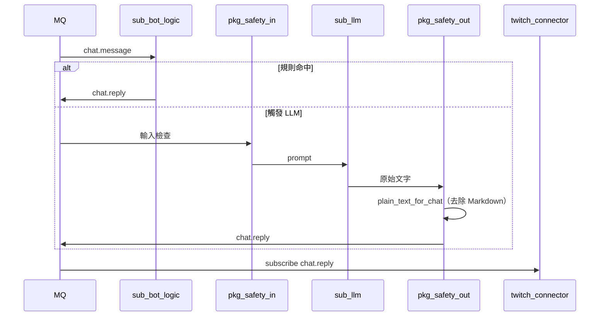

# 產品 C：LLM BOT

| 項目 | 連結 |
|------|------|
| 模組 / 啟用 | [modules.md#產品-c--llm-bot](../modules.md#產品-c--llm-bot) |
| 安全層 | [solid.md](../solid.md)、`pkg-safety` |
| As-is 參考 | [`llm_twitchat`](../../../llm_twitchat)、[references/llm-twitchat.md](../references/llm-twitchat.md) |

產品 B 基礎上增加 `sub-llm`。預設僅觸發詞（如 `!ask`）或 redemption 觸發 LLM。

## As-is：`llm_twitchat`

[`llm_twitchat`](../../../llm_twitchat) 為**獨立 Web App**（`uv run llm-twitchat`），與 `twitch_api` 分離運行：

- 直播音訊 STT + Twitch IRC 聊天（匿名）→ 瀏覽器問答 / 摘要 / 高光
- **不**經 MQ、**不**發布 `chat.reply`（IRC 唯讀）
- 目標態：LLM 邏輯抽成 `sub-llm`，訂閱 `chat.message` 並經 `twitch-connector` 回覆

若需同時具備規則 BOT 發話與 LLM 問答，現階段需分別啟動 `twitch_api` 與 `llm_twitchat`；遷移完成後由 `stream-app` 依 [modules.md](../modules.md) 啟用表編排。

## 時序

## 雙閘門

| 閘門 | 檢查 |
|------|------|
| 輸入 | injection、黑名單、頻率、權限 |
| 輸出 | 違規、個資、長度；fallback 不送原文 |
| 格式化 | `sub_llm.chat_format.plain_text_for_chat` 去除 Markdown，使回覆適合 Twitch 聊天室 |

輸入參考 `twitch_api/tts/message_filter.py`；輸出安全由 `safety` 負責；Markdown 剝除在 `sub-llm` 內（`LLM_SYSTEM_PROMPT` 引導 + 後處理雙層防護）。

## SOLID

- `sub-llm` 只產出 `chat.reply`，不呼叫 Helix（**S**, **D**）
- 不修改 `sub-bot-logic` 加入 LLM 分支（**O**）
