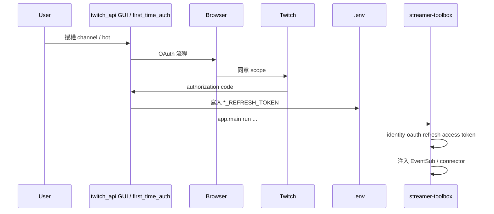
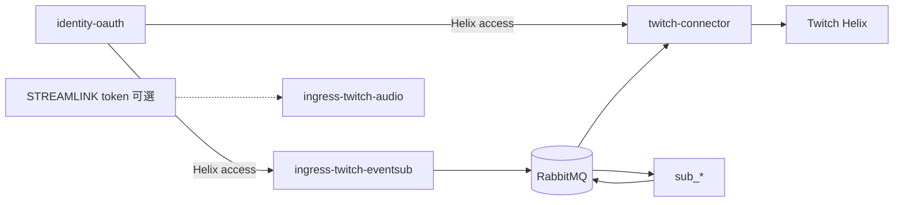

# OAuth 啟動（橫切）

| 項目 | 說明 |
|------|------|
| 適用產品 | B、C、D（需 EventSub 或發話）；A 零 OAuth 方案除外 |
| 模組 | `identity-oauth` |
| **詳細設計** | **[architecture/identity-auth.md](../architecture/identity-auth.md)**（權威來源） |
| 參考實作 | [`twitch_api`](../../../twitch_api) `auth/`、`runtime/account_service.py` |

Identity 為 **bootstrap + runtime token 供應**，不參與 `chat.message` 管線（SOLID **S**）。**Token 永不進 RabbitMQ。**

## 憑證種類（摘要）

| 種類 | 用途 | 模組 |
|------|------|------|
| **Helix OAuth** | EventSub、Helix 發話 | `identity-oauth` → EventSub、connector |
| **Streamlink GQL**（可選） | HLS 拉流 | `TWITCH_STREAMLINK_AUTH_TOKEN` → `ingress-twitch-audio` |
| **無** | IRC / 本機 STT | `ingress-ttv-read`、`ingress-local-audio` |

Helix token 與 Streamlink browser token **不可混用**。詳見 [identity-auth.md §2](../architecture/identity-auth.md#2-三種憑證不可混用)。

## 帳號角色（摘要）

| 角色 | 用途 |
|------|------|
| `channel` | 主帳號 — EventSub |
| `bot` | Bot 帳號 — `twitch-connector` 發話 |

雙帳號 env、`single_account` 模式、模組對照表見 [identity-auth.md §3–§4](../architecture/identity-auth.md#3-帳號角色對齊-twitch_api)。

## Bootstrap 時序

## 執行期管線

## twitch_api 對照

| 機制 | twitch_api | streamer-toolbox 目標 |
|------|------------|------------------------|
| 首次授權 | `scripts/first_time_auth.py`、GUI | 共用 `.env`，不在 toolbox 重複 GUI |
| Refresh | `auth/oauth_manager.py` | `identity-oauth` |
| 雙帳號 | `runtime/account_service.py` | `MultiAccountTokenProvider`（規劃） |
| Validate | `auth/token_sync.py` | `identity-oauth` CLI（擴充規劃） |

## 實作狀態

| 項目 | 狀態 |
|------|------|
| 單組 env fallback + 雙帳號 `MultiAccountTokenProvider` | ✅ |
| EventSub 雙 token / connector `role=bot` | ✅ |
| 雙帳號 channel + bot | ✅ |
| Streamlink 可選 OAuth | 📋 |
| `ingress-local-audio`（免 Twitch auth） | ✅ |
