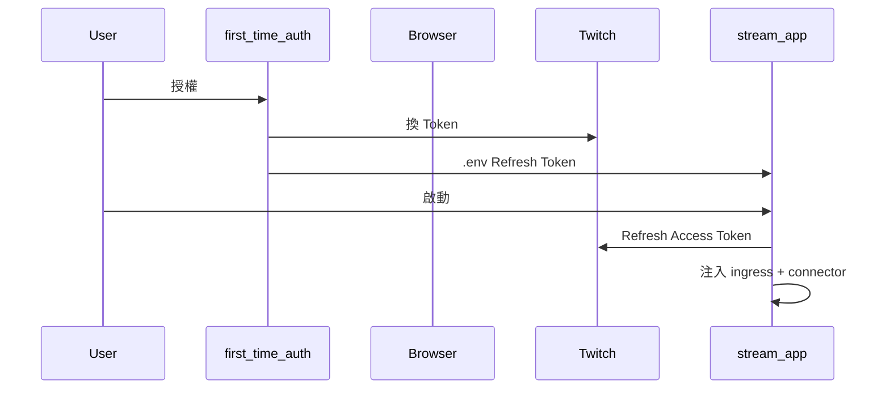
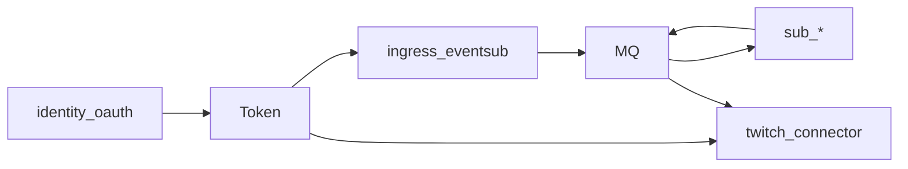

# OAuth 啟動（橫切）

| 項目 | 說明 |
|------|------|
| 適用產品 | B、C、D（需 EventSub 或發話）；A 零 OAuth 方案除外 |
| 模組 | `identity-oauth` |
| 權威來源 | [`twitch_api/README.md`](../../../twitch_api/README.md) |

Identity 為 **bootstrap**，不參與 `chat.message` 管線（SOLID **S**）。

## 時序

## 執行期維護

| 機制 | twitch_api 路徑 |
|------|-----------------|
| 首次授權 | `scripts/first_time_auth.py` |
| GUI 重授權 | `auth/interactive_oauth.py` |
| Refresh | `auth/oauth_manager.py` |
| Validate | `auth/token_sync.py` |
| 雙帳號 | `runtime/account_service.py` |

## 與管線關係

