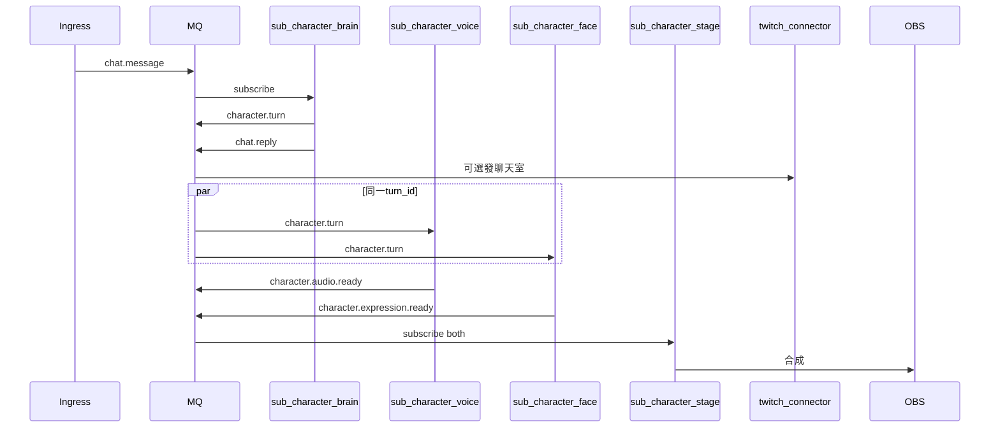

# 產品 D：虛擬角色（Future / 假設性）

| 項目 | 連結 |
|------|------|
| 模組 / 啟用 | [modules.md#產品-d--虛擬角色](../modules.md#產品-d--虛擬角色) |
| 事件 | [character.turn](../events.md#characterturn) 等 |
| SOLID | 新建 `sub-character-*`，不改 `sub-tts` / `sub-llm`（**O**） |

Neuro-sama 類型：聊天輸入 → 人設 LLM → TTS + 表情同步 → OBS。與產品 C 差異在**第二層 topic** 同步語音與表情。

## 為何不用 `chat.message` fan-out？

| Sub | 處理對象 |
|-----|----------|
| `sub-tts` | 觀眾說的話 |
| `sub-llm` | 觀眾 → 文字回覆 |

角色要同步的是**角色自己這輪要說的話** → 需 `character.turn` 錨點。

## 時序

## Package 職責

| Package | 訂閱 | 發布 |
|---------|------|------|
| `sub-character-brain` | `chat.message` | `character.turn`, `chat.reply` |
| `sub-character-voice` | `character.turn` | `character.audio.ready` |
| `sub-character-face` | `character.turn` | `character.expression.ready` |
| `sub-character-stage` | audio + expression ready | —（輸出至 OBS） |

共用：`pkg-tts`（voice）、`pkg-safety`（brain）、`pkg-events`。

## 與產品 C 並存

| 做法 | 說明 |
|------|------|
| 互斥 | App 設 `product: C` 或 `product: D` |
| 並存 | 不啟動 `sub-llm`；brain 自含人設 LLM |
| 彈幕 overlay | 可選 `sub-show` 訂閱 `chat.message`，與角色管線無耦合 |

## stage 同步策略

`sub-character-stage` 以 `turn_id` 等待 audio + expression 就緒（或超時 fallback 僅播 audio）。不應在 brain 內阻塞等待 TTS（違反 **S**）。
